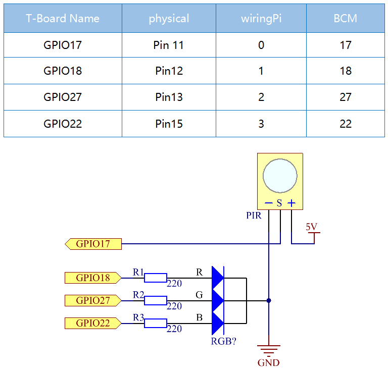
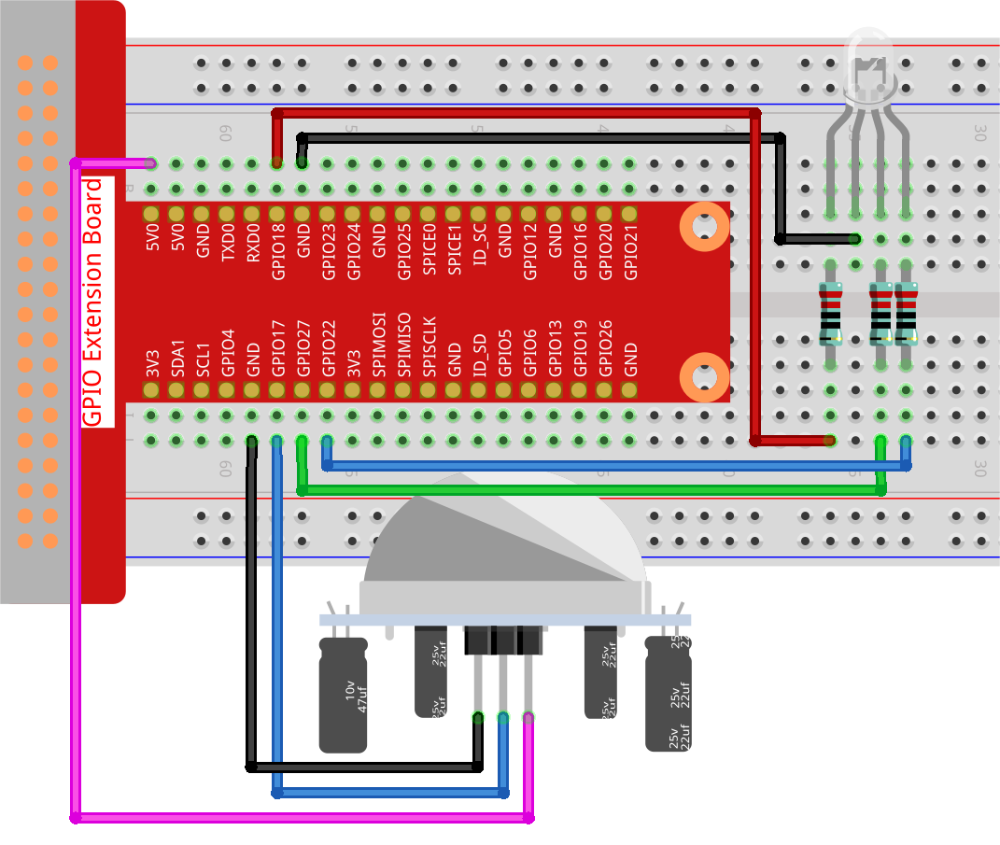

.. note::

    Hello, welcome to the SunFounder Raspberry Pi & Arduino & ESP32 Enthusiasts Community on Facebook! Dive deeper into Raspberry Pi, Arduino, and ESP32 with fellow enthusiasts.

    **Why Join?**

    - **Expert Support**: Solve post-sale issues and technical challenges with help from our community and team.
    - **Learn & Share**: Exchange tips and tutorials to enhance your skills.
    - **Exclusive Previews**: Get early access to new product announcements and sneak peeks.
    - **Special Discounts**: Enjoy exclusive discounts on our newest products.
    - **Festive Promotions and Giveaways**: Take part in giveaways and holiday promotions.

    👉 Ready to explore and create with us? Click [|link_sf_facebook|] and join today!

.. _2.2.6_py:

2.2.6 PIR Sensor
=================

**Introduction**

The Passive Infrared (PIR) sensor is a motion detection device that senses infrared radiation emitted by humans and animals. In this project, we will build a motion-activated LED system using a PIR sensor and an RGB LED. When the PIR sensor detects motion, the LED will glow yellow. If no motion is detected, the LED will turn blue. This project introduces basic motion sensing and LED control using a Raspberry Pi.

----------------------------------------------

**What You’ll Need**

Below are the components required for this project:

.. list-table::
    :widths: 30 20
    :header-rows: 1

    * - COMPONENT INTRODUCTION
      - PURCHASE LINK
    * - GPIO Extension Board
      - |link_gpio_board_buy|
    * - Breadboard
      - |link_breadboard_buy|
    * - Wires
      - |link_wires_buy|
    * - Resistor
      - |link_resistor_buy|
    * - RGB LED
      - |link_rgb_led_buy|
    * - PIR Sensor
      - 

----------------------------------------------

**Circuit Diagram**

Below is the schematic diagram for this project:

----------------------------------------------

**Wiring Diagram**

Build the circuit as shown in the diagram below:

Ensure the RGB LED and PIR sensor are connected to the correct GPIO pins as per the schematic.

----------------------------------------------

**Writing the Code**

1. Navigate to the project directory:

   .. code-block:: bash

       cd ~/zero-w-ai-kit/python

2. Run the Python script:

   .. code-block:: bash

       sudo python3 2.2.7_PIR_zero.py

When the script runs:

* If motion is detected, the RGB LED glows yellow (red and green combined).
* If no motion is detected, the LED glows blue.

Adjust the PIR sensor’s potentiometers for sensitivity and detection range:

* Turn both potentiometers counterclockwise to the end for optimal performance.

.. image:: ../python/img/2.2.7_PIR_TTE.png
    :width: 400
    :align: center

.. warning::
    If you encounter the error ``RuntimeError: Cannot determine SOC peripheral base address``, refer to the :ref:`faq_soc` for troubleshooting steps.

----------------------------------------------

**Code**

Below is the Python code for this project:

.. code-block:: python

   #!/usr/bin/env python3
   from gpiozero import RGBLED, MotionSensor
   from time import sleep

   # Initialize RGB LED and PIR motion sensor
   led = RGBLED(red=18, green=27, blue=22)  # RGB LED connected to GPIO pins 18, 27, and 22
   pir = MotionSensor(17)  # PIR sensor connected to GPIO pin 17

   try:
       # Continuously monitor for motion and update LED color
       while True:
           if pir.motion_detected:  # Check for motion detected by PIR sensor
               led.color = (1, 1, 0)  # Set LED color to yellow (Red + Green)
           else:
               led.color = (0, 0, 1)  # Set LED color to blue (only Blue)
           sleep(0.1)  # Short delay to reduce CPU load
   except KeyboardInterrupt:
       # Gracefully handle script termination
       pass

This Python script monitors a PIR (Passive Infrared) motion sensor and controls an RGB LED based on motion detection. When executed:

1. **When Motion is Detected**:

   - The RGB LED (connected to GPIO pins 18, 27, and 22) turns yellow (a combination of red and green).
   - The script continuously checks the motion sensor and updates the LED color.

2. **When No Motion is Detected**: The RGB LED turns blue.

3. The program runs indefinitely, checking the PIR sensor every 0.1 seconds, until interrupted with ``Ctrl+C``.

----------------------------------------------

**Understanding the Code**

1. **Imports:**

   The script uses the ``gpiozero`` library to control the RGB LED and PIR sensor, and the ``time`` module to introduce delays.

   .. code-block:: python

       from gpiozero import RGBLED, MotionSensor
       from time import sleep

2. **Initialization:**

   The RGB LED is initialized with its red, green, and blue components connected to GPIO pins 18, 27, and 22, respectively. The PIR sensor is connected to GPIO pin 17.

   .. code-block:: python

       led = RGBLED(red=18, green=27, blue=22)
       pir = MotionSensor(17)

3. **Main Loop:**

   * Continuously checks for motion detected by the PIR sensor.
   * If motion is detected, the LED turns yellow.
   * If no motion is detected, the LED turns blue.
   * The ``sleep`` function introduces a short delay to reduce CPU load.

   .. code-block:: python

       while True:
           if pir.motion_detected:
               led.color = (1, 1, 0)
           else:
               led.color = (0, 0, 1)
           sleep(0.1)

4. **Graceful Exit:**

   The ``try-except`` block ensures that the program exits cleanly when interrupted with ``Ctrl+C``.

   .. code-block:: python

       except KeyboardInterrupt:
           pass

----------------------------------------------

**Troubleshooting**

1. **RGB LED Does Not Light Up**:

   - **Cause**: Incorrect wiring of the RGB LED.
   - **Solution**: Verify the red, green, and blue pins of the LED are correctly connected to GPIO pins 18, 27, and 22. Ensure resistors are used to prevent damage.

2. **Motion Not Detected**:

   - **Cause**: PIR sensor is not wired or configured properly.
   - **Solution**:

     - Ensure the PIR sensor is connected to GPIO pin 17, power, and ground.
     - Adjust the sensor’s sensitivity and delay potentiometers if available.

3. **Script Does Not Respond to Motion**:

   - **Cause**: Faulty PIR sensor or incorrect ``pir.motion_detected`` handling.
   - **Solution**: Test the PIR sensor independently to confirm it detects motion and triggers its output pin.

----------------------------------------------

**Extendable Ideas**

1. **Auditory Feedback**: Add a buzzer that sounds when motion is detected:

   .. code-block:: python

      from gpiozero import Buzzer
      buzzer = Buzzer(23)
      if pir.motion_detected:
         buzzer.on()
      else:
         buzzer.off()

2. **Data Logging**: Log motion detection events with timestamps to a file for analysis:

   .. code-block:: python

      with open("motion_log.txt", "a") as log_file:
         log_file.write(f"Motion detected at {time.time():.3f}\n")

3. **Event-Based Triggers**: Add logic for specific actions based on motion patterns or duration:

   .. code-block:: python

      import time
      motion_start = None
      def detect_motion():
         global motion_start
         if pir.motion_detected:
            motion_start = time.time()
         else:
            duration = time.time() - motion_start
            print(f"Motion lasted {duration:.2f} seconds")

----------------------------------------------

**Conclusion**

This project demonstrates how to use a PIR sensor with an RGB LED to build a motion-activated system. By understanding the basics of motion sensing and LED control, you can expand this project into more advanced applications such as security systems, automated lighting, or interactive devices. The PIR sensor’s versatility and simplicity make it an excellent component for countless DIY and professional projects.
