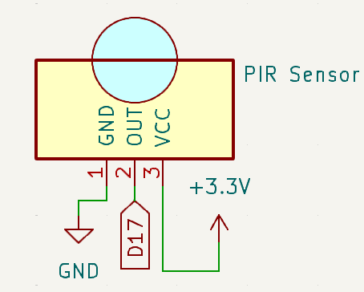
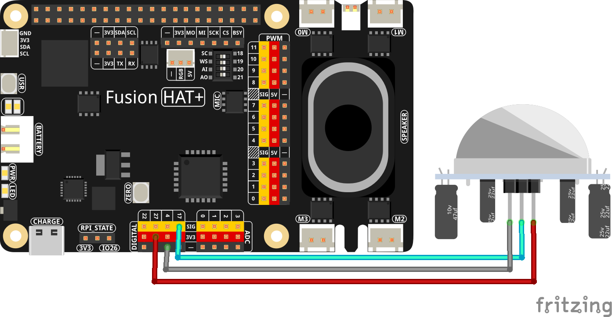

.. note::

    Hello, welcome to the SunFounder Raspberry Pi & Arduino & ESP32 Enthusiasts Community on Facebook! Dive deeper into Raspberry Pi, Arduino, and ESP32 with fellow enthusiasts.

    **Why Join?**

    - **Expert Support**: Solve post-sale issues and technical challenges with help from our community and team.
    - **Learn & Share**: Exchange tips and tutorials to enhance your skills.
    - **Exclusive Previews**: Get early access to new product announcements and sneak peeks.
    - **Special Discounts**: Enjoy exclusive discounts on our newest products.
    - **Festive Promotions and Giveaways**: Take part in giveaways and holiday promotions.

    👉 Ready to explore and create with us? Click [|link_sf_facebook|] and join today!

.. _2.2.6_py:

2.2.6 PIR Sensor
=================

**Introduction**

The Passive Infrared (PIR) sensor is a motion detection device that senses infrared radiation emitted by humans and animals. In this project, we will use the PIR sensor to detect motion.

----------------------------------------------

**What You’ll Need**

Below are the components required for this project:

.. list-table::
    :widths: 30 20
    :header-rows: 1

    *   - COMPONENT INTRODUCTION
        - PURCHASE LINK

    *   - :ref:`cpn_pir`
        - |link_reed_switch_buy|
    *   - :ref:`cpn_wires`
        - |link_wires_buy|        
    *   - Fusion HAT
        - 
    *   - Raspberry Pi Zero 2 W
        -

----------------------------------------------

**Circuit Diagram**

Below is the schematic diagram for this project:

----------------------------------------------

**Wiring Diagram**

Build the circuit as shown in the diagram below:

Ensure the RGB LED and PIR sensor are connected to the correct GPIO pins as per the schematic.

.. note::

   Adjust the two potentiometers on the PIR module for optimal sensitivity and detection distance. Turn both counterclockwise to their maximum setting for best results.

.. image:: ../python/img/4.1.7_PIR_TTE.png
   :width: 400
   :align: center

----------------------------------------------

**Running the Example**

All example code used in this tutorial is available in the ``ai-explorer-lab-kit`` directory. 
Follow these steps to run the example:

.. code-block:: shell
   
   cd ai-explorer-lab-kit/python/
   sudo python3 2.2.6_PIR_zero.py 

----------------------------------------------

**Writing the Code**

Below is the Python code for this project:

.. raw:: html

   <run></run>

.. code-block:: python

   #!/usr/bin/env python3
   from fusion_hat import Pin  
   from signal import pause  # Import pause function from signal module

   # Initialize a PIR Module object on GPIO pin 17
   pir = Pin(17, Pin.IN, pull= Pin.PULL_DOWN)

   def detect():
      if pir.value() == 1:  # Check if the PIR Module is triggered
         print("Detected Barrier!")
      else:
         print("No Barrier")

   try:
      pir.when_activated = detect  # Set up an interrupt to detect changes in the pir sensor state
      pir.when_deactivated = detect  

      # Run an event loop that waits for button events and keeps the script running
      print("CTRL + C to exit")
      pause()

   except KeyboardInterrupt:
      # Handle KeyboardInterrupt (Ctrl+C) to exit the loop gracefully
      pass

This Python script monitors a PIR (Passive Infrared) motion sensor based on motion detection. When executed:

1. **When Motion is Detected**: Prints "Detected Barrier!" to the console.

2. **When No Motion is Detected**: Prints "No Barrier" to the console.

3. The program runs indefinitely, waiting for motion events. It can be terminated by pressing Ctrl+C.

----------------------------------------------

**Understanding the Code**

1. **Imports:**

   .. code-block:: python

      from fusion_hat import Pin  
      from signal import pause  # Import pause function from signal module

   The script uses the ``fusion_hat`` library to control the PIR sensor, and the ``signal`` module to handle program termination.

2. **Initialization:**

   .. code-block:: python

      pir = Pin(17, Pin.IN, pull= Pin.PULL_DOWN)

   In this line, a PIR sensor is initialized on pin 17 with an internal pull-down resistor enabled.

3. **Main Loop:**

   .. code-block:: python

      def detect():
         if pir.value() == 1:  # Check if the PIR Module is triggered
            print("Detected Barrier!")
         else:
            print("No Barrier")

      try:
         pir.when_activated = detect  # Set up an interrupt to detect changes in the pir sensor state
         pir.when_deactivated = detect  

         # Run an event loop that waits for button events and keeps the script running
         print("CTRL + C to exit")
         pause()

      except KeyboardInterrupt:
         # Handle KeyboardInterrupt (Ctrl+C) to exit the loop gracefully
         pass

   * Continuously checks for motion detected by the PIR sensor.
   * If motion is detected, the message "Detected Barrier!" is printed.
   * If no motion is detected, the message "No Barrier" is printed.

----------------------------------------------

**Troubleshooting**

1. **Motion Not Detected**:

   - **Cause**: PIR sensor is not wired or configured properly.
   - **Solution**:

     - Ensure the PIR sensor is connected to GPIO pin 17, power, and ground.
     - Adjust the sensor’s sensitivity and delay potentiometers if available.

----------------------------------------------

**Extendable Ideas**

1. **Auditory Feedback**: Add a buzzer that sounds when motion is detected:

   .. code-block:: python

      from fusion_hat import Buzzer
      buzzer = Buzzer(Pin(22))
      if pir.value() == 1:
         buzzer.on()
      else:
         buzzer.off()

2. **Data Logging**: Log motion detection events with timestamps to a file for analysis:

   .. code-block:: python

      with open("motion_log.txt", "a") as log_file:
         log_file.write(f"Motion detected at {time.time():.3f}\n")

----------------------------------------------

**Conclusion**

This project demonstrates how to use a PIR sensor. By understanding the basics of motion sensing  control, you can expand this project into more advanced applications such as security systems, automated lighting, or interactive devices. The PIR sensor’s versatility and simplicity make it an excellent component for countless DIY and professional projects.
