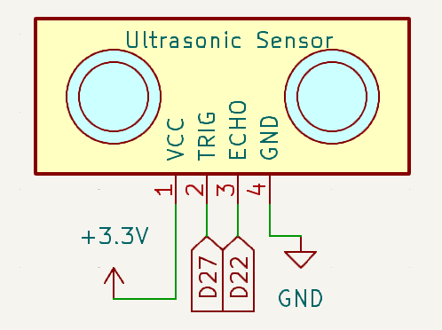
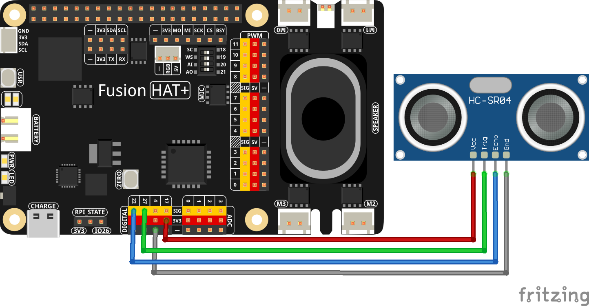

.. note::

    Hello, welcome to the SunFounder Raspberry Pi & Arduino & ESP32 Enthusiasts Community on Facebook! Dive deeper into Raspberry Pi, Arduino, and ESP32 with fellow enthusiasts.

    **Why Join?**

    - **Expert Support**: Solve post-sale issues and technical challenges with help from our community and team.
    - **Learn & Share**: Exchange tips and tutorials to enhance your skills.
    - **Exclusive Previews**: Get early access to new product announcements and sneak peeks.
    - **Special Discounts**: Enjoy exclusive discounts on our newest products.
    - **Festive Promotions and Giveaways**: Take part in giveaways and holiday promotions.

    👉 Ready to explore and create with us? Click [|link_sf_facebook|] and join today!

.. _2.2.7_py:

2.2.7 Ultrasonic Sensor Module
==============================

**Introduction**

The ultrasonic sensor module uses ultrasonic waves to measure distances with remarkable accuracy. It emits ultrasonic waves and listens for their echo, calculating the distance based on the time taken for the echo to return. This versatile technology is commonly used in robotics, obstacle detection, and range-finding applications.

----------------------------------------------

**What You’ll Need**

Here are the components required for this project:

.. list-table::
    :widths: 30 20
    :header-rows: 1

    *   - COMPONENT INTRODUCTION
        - PURCHASE LINK

    *   - :ref:`cpn_wires`
        - |link_wires_buy|
    *   - :ref:`cpn_ultrasonic_sensor`
        - |link_ultrasonic_buy|
    *   - Fusion HAT
        - 
    *   - Raspberry Pi Zero 2 W
        -

----------------------------------------------

**Circuit Diagram**

Below is the schematic diagram for the ultrasonic sensor module:

----------------------------------------------

**Wiring Diagram**

Assemble the circuit as shown in the diagram below:

Ensure the connections are secure, with the Echo pin connected to GPIO 22 and the Trigger pin to GPIO 27 of the Raspberry Pi.

----------------------------------------------

**Writing the Code**

Below is the Python code for this project:

.. raw:: html

   <run></run>

.. code-block:: python

   #!/usr/bin/env python3
   from fusion_hat import Ultrasonic,Pin
   from time import sleep

   # Initialize the DistanceSensor
   # Trigger pin is connected to GPIO 27, Echo pin to GPIO 22
   sensor = Ultrasonic(trig=Pin(27), echo=Pin(22))

   try:
      # Main loop to continuously measure and report distance
      while True:
         dis = sensor.read() # Measure distance in centimeters
         print('Distance: {:.2f} cm'.format(dis))  # Print the distance with two decimal precision
         sleep(0.3)  # Wait for 0.3 seconds before the next measurement

   except KeyboardInterrupt:
      # Handle KeyboardInterrupt (Ctrl+C) to gracefully exit the loop
      pass

This Python script uses an ultrasonic distance sensor to measure the distance to an object and displays the result on the console. When executed:

1. The sensor, connected to GPIO pins 27 (trigger) and 22 (echo), continuously measures the distance to the nearest object.
2. The distance is calculated in meters and converted to centimeters, then displayed in the format: ``Distance: <value> cm`` with two decimal places of precision.
3. The distance is updated every 0.3 seconds, allowing for near real-time monitoring.
4. The program runs indefinitely until interrupted with ``Ctrl+C``, at which point it exits gracefully.

----------------------------------------------

**Understanding the Code**

1. **Imports:**

   .. code-block:: python

      from fusion_hat import Ultrasonic,Pin
      from time import sleep

   The script imports the ``Ultrasonic`` class from the ``fusion_hat`` library to interact with the ultrasonic sensor and the ``sleep`` function from the ``time`` module to introduce delays.

2. **Initialization:**

   .. code-block:: python

      sensor = Ultrasonic(trig=Pin(27), echo=Pin(22))

   The ultrasonic sensor is initialized with the Echo pin connected to GPIO 22 and the Trigger pin to GPIO 27. This setup enables the Raspberry Pi to send and receive ultrasonic signals.

3. **Main Loop:**

   .. code-block:: python

      while True:
         dis = sensor.read() # Measure distance in centimeters
         print('Distance: {:.2f} cm'.format(dis))  # Print the distance with two decimal precision
         sleep(0.3)  # Wait for 0.3 seconds before the next measurement

   * Continuously measures the distance to the nearest object.
   * Converts the distance from meters to centimeters.
   * Prints the distance with two decimal places of precision.
   * Includes a 0.3-second delay to allow the sensor to stabilize between measurements.

4. **Graceful Exit:**

   The ``try-except`` block ensures the program exits cleanly when interrupted with ``Ctrl+C``.

   .. code-block:: python

      except KeyboardInterrupt:
         pass

----------------------------------------------

**Troubleshooting**

1. **No Distance Output**:

   - **Cause**: The sensor is not properly connected or powered.
   - **Solution**:

      - Ensure the trigger pin is connected to GPIO 27 and the echo pin to GPIO 22.
      - Verify that the sensor has a stable power supply.

2. **Constant or Incorrect Distance Values**:

   - **Cause**: Obstacles are too close or too far from the sensor, or there is interference.
   - **Solution**:

      - Ensure the object is within the sensor's effective range (typically 2 cm to 400 cm).
      - Check for interference from other ultrasonic devices or reflective surfaces.

3. **Distance Always Zero**:

   - **Cause**: Faulty sensor or incorrect wiring.
   - **Solution**: Test the sensor on another GPIO setup or replace it if faulty. Double-check the wiring configuration.

----------------------------------------------

**Extendable Ideas**

1. **Threshold-Based Alerts**: Trigger an alert when the measured distance is below a specific threshold:

  .. code-block:: python

      if dis < 10:
          print("Warning: Object too close!")

2. **Auditory Feedback**: Add a buzzer that sounds when the distance is below a threshold:

  .. code-block:: python

      from fusion_hat import Buzzer
      buzzer = Buzzer(Pin(4))
      if dis < 10:
         buzzer.on()
      else:
         buzzer.off()

----------------------------------------------

**Conclusion**

This project demonstrates how to use an ultrasonic sensor module to measure distances with a Raspberry Pi. By understanding the principles of ultrasonic wave detection and GPIO programming, you can integrate such sensors into a variety of applications, from robotics to home automation. With this foundation, you can explore more advanced projects involving sensors and real-world interaction.
