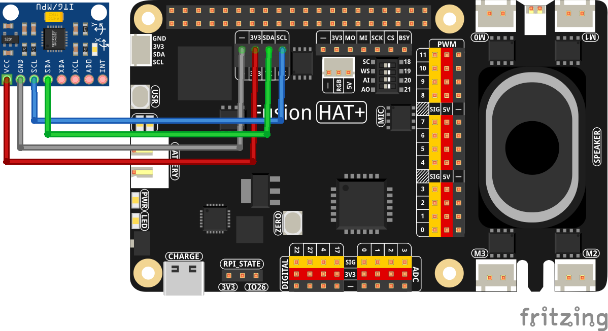

.. note::

    Hello, welcome to the SunFounder Raspberry Pi & Arduino & ESP32 Enthusiasts Community on Facebook! Dive deeper into Raspberry Pi, Arduino, and ESP32 with fellow enthusiasts.

    **Why Join?**

    - **Expert Support**: Solve post-sale issues and technical challenges with help from our community and team.
    - **Learn & Share**: Exchange tips and tutorials to enhance your skills.
    - **Exclusive Previews**: Get early access to new product announcements and sneak peeks.
    - **Special Discounts**: Enjoy exclusive discounts on our newest products.
    - **Festive Promotions and Giveaways**: Take part in giveaways and holiday promotions.

    👉 Ready to explore and create with us? Click [|link_sf_facebook|] and join today!

.. _2.2.8_py:

2.2.8 MPU6050 Module
====================

**Introduction**

The MPU6050 is a highly integrated 6-axis motion tracking module that includes a 3-axis gyroscope and a 3-axis accelerometer. This module is widely used in smartphones, tablets, and wearable devices due to its compact size, low power consumption, and high performance. In this project, you will learn how to interface with the MPU6050 using the I2C protocol to obtain acceleration and angular velocity data, which will then be displayed on the screen.

----------------------------------------------

**What You’ll Need**

Below are the components required for this project:

.. list-table::
    :widths: 30 20
    :header-rows: 1

    *   - COMPONENT INTRODUCTION
        - PURCHASE LINK

    *   - MPU6050 Module
        - |link_mpu6050_buy|
    *   - :ref:`cpn_wires`
        - |link_wires_buy|
    *   - Fusion HAT
        - 
    *   - Raspberry Pi Zero 2 W
        -

----------------------------------------------

**Circuit Diagram**

The MPU6050 communicates with the microcontroller via the I2C bus. Connect the SDA1 and SCL1 pins of the MPU6050 to the corresponding I2C pins on the Raspberry Pi:

.. image:: ../python/img/2.2.9_mpu6050_schematic.png

----------------------------------------------

**Wiring Diagram**

Assemble the circuit as shown in the wiring diagram below:

Ensure that all connections are secure and match the schematic to avoid communication errors.

----------------------------------------------

**Writing the Code**

Below is the Python code for this project:

.. code-block:: python

   from fusion_hat import MPU6050
   from time import sleep

   mpu = MPU6050()

   # mpu.set_accel_range(MPU6050.ACCEL_RANGE_2G)
   # mpu.set_gyro_range(MPU6050.GYRO_RANGE_250DEG)

   while True:
      temp = mpu.get_temp()
      acc_x, acc_y, acc_z  = mpu.get_accel_data()
      gyro_x, gyro_y, gyro_z = mpu.get_gyro_data()
      print(
         f"Temp: {temp:0.2f} 'C",
         f"  |  ACC: {acc_x:8.5f}g {acc_y:8.5f}g {acc_z:8.5f}g",
         f"  |  GYRO: {gyro_x:8.5f}deg/s {gyro_y:8.5f}deg/s {gyro_z:8.5f}deg/s"
      )
      sleep(0.2)

This Python script utilizes the MPU6050 sensor, which is commonly used for motion tracking in devices such as drones, mobile phones, and gaming devices. The script reads temperature, accelerometer, and gyroscope data from the sensor and prints these readings continuously in a formatted output. Below, I'll explain the code step-by-step in a way suitable for a documentation style like you might find on readthedocs.

----------------------------------------------

**Understanding the Code**

1. **Importing Libraries**

   .. code-block:: python

      from fusion_hat import MPU6050
      from time import sleep

   These lines import the necessary Python libraries. ``fusion_hat`` contains the ``MPU6050`` class for interfacing with the sensor. The ``sleep`` function from the ``time`` module is used to introduce a delay in the loop.

2. **Initializing the Sensor**

   .. code-block:: python

      mpu = MPU6050()

   This line creates an instance of the ``MPU6050`` class, initializing the sensor so that it's ready to gather data.

3. **Main Loop**

   .. code-block:: python

      while True:
         temp = mpu.get_temp()
         acc_x, acc_y, acc_z = mpu.get_accel_data()
         gyro_x, gyro_y, gyro_z = mpu.get_gyro_data()
         print(
            f"Temp: {temp:0.2f} 'C",
            f"  |  ACC: {acc_x:8.5f}g {acc_y:8.5f}g {acc_z:8.5f}g",
            f"  |  GYRO: {gyro_x:8.5f}deg/s {gyro_y:8.5f}deg/s {gyro_z:8.5f}deg/s"
         )
         sleep(0.2)

   - **While Loop**: The ``while True`` statement creates an infinite loop, meaning the code inside the loop runs repeatedly without stopping.

   - **Reading Sensor Data**:

      - ``temp = mpu.get_temp()``: Retrieves the current temperature from the sensor and stores it in the variable ``temp``.
      - ``acc_x, acc_y, acc_z = mpu.get_accel_data()``: Retrieves the current acceleration data in three dimensions (x, y, z) from the sensor.
      - ``gyro_x, gyro_y, gyro_z = mpu.get_gyro_data()``: Retrieves the gyroscope data, which measures angular velocity in the x, y, and z directions.

   - **Printing Data**: The ``print`` statement formats and displays the sensor data. Temperature is displayed in degrees Celsius, acceleration in g-forces, and gyroscope data in degrees per second.

   - **Sleep**: ``sleep(0.2)`` pauses the loop for 0.2 seconds before repeating. This delay helps manage the rate at which data is read and printed, preventing the script from consuming too much CPU time.

4. **Additional Comments**

   The lines to set the accelerometer and gyroscope ranges are commented out:

   .. code-block:: python

      # mpu.set_accel_range(MPU6050.ACCEL_RANGE_2G)
      # mpu.set_gyro_range(MPU6050.GYRO_RANGE_250DEG)

   Uncommenting these lines would allow you to configure the sensitivity of the accelerometer and gyroscope. For example, ``ACCEL_RANGE_2G`` configures the accelerometer to measure up to ±2g, and ``GYRO_RANGE_250DEG`` sets the gyroscope to measure up to ±250 degrees per second. By default, the MPU6050 module initializes with the default ranges of ±2g for acceleration and ±250 degrees per second for gyroscope.

   You can adjust these ranges based on your specific application requirements. The range settings are as follows:

   - **Accelerometer Ranges**:

      - ``MPU6050.ACCEL_RANGE_2G``: ±2g
      - ``MPU6050.ACCEL_RANGE_4G``: ±4g
      - ``MPU6050.ACCEL_RANGE_8G``: ±8g
      - ``MPU6050.ACCEL_RANGE_16G``: ±16g

   - **Gyroscope Ranges**:

      - ``MPU6050.GYRO_RANGE_250DEG``: ±250 degrees per second
      - ``MPU6050.GYRO_RANGE_500DEG``: ±500 degrees per second
      - ``MPU6050.GYRO_RANGE_1000DEG``: ±1000 degrees per second
      - ``MPU6050.GYRO_RANGE_2000DEG``: ±2000 degrees per second

----------------------------------------------

**Troubleshooting**

1. **No Output or Sensor Not Detected**:

   - **Cause**: Incorrect I2C setup or wiring.
   - **Solution**:

      - Ensure the MPU6050 is correctly connected to the Raspberry Pi's I2C pins (SDA, SCL, power, ground).
      - Verify the I2C address using the ``i2cdetect`` tool:

      .. code-block:: shell

         sudo i2cdetect -y 1
         
      - Confirm that the device address matches ``0x68`` in the script.

2. **Incorrect or Erratic Values**:

   - **Cause**: Sensor calibration issues or noisy environment.
   - **Solution**:

     - Place the MPU6050 on a stable surface to reduce noise.
     - Perform calibration on the gyroscope and accelerometer to ensure accurate readings.

3. **ImportError: No Module Named ``smbus``**:

   - **Cause**: The ``smbus`` library is not installed.
   - **Solution**: Install the library using:

   .. code-block:: shell

     sudo apt-get install python3-smbus

----------------------------------------------

**Extendable Ideas**

1. **Data Logging**: Save gyroscope and accelerometer readings to a file for analysis:
     
   .. code-block:: python

      with open("mpu6050_log.txt", "a") as log_file:
         log_file.write(f"{time.time():.3f}, {gyro_x}, {gyro_y}, {gyro_z}, {acc_x}, {acc_y}, {acc_z}\n")

2. **Integration with Motors**: Use the gyroscope data to stabilize a drone or robotic arm.

----------------------------------------------

**Conclusion**

This script provides a simple yet powerful way to continuously monitor and display data from the MPU6050 sensor, which could be useful in various applications requiring real-time motion tracking or environmental monitoring.
