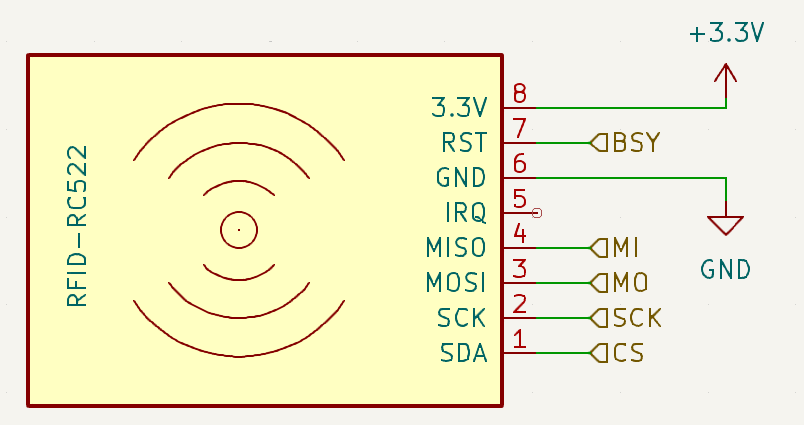
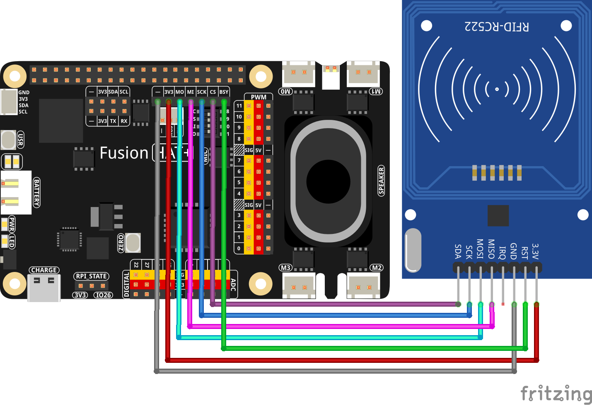

2.2.9 RFID
==========================

**Introduction**

In this tutorial, we'll explore how to use an RC522 RFID reader/writer with a Raspberry Pi Zero to read from and write to RFID tags. This guide provides insights into setting up the hardware, writing and understanding Python scripts for interacting with RFID tags. It's a fantastic introduction to the world of RFID technology, often used in access control, tracking systems, and identity verification.

-----------------------------------------------------

**What You’ll Need**

Below are the components required for this project:

.. list-table::
    :widths: 30 20
    :header-rows: 1

    *   - COMPONENT INTRODUCTION
        - PURCHASE LINK

    *   - :ref:`cpn_wires`
        - |link_wires_buy|
    *   - :ref:`cpn_mfrc522`
        - |link_mfrc522_rfid_buy|
    *   - Fusion HAT
        - 
    *   - Raspberry Pi Zero 2 W
        -

----------------------------------------------

**Circuit Diagram**

----------------------------------------------

**Wiring Diagram**

Assemble the circuit as shown in the wiring diagram below:

Ensure that all connections are secure and match the schematic to avoid communication errors.

-----------------------------------------------------

**Writing the Code**

We have two separate Python scripts here. One (``2.2.9_read.py``) is for reading data from an RFID tag, and the other (``2.2.9_write.py``) is for writing data to an RFID tag.

For reading from an RFID tag:

.. code-block:: python

    from fusion_hat import RC522
    import time
    rc = RC522()
    rc.Pcd_start()
    print("Reading...Please place the card...")

    try:
        uid,message = rc.read(2)
        print("UID:", uid)    
        print("Successfully retrieved data block:", message)
        input("Press enter to exit...")
    except KeyboardInterrupt:
        print("Exiting...")

For writing data to an RFID tag:

.. code-block:: python

    from fusion_hat import RC522

    rc = RC522()
    rc.Pcd_start()
    x = input("Please enter the data to be written:")
    print("Reading...Please place the card...")
    data = [ord(x[i]) for i in range(len(x))]

    try:
        rc.write(2,data)
        uid,message = rc.read(2)
        print("UID:", uid)    
        print("Successfully retrieved data block:", message)
        input("Press enter to exit...")
    except:
        print("Error")

-----------------------------------------------------

**Understanding the Code**

Each script initiates by setting up the RC522 module and preparing it for communication. Let's break down the crucial components of each script:

1. **Initialization and Setup**:

    .. code-block:: python

        rc = RC522()
        rc.Pcd_start()

    Both scripts begin by importing necessary libraries and creating an instance of ``RC522``. The ``Pcd_start()`` method initializes the RC522 hardware.

2. **Reading Data**:

    .. code-block:: python

        uid, message = rc.read(2)

    In ``2.2.9_read.py``, the ``read`` method is called with the parameter ``2``, which specifies the block from which data should be read. The script outputs the UID of the card and the data read from it.

3. **Writing Data**:

    .. code-block:: python

        data = [ord(x[i]) for i in range(len(x))]
        rc.write(2, data)

    The ``2.2.9_write.py`` script includes user input conversion into a list of ASCII values, which are then written to the RFID tag. After writing, it reads back the data to verify the write operation.

-----------------------------------------------------

**Troubleshooting**

- **No Response from Reader**: Ensure all physical connections are secure, and the RC522 is correctly powered.

- **Read/Write Errors**: Check that the RFID tags are compatible with the RC522 and are not damaged.

- **Script Errors**: Ensure the ``fusion_hat`` library is installed correctly. Update or reinstall if necessary.

-----------------------------------------------------

**Extendable Ideas**

- **Integration with a Database**: Store read data into a database for further processing or tracking.

- **Enhanced Security Features**: Implement encryption and decryption techniques for data written to and read from RFID tags.

- **Multi-Device Communication**: Set up multiple readers to create a more extensive access control system or tracking system.

-----------------------------------------------------

**Conclusion**

This tutorial on using the RC522 RFID module with the Raspberry Pi Zero introduces you to the basics of RFID technology in practical applications. By understanding and leveraging the provided scripts, you can build complex systems for personal or commercial use, enhancing your understanding of both hardware interaction and software control.