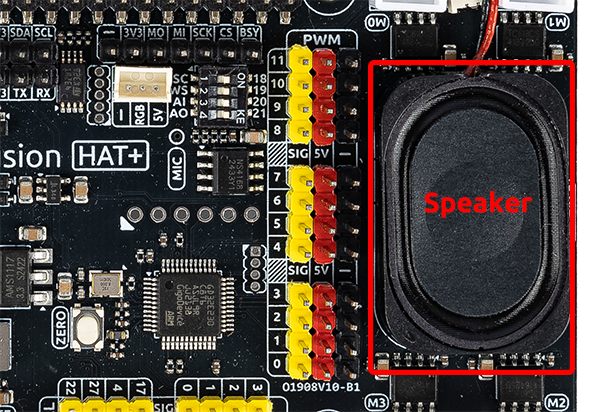

3.1.3 Fusion HAT Speaker
==============================

**Introduction**

The Fusion HAT is an expansion board designed for the Raspberry Pi and includes a built-in speaker, making it ideal for audio output tasks such as voice prompts, alarms, or sound effects in embedded AI and IoT applications.

This guide will walk you through verifying and testing the speaker on your Raspberry Pi system.

.. note::

   This guide assumes you have already installed Raspberry Pi OS and the necessary drivers for the Fusion HAT.

**What You’ll Need**

Below are the components required for this project:

.. list-table::
    :widths: 30 20
    :header-rows: 1

    *   - COMPONENT INTRODUCTION
        - PURCHASE LINK

    *   - Fusion HAT
        - 
    *   - Raspberry Pi Zero 2 W
        -

**Check if the Speaker is Recognized**

Before testing, confirm that the system recognizes the Fusion HAT's audio device.

Open a terminal and run:

.. code-block:: bash

   aplay -l

This command lists all audio playback devices. A successful output should look something like this:

.. code-block:: text

   **** List of PLAYBACK Hardware Devices ****
   card 0: sndrpigooglevoi [snd_rpi_googlevoicehat_soundcar], device 0: Google voiceHAT SoundCard HiFi voicehat-hifi-0 [Google voiceHAT SoundCard HiFi voicehat-hifi-0]
     Subdevices: 1/1
     Subdevice #0: subdevice #0

If you see a device listed under `card 0` or another card number with a name like `voicehat-hifi`, the speaker hardware is correctly detected.

**Enable the Speaker**

For safety reasons, the Fusion HAT speaker is **disabled by default**. You can enable it by running:

.. code-block:: bash

   fusion_hat enable_speaker

.. note::

   - This setting will remain active until the Raspberry Pi is powered off.
   - To disable the speaker manually (without rebooting), you can use:

   .. code-block:: bash

      fusion_hat disable_speaker

**Test the Speaker**

Once the speaker is enabled, you can verify its functionality using the following methods.

* Method 1: Using the `speaker-test` Command

   `speaker-test` is a tool provided by the ALSA audio system for generating test tones.

   1. Play a stereo test sound using:

      .. code-block:: bash

         speaker-test -t wav -c 2

      **Parameter Explanation**:

      - ``-t wav``: Uses pre-recorded WAV test files with spoken channel labels.
      - ``-c 2``: Enables stereo mode (two channels: left and right).

   2. If the speaker is working properly, you should hear the phrases “Front Left” and “Front Right” alternately from the speaker.

   3. To stop playback, press ``Ctrl + C``.

* Method 2: Playing a Test Audio File

   A sample sound file named `doorbell.wav` is included in the `music` directory of the AI Explorer Lab Kit. Use the following commands to play it:

   .. code-block:: bash

      cd ~/ai-explorer-lab-kit/music/
      aplay doorbell.wav

   If the speaker is functional, you will hear a doorbell sound.

   .. tip::

      You can also use your own `.wav` audio files with `aplay`. Just ensure the format is supported.

**Troubleshooting**

- **No sound output**:

  - Confirm the speaker is enabled using `fusion_hat enable_speaker`
  - Check if the volume is muted or too low using `alsamixer`
  - Ensure `aplay -l` shows a valid audio device

- **Speaker not listed in `aplay -l`**:

  - Check the physical connection of the Fusion HAT
  - Reboot the Raspberry Pi
  - Ensure the necessary drivers are installed (usually handled by OS updates)

- **Speaker output is distorted or delayed**:

  - Reduce CPU load or audio playback rate
  - Try mono (`-c 1`) or lower-quality playback for testing