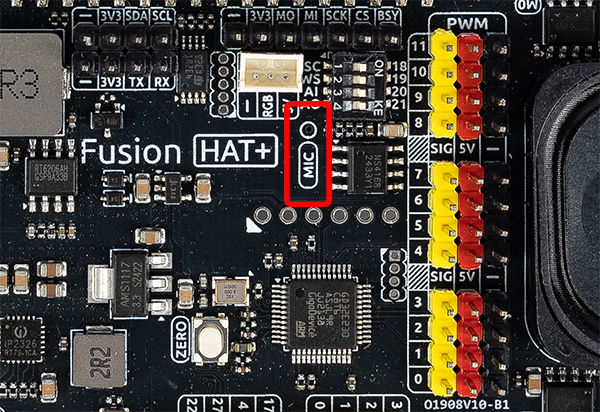

Raspberry Pi Microphone
==============================

**Introduction**

The Fusion HAT includes a built-in microphone, making it ideal for audio input applications such as voice recognition, sound detection, or recording logs in AI/IoT projects.

This guide will help you check if the microphone is recognized by the system and show you how to perform a basic recording test.

**What You’ll Need**

Below are the components required for this tutorial:

.. list-table::
    :widths: 30 20
    :header-rows: 1

    *   - Component
        - Purchase Link

    *   - Fusion HAT
        - 
    *   - Raspberry Pi Zero 2 W (or compatible model)
        - 

**Check if the Microphone is Recognized**

Use the following command to check whether the system has detected the microphone:

.. code-block:: bash

   arecord -l

This will list all audio **capture** devices available on your Raspberry Pi. Sample output:

.. code-block:: text

   **** List of CAPTURE Hardware Devices ****
   card 0: sndrpigooglevoi [snd_rpi_googlevoicehat_soundcar], device 0: Google voiceHAT SoundCard HiFi voicehat-hifi-0 [Google voiceHAT SoundCard HiFi voicehat-hifi-0]
     Subdevices: 1/1
     Subdevice #0: subdevice #0

If you see the `voicehat-hifi` listed under card 0, it means the microphone hardware is detected correctly.

**Enable the Audio Module**

For protection purposes, the audio module on the Fusion HAT is **disabled by default**. To enable it, run:

.. code-block:: bash

   fusion_hat enable_speaker

.. note::

   This setting remains active until the Raspberry Pi is powered off.
   If you want to disable the audio module again, either reboot the device or run:

   .. code-block:: bash

      fusion_hat disable_speaker

**Test the Microphone**

Once the microphone is enabled, you can perform a basic recording test:

1. Record a short audio sample:

   .. code-block:: bash

      rec -c 1 test.wav

   **Parameter Explanation**:

   - ``rec``: Command for recording (from the `sox` package)
   - ``-c 1``: Record in mono (1 channel)
   - ``test.wav``: Output file name

2. Playback the recorded file:

   .. code-block:: bash

      aplay test.wav

   If you hear your recorded voice, the microphone is working properly.

3. If the recorded volume is too low, you can amplify it using `sox`:

   .. code-block:: bash

      sox input.wav output.wav gain 5

   - ``input.wav``: The original recording
   - ``output.wav``: The amplified version
   - ``gain 5``: Increase the volume by 5 dB (you can adjust this value as needed)

**Adjust Microphone Volume**

If the recording volume is too low or muted, you can manually adjust the microphone gain:

1. Launch the ALSA mixer:

   .. code-block:: bash

      alsamixer

2. Press ``F6`` to select the correct sound card (e.g., USB or voiceHAT audio)

3. Use the arrow keys to increase the microphone level. If the mic is muted, unmute it (look for `MM` at the bottom—press ``M`` to toggle).

.. tip::

   If `rec` or `sox` is not installed, you can install them using:

   .. code-block:: bash

      sudo apt update
      sudo apt install sox

**Troubleshooting**

- **No input detected**:

  - Ensure the microphone is enabled with `fusion_hat enable_speaker`
  - Verify that `arecord -l` lists the correct device
  - Try using `arecord` instead of `rec` to test manually

- **Audio is distorted or noisy**:

  - Reduce the microphone gain in `alsamixer`
  - Avoid recording in noisy environments

- **`rec` command not found**:

  - Install `sox` with `sudo apt install sox`
