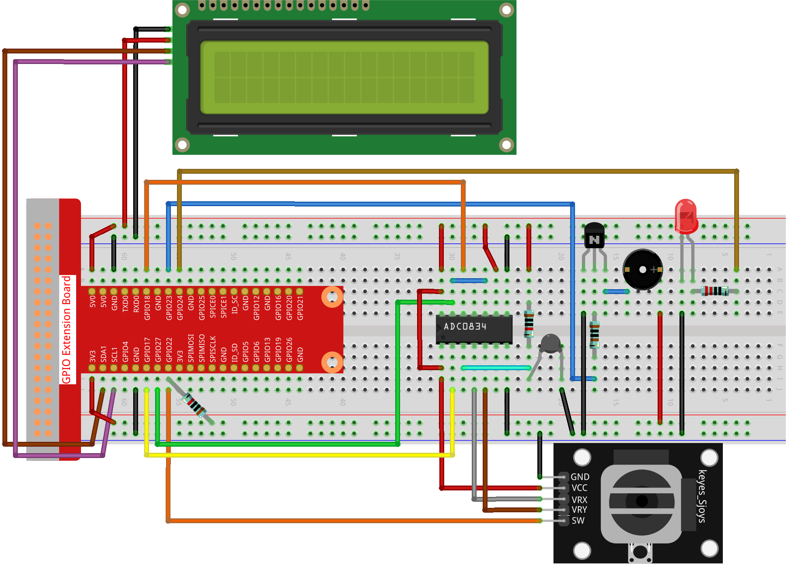

.. note::

    Hello, welcome to the SunFounder Raspberry Pi & Arduino & ESP32 Enthusiasts Community on Facebook! Dive deeper into Raspberry Pi, Arduino, and ESP32 with fellow enthusiasts.

    **Why Join?**

    - **Expert Support**: Solve post-sale issues and technical challenges with help from our community and team.
    - **Learn & Share**: Exchange tips and tutorials to enhance your skills.
    - **Exclusive Previews**: Get early access to new product announcements and sneak peeks.
    - **Special Discounts**: Enjoy exclusive discounts on our newest products.
    - **Festive Promotions and Giveaways**: Take part in giveaways and holiday promotions.

    👉 Ready to explore and create with us? Click [|link_sf_facebook|] and join today!

.. _4.1.10_py:

4.1.10 Overheat Monitor
========================

**Introduction**

In industrial or household settings, monitoring temperature is crucial to prevent overheating, which could lead to equipment damage or safety hazards. This project demonstrates how to build a smart overheat monitoring device using a thermistor, joystick, buzzer, LED, and LCD. The device allows real-time temperature monitoring and includes an adjustable temperature threshold feature for triggering alerts.

----------------------------------------------

**What You’ll Need**

The following components are required for this project:

.. list-table::
    :widths: 30 20
    :header-rows: 1

    *   - COMPONENT INTRODUCTION
        - PURCHASE LINK
    *   - GPIO Extension Board
        - |link_gpio_board_buy|
    *   - Breadboard
        - |link_breadboard_buy|
    *   - Wires
        - |link_wires_buy|
    *   - Resistors
        - |link_resistor_buy|
    *   - LED
        - |link_led_buy|
    *   - Joystick
        - N/A
    *   - ADC0834 Module
        - N/A
    *   - Transistor
        - |link_transistor_buy|
    *   - I2C LCD (16x2)
        - |link_i2clcd1602_buy|
    *   - Thermistor
        - |link_thermistor_buy|
    *   - Buzzer
        - N/A

----------------------------------------------

**Circuit Diagram**

The schematic diagram for the overheat monitor is shown below:

.. image:: ../python/img/4.1.13_overheat_monitor_schematic.png
   :align: center

----------------------------------------------

**Wiring Diagram**

Follow the wiring diagram to connect all components:

----------------------------------------------

**Writing the Code**

1. Navigate to the project directory:

   .. code-block:: bash

       cd ~/zero-w-ai-kit/python

2. Run the Python script:

   .. code-block:: bash

       sudo python3 4.1.13_OverheatMonitor_zero.py

   When the program is running:

   * The LCD will display the current temperature and the high-temperature threshold (default: 40°C).
   * If the current temperature exceeds the threshold, the LED and buzzer will activate as an alert.
   * Use the joystick to adjust the threshold. Push the joystick along the X or Y axes to increase or decrease the threshold. Press the joystick to reset the threshold to its initial value.

----------------------------------------------

**Code**

Here is the Python script for the overheat monitoring system:

.. code-block:: python

    #!/usr/bin/env python3

    import LCD1602
    from gpiozero import LED, Buzzer, Button
    import ADC0834
    import time
    import math

    # Initialize joystick button, buzzer, and LED
    Joy_BtnPin = Button(22)
    buzzPin = Buzzer(23)
    ledPin = LED(24)

    # Set initial upper temperature threshold
    upperTem = 40

    # Setup ADC and LCD modules
    ADC0834.setup()
    LCD1602.init(0x27, 1)

    def get_joystick_value():
        """Read joystick values and return a change value."""
        x_val = ADC0834.getResult(1)
        y_val = ADC0834.getResult(2)
        if x_val > 200:
            return 1
        elif x_val < 50:
            return -1
        elif y_val > 200:
            return -10
        elif y_val < 50:
            return 10
        else:
            return 0

    def upper_tem_setting():
        """Adjust the upper temperature threshold using joystick input."""
        global upperTem
        LCD1602.write(0, 0, 'Upper Adjust: ')
        change = int(get_joystick_value())
        upperTem += change
        strUpperTem = str(upperTem)
        LCD1602.write(0, 1, strUpperTem)
        LCD1602.write(len(strUpperTem), 1, ' ' * (16 - len(strUpperTem)))
        time.sleep(0.1)

    def temperature():
        """Read and calculate the current temperature in Celsius."""
        analogVal = ADC0834.getResult()
        Vr = 5 * float(analogVal) / 255
        Rt = 10000 * Vr / (5 - Vr)
        temp = 1 / (((math.log(Rt / 10000)) / 3950) + (1 / (273.15 + 25)))
        Cel = temp - 273.15
        return round(Cel, 2)

    def monitoring_temp():
        """Monitor temperature and trigger alerts if it exceeds the threshold."""
        global upperTem
        Cel = temperature()
        LCD1602.write(0, 0, 'Temp: ')
        LCD1602.write(0, 1, 'Upper: ')
        LCD1602.write(6, 0, str(Cel))
        LCD1602.write(7, 1, str(upperTem))
        time.sleep(0.1)
        if Cel >= upperTem:
            buzzPin.on()
            ledPin.on()
        else:
            buzzPin.off()
            ledPin.off()

    # Main execution loop
    try:
        lastState = 1
        stage = 0
        while True:
            currentState = Joy_BtnPin.value
            if currentState == 1 and lastState == 0:
                stage = (stage + 1) % 2
                time.sleep(0.1)
                LCD1602.clear()
            lastState = currentState
            if stage == 1:
                upper_tem_setting()
            else:
                monitoring_temp()
    except KeyboardInterrupt:
        LCD1602.clear()
        ADC0834.destroy()

This Python script integrates a temperature monitoring system with a joystick-controlled adjustable threshold. It provides the following functionalities:

1. **Temperature Measurement**: Reads the current temperature using the ADC0834 module and displays it on the LCD.

2. **Upper Threshold Adjustment**:

   - Uses a joystick to adjust the upper temperature threshold:

     - Horizontal movements (left/right) change the threshold by ±1.
     - Vertical movements (up/down) change the threshold by ±10.

   - The updated threshold is displayed in real-time on the LCD.

3. **Alert Mechanism**:

   - If the temperature exceeds the threshold:

     - A buzzer (GPIO pin 23) turns on.
     - An LED (GPIO pin 24) lights up.

   - The buzzer and LED turn off when the temperature falls below the threshold.

4. **Joystick Button Functionality**: The joystick button (GPIO pin 22) toggles between two modes:
   
   - Threshold adjustment mode.
   - Temperature monitoring mode.

5. **Graceful Exit**: On ``Ctrl+C``, the LCD is cleared, and the ADC module is safely shut down.

----------------------------------------------

**Understanding the Code**

1. **Initialization:**

   * Sets up GPIO pins for the joystick button, buzzer, and LED.
   * Initializes the ADC and LCD modules.

2. **Joystick Input:**

   * Reads joystick values to determine adjustments to the temperature threshold.

3. **Temperature Monitoring:**

   * Continuously monitors the current temperature and updates the LCD display.
   * Triggers an alarm (LED and buzzer) if the temperature exceeds the threshold.

4. **Mode Switching:**

   * Toggles between "threshold adjustment" and "temperature monitoring" modes using the joystick button.

5. **Graceful Exit:**

   * Cleans up resources on script termination to ensure no GPIO pins are left active.

----------------------------------------------

**Troubleshooting**

1. **Temperature Not Displayed**:

   - **Cause**: ADC0834 module not properly set up.
   - **Solution**:

     - Verify the ADC0834 module is correctly connected and initialized with ``ADC0834.setup()``.
     - Ensure the thermistor is functional and wired properly.

2. **Joystick Not Responding**:

   - **Cause**: Incorrect joystick wiring or configuration.
   - **Solution**:

     - Verify connections for the joystick's X, Y, and button pins (ADC channels 1, 2, and GPIO 22).
     - Test the joystick independently to confirm functionality.

3. **Buzzer/LED Not Triggering**:

   - **Cause**: Incorrect wiring or GPIO pin configuration.
   - **Solution**:

     - Check the connections for the buzzer (GPIO 23) and LED (GPIO 24).
     - Test the components using simple scripts to ensure they function correctly.

4. **Threshold Adjustment Not Working**:

   - **Cause**: Joystick movement not detected or ``get_joystick_value()`` logic error.
   - **Solution**: Add debug prints to verify the values returned by ``get_joystick_value()``.

       .. code-block:: python

           print(f"Joystick Value: {get_joystick_value()}")

5. **LCD Not Displaying Properly**:

   - **Cause**: Incorrect I2C address or wiring.
   - **Solution**:

     - Verify the LCD's I2C address using ``i2cdetect -y 1``.
     - Update ``LCD1602.init()`` with the correct address.

6. **Script Crashes Unexpectedly**:

   - **Cause**: Resource cleanup issues on exit.
   - **Solution**: Ensure ``ADC0834.destroy()`` and ``LCD1602.clear()`` are called in the ``except KeyboardInterrupt`` block.

----------------------------------------------

**Extendable Ideas**

1. **Dynamic Threshold Alerts**: Add a hysteresis mechanism to avoid frequent toggling of alerts around the threshold.

2. **Data Logging**: Log temperature readings and threshold changes to a file for later analysis:

     .. code-block:: python

         with open("temperature_log.txt", "a") as log_file:
             log_file.write(f"{time.strftime('%Y-%m-%d %H:%M:%S')} - Temp: {Cel}, Threshold: {upperTem}\n")

3. **Temperature Unit Conversion**: Add functionality to display the temperature in Fahrenheit or Kelvin.

4. **Advanced Joystick Features**: Use long joystick presses for additional actions, such as resetting the threshold to default.

5. **Real-Time Clock Integration**: Add a real-time clock module to timestamp temperature readings on the LCD.

6. **Temperature Trends**: Calculate and display the rate of temperature change over time.

----------------------------------------------

**Conclusion**

This project combines multiple sensors and components to create a functional and interactive overheat monitoring device. It provides a practical understanding of temperature sensing, user input handling, and alert mechanisms. Experiment with the device to adapt it to various real-world scenarios, such as monitoring server rooms, household appliances, or industrial machinery.
