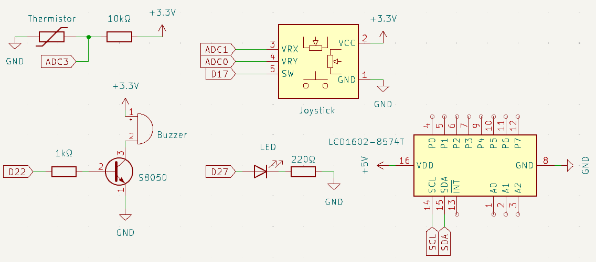
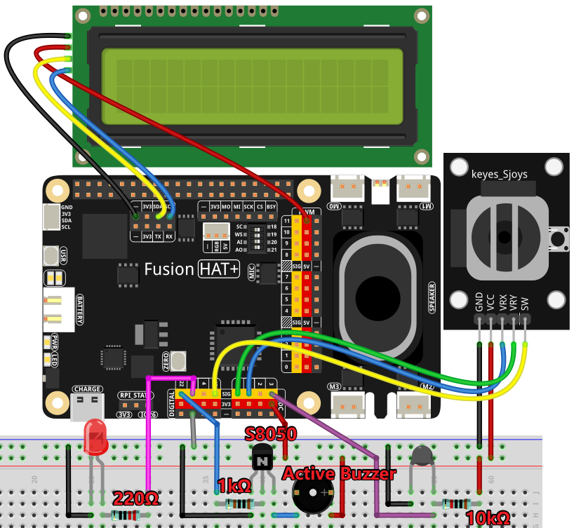

.. note::

    Hello, welcome to the SunFounder Raspberry Pi & Arduino & ESP32 Enthusiasts Community on Facebook! Dive deeper into Raspberry Pi, Arduino, and ESP32 with fellow enthusiasts.

    **Why Join?**

    - **Expert Support**: Solve post-sale issues and technical challenges with help from our community and team.
    - **Learn & Share**: Exchange tips and tutorials to enhance your skills.
    - **Exclusive Previews**: Get early access to new product announcements and sneak peeks.
    - **Special Discounts**: Enjoy exclusive discounts on our newest products.
    - **Festive Promotions and Giveaways**: Take part in giveaways and holiday promotions.

    👉 Ready to explore and create with us? Click [|link_sf_facebook|] and join today!

.. _4.1.10_py:

4.1.10 Overheat Monitor
========================

**Introduction**

In industrial or household settings, monitoring temperature is crucial to prevent overheating, which could lead to equipment damage or safety hazards. This project demonstrates how to build a smart overheat monitoring device using a thermistor, joystick, buzzer, LED, and LCD. The device allows real-time temperature monitoring and includes an adjustable temperature threshold feature for triggering alerts.

----------------------------------------------

**What You’ll Need**

The following components are required for this project:

.. list-table::
    :widths: 30 20
    :header-rows: 1

    *   - COMPONENT INTRODUCTION
        - PURCHASE LINK

    *   - :ref:`cpn_breadboard`
        - |link_breadboard_buy|
    *   - :ref:`cpn_wires`
        - |link_wires_buy|
    *   - :ref:`cpn_resistor`
        - |link_resistor_buy|
    *   - :ref:`cpn_led`
        - |link_led_buy|
    *   - :ref:`cpn_joystick`
        - 
    *   - :ref:`cpn_transistor`
        - |link_transistor_buy|
    *   - :ref:`cpn_i2c_lcd`
        - |link_i2clcd1602_buy|
    *   - :ref:`cpn_thermistor`
        - |link_thermistor_buy|
    *   - :ref:`cpn_buzzer`
        - 
    *   - Fusion HAT
        - 
    *   - Raspberry Pi Zero 2 W
        -

----------------------------------------------

**Circuit Diagram**

The schematic diagram for the overheat monitor is shown below:

----------------------------------------------

**Wiring Diagram**

Follow the wiring diagram to connect all components:

----------------------------------------------

**Running the Example**

All example code used in this tutorial is available in the ``ai-explorer-lab-kit`` directory. 
Follow these steps to run the example:

.. code-block:: shell
   
   cd ai-explorer-lab-kit/python/
   sudo python3 4.1.10_overheat_monitor_zero.py 

----------------------------------------------

**Writing the Code**

Here is the Python script for the overheat monitoring system:

.. raw:: html

   <run></run>

.. code-block:: python

    #!/usr/bin/env python3

    from fusion_hat import Pin, Buzzer, ADC,LCD1602
    import time
    import math

    # Initialize joystick button, buzzer, and LED
    Joy_BtnPin = Pin(17, Pin.IN, Pin.PULL_UP)
    xAxis = ADC('A1')
    yAxis = ADC('A0')

    buzzPin = Buzzer(Pin(22, Pin.OUT))
    ledPin = Pin(27, Pin.OUT)
    thermistor = ADC('A3')

    # Set initial upper temperature threshold
    upperTem = 40

    # Setup LCD modules
    lcd = LCD1602(address=0x27, backlight=1)

    def MAP(x, in_min, in_max, out_min, out_max):
        """
        Map a value from one range to another.
        :param x: The value to be mapped.
        :param in_min: The lower bound of the value's current range.
        :param in_max: The upper bound of the value's current range.
        :param out_min: The lower bound of the value's target range.
        :param out_max: The upper bound of the value's target range.
        :return: The mapped value.
        """
        return (x - in_min) * (out_max - out_min) / (in_max - in_min) + out_min

    def get_joystick_value():
        """
        Reads the joystick values and returns a change value based on the joystick's position.
        """
        x_val = MAP(xAxis.read(),0,4095,-100,100)
        y_val = MAP(yAxis.read(),0,4095,-100,100)
        if x_val > 50:
            return 1
        elif x_val < -50:
            return -1
        elif y_val > 50:
            return -10
        elif y_val < -50:
            return 10
        else:
            return 0

    def upper_tem_setting():
        """
        Adjusts and displays the upper temperature threshold on the LCD.
        """
        global upperTem
        lcd.write(0, 0, 'Upper Adjust: ')
        change = int(get_joystick_value())
        upperTem += change
        strUpperTem = str(upperTem)
        lcd.write(0, 1, strUpperTem)
        lcd.write(len(strUpperTem), 1, '              ')
        time.sleep(0.1)

    def temperature():
        """
        Reads the current temperature from the sensor and returns it in Celsius.
        """
        analogVal = thermistor.read()
        Vr = 3.3 * float(analogVal) / 4095
        if 3.3 - Vr < 0.1:
            print("Please check the thermistor")
            time.sleep(1)
            return None
        Rt = 10000 * Vr / (3.3 - Vr)
        temp = 1 / (((math.log(Rt / 10000)) / 3950) + (1 / (273.15 + 25)))
        Cel = temp - 273.15
        return round(Cel, 2)

    def monitoring_temp():
        """
        Monitors and displays the current temperature and upper temperature threshold. 
        Activates buzzer and LED if the temperature exceeds the upper limit.
        """
        global upperTem
        Cel = temperature()
        if Cel is None:
            return
        lcd.write(0, 0, 'Temp: ')
        lcd.write(0, 1, 'Upper: ')
        lcd.write(6, 0, str(Cel))
        lcd.write(7, 1, str(upperTem))
        time.sleep(0.1)
        if Cel >= upperTem:
            buzzPin.on()
            ledPin.on()
        else:
            buzzPin.off()
            ledPin.off()

    # Main execution loop
    try:
        lastState = 1
        stage = 0
        while True:
            currentState = Joy_BtnPin.value()
            # Toggle between settings and monitoring mode
            if currentState == 1 and lastState == 0:
                stage = (stage + 1) % 2
                time.sleep(0.1)
                lcd.clear()
            lastState = currentState
            if stage == 1:
                upper_tem_setting()
            else:
                monitoring_temp()

    except KeyboardInterrupt:
        # Clean up and exit
        lcd.clear()

This Python script integrates a temperature monitoring system with a joystick-controlled adjustable threshold. It provides the following functionalities:

1. **Temperature Measurement**: Reads the current temperature and displays it on the LCD.

2. **Upper Threshold Adjustment**:

   - Uses a joystick to adjust the upper temperature threshold:

     - Horizontal movements (left/right) change the threshold by ±1.
     - Vertical movements (up/down) change the threshold by ±10.

   - The updated threshold is displayed in real-time on the LCD.

3. **Alert Mechanism**:

   - If the temperature exceeds the threshold:

     - A buzzer turns on.
     - An LED lights up.

   - The buzzer and LED turn off when the temperature falls below the threshold.

4. **Joystick Button Functionality**: The joystick button toggles between two modes:
   
   - Threshold adjustment mode.
   - Temperature monitoring mode.

5. **Graceful Exit**: On ``Ctrl+C``, the LCD is cleared, and the ADC module is safely shut down.

----------------------------------------------

**Understanding the Code**

1. **Initialization:**

   * Sets up GPIO pins for the joystick button, buzzer, and LED.
   * Initializes the ADC and LCD modules.

2. **Joystick Input:**

   * Reads joystick values to determine adjustments to the temperature threshold.

3. **Temperature Monitoring:**

   * Continuously monitors the current temperature and updates the LCD display.
   * Triggers an alarm (LED and buzzer) if the temperature exceeds the threshold.

4. **Mode Switching:**

   * Toggles between "threshold adjustment" and "temperature monitoring" modes using the joystick button.

5. **Graceful Exit:**

   * Cleans up resources on script termination to ensure no GPIO pins are left active.

----------------------------------------------

**Troubleshooting**

1. **Temperature Not Displayed**:

   - **Cause**: Module not properly set up.
   - **Solution**:

     - Ensure the thermistor is functional and wired properly.

2. **Joystick Not Responding**:

   - **Cause**: Incorrect joystick wiring or configuration.
   - **Solution**:

     - Verify connections for the joystick's X, Y, and button pins (A1, A2 and GPIO 17, respectively).
     - Test the joystick independently to confirm functionality.

3. **Buzzer/LED Not Triggering**:

   - **Cause**: Incorrect wiring or GPIO pin configuration.
   - **Solution**:

     - Check the connections for the buzzer (GPIO 27) and LED (GPIO 22).
     - Test the components using simple scripts to ensure they function correctly.

4. **Threshold Adjustment Not Working**:

   - **Cause**: Joystick movement not detected or ``get_joystick_value()`` logic error.
   - **Solution**: Add debug prints to verify the values returned by ``get_joystick_value()``.

      .. code-block:: python

         print(f"Joystick Value: {get_joystick_value()}")

5. **LCD Not Displaying Properly**:

   - **Cause**: Incorrect I2C address or wiring.
   - **Solution**:

     - Verify the LCD's I2C address using ``i2cdetect -y 1``.

----------------------------------------------

**Extendable Ideas**

1. **Dynamic Threshold Alerts**: Add a hysteresis mechanism to avoid frequent toggling of alerts around the threshold.

2. **Data Logging**: Log temperature readings and threshold changes to a file for later analysis:

   .. code-block:: python

      with open("temperature_log.txt", "a") as log_file:
            log_file.write(f"{time.strftime('%Y-%m-%d %H:%M:%S')} - Temp: {Cel}, Threshold: {upperTem}\n")

3. **Temperature Unit Conversion**: Add functionality to display the temperature in Fahrenheit or Kelvin.

4. **Advanced Joystick Features**: Use long joystick presses for additional actions, such as resetting the threshold to default.

5. **Real-Time Clock Integration**: Add a real-time clock module to timestamp temperature readings on the LCD.

6. **Temperature Trends**: Calculate and display the rate of temperature change over time.

----------------------------------------------

**Conclusion**

This project combines multiple sensors and components to create a functional and interactive overheat monitoring device. It provides a practical understanding of temperature sensing, user input handling, and alert mechanisms. Experiment with the device to adapt it to various real-world scenarios, such as monitoring server rooms, household appliances, or industrial machinery.
