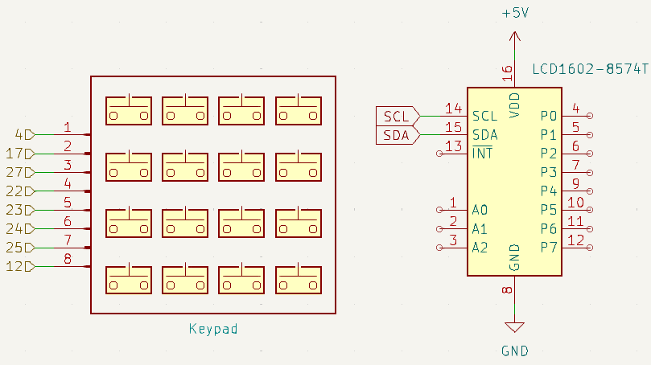

.. note::

    Hello, welcome to the SunFounder Raspberry Pi & Arduino & ESP32 Enthusiasts Community on Facebook! Dive deeper into Raspberry Pi, Arduino, and ESP32 with fellow enthusiasts.

    **Why Join?**

    - **Expert Support**: Solve post-sale issues and technical challenges with help from our community and team.
    - **Learn & Share**: Exchange tips and tutorials to enhance your skills.
    - **Exclusive Previews**: Get early access to new product announcements and sneak peeks.
    - **Special Discounts**: Enjoy exclusive discounts on our newest products.
    - **Festive Promotions and Giveaways**: Take part in giveaways and holiday promotions.

    👉 Ready to explore and create with us? Click [|link_sf_facebook|] and join today!

.. _4.1.11_py:

4.1.11 Password Lock
=====================

**Introduction**

In this project, we create a combination lock system using a keypad and an LCD display. The LCD provides prompts to enter a password, and the system checks the entered password against a predefined value. If the password is correct, the LCD displays a "Correct" message; otherwise, it shows an error prompt. 

This project can be further enhanced by adding components like buzzers or LEDs to create additional feedback mechanisms for password input.

----------------------------------------------

**What You’ll Need**

Below is the list of components required for this project:

.. list-table::
    :widths: 30 20
    :header-rows: 1

    *   - COMPONENT INTRODUCTION
        - PURCHASE LINK

    *   - :ref:`cpn_breadboard`
        - |link_breadboard_buy|
    *   - :ref:`cpn_wires`
        - |link_wires_buy|
    *   - :ref:`cpn_resistor`
        - |link_resistor_buy|
    *   - :ref:`cpn_i2c_lcd`
        - |link_i2clcd1602_buy|
    *   - :ref:`cpn_keypad`
        - |link_keypad_buy|
    *   - Fusion HAT
        - 
    *   - Raspberry Pi Zero 2 W
        -

----------------------------------------------

**Circuit Diagram**

Below is the schematic diagram for the password lock:

----------------------------------------------

**Wiring Diagram**

The wiring connections are shown below:

.. image:: img/fzz/4.1.11_bb.png
   :width: 800
   :align: center

----------------------------------------------

**Running the Example**

All example code used in this tutorial is available in the ``ai-explorer-lab-kit`` directory. 
Follow these steps to run the example:

.. code-block:: shell
   
   cd ai-explorer-lab-kit/python/
   sudo python3 4.1.11_PasswordLock_zero.py 

----------------------------------------------

**Writing the Code**

Here’s the Python script for the password lock system:

.. raw:: html

   <run></run>

.. code-block:: python

   #!/usr/bin/env python3

   from fusion_hat import Pin,Keypad,LCD1602
   from time import sleep

   # Password verification setup
   LENS = 4
   password = ['1', '9', '8', '4']  # Preset password
   testword = ['0', '0', '0', '0']  # User input storage
   keyIndex = 0  # Index for input keys

   def check():
      """
      Check if the entered password matches the preset password.
      :return: 1 if match, 0 otherwise.
      """
      for i in range(LENS):
         if password[i] != testword[i]:
               return 0
      return 1

   def loop():
      """
      Main loop for handling keypad input and password verification.
      """
      global keyIndex, last_key_pressed
      while True:
         pressed_keys = keypad.read()
         if pressed_keys and pressed_keys != last_key_pressed:
               if keyIndex < LENS:
                  lcd.clear()
                  lcd.write(0, 0, "Enter password:")
                  lcd.write(15 - keyIndex, 1, pressed_keys[0])
                  testword[keyIndex] = pressed_keys[0]
                  keyIndex += 1

               if keyIndex == LENS:
                  if check() == 0:
                     lcd.clear()
                     lcd.write(3, 0, "WRONG KEY!")
                     lcd.write(0, 1, "please try again")
                  else:
                     lcd.clear()
                     lcd.write(4, 0, "CORRECT!")
                     lcd.write(2, 1, "welcome back")
                  keyIndex = 0  # Reset key index after checking

         last_key_pressed = pressed_keys
         sleep(0.1)

   # Pin configuration for keypad
   rows_pins = [4, 17, 27, 22]
   cols_pins = [23, 24, 25, 12]
   keys = ["1", "2", "3", "A",
         "4", "5", "6", "B",
         "7", "8", "9", "C",
         "*", "0", "#", "D"]

   # Initialize keypad and LCD
   keypad = Keypad(rows_pins, cols_pins, keys)
   last_key_pressed = []
   lcd = LCD1602(address=0x27, backlight=1)
   lcd.clear()
   lcd.write(0, 0, 'WELCOME!')
   lcd.write(2, 1, 'Enter password')
   sleep(2)

   try:
      loop()
   except KeyboardInterrupt:
      lcd.clear()  # Clear LCD display on interrupt

This Python script implements a password verification system using a 4x4 keypad and an LCD1602 display. The program's functionalities include:

1. **Password Input**:

   - Users enter a predefined 4-character password using the keypad.
   - Each key press is displayed on the LCD, showing the entered digit in the password field.

2. **Password Validation**: When the 4-character password is complete, the script verifies it against the predefined password:
     
   - If the password is correct, the LCD displays:

      .. code-block:: python
         
         CORRECT!
         Welcome back

   - If the password is incorrect, the LCD displays:

      .. code-block:: python

         WRONG KEY!
         Please try again

3. **LCD Display**:

   - During password entry, the LCD provides feedback by displaying this label with the entered digits visible in real-time:

   .. code-block:: python

      Enter password:
   
4. **Continuous Operation**: The system continuously waits for input, resets after each attempt, and allows multiple password attempts.

5. **Graceful Exit**: On ``Ctrl+C``, the LCD is cleared, and the program exits cleanly.

----------------------------------------------

**Understanding the Code**

1. **Keypad Class:**  

   A custom class that manages the rows and columns of the keypad and detects pressed keys.  

2. **Password Logic:**  

   * ``password``: The predefined password.
   * ``testword``: Tracks user input.
   * ``check()``: Compares the user input to the predefined password.

3. **LCD Display:**  

   The LCD is initialized to display prompts and feedback to the user based on the input.

4. **Main Loop:**  

   The loop continuously checks for pressed keys, updates the display, and validates the input.

----------------------------------------------

**Troubleshooting**

1. **Keypad Does Not Respond**:

   - **Cause**: Incorrect wiring or GPIO configuration.
   - **Solution**:

     - Verify that the row and column pins are connected as specified in the ``rows_pins`` and ``cols_pins`` lists.
     - Test the keypad separately to ensure functionality.

2. **LCD Display Does Not Show Output**:

   - **Cause**: Incorrect I2C address or wiring.
   - **Solution**:

     - Use ``i2cdetect -y 1`` to verify the LCD's I2C address and update ``lcd = LCD1602(address=0x27, backlight=1)`` with the correct address.
     - Ensure SDA and SCL pins are connected correctly.

3. **Incorrect Password Always Detected**:

   - **Cause**: Mismatch between ``password`` and ``testword`` or input handling logic.
   - **Solution**:

     - Confirm the predefined ``password`` matches the expected input.
     - Add debugging prints to check the ``testword`` values during password entry:

       .. code-block:: python

           print(f"Testword: {testword}")

4. **LCD Shows Incomplete Characters**:

   - **Cause**: Keypad inputs not properly registered.
   - **Solution**: Increase the debounce time by adding a longer ``sleep(0.2)`` in the ``loop()`` function.

----------------------------------------------

**Extendable Ideas**

1. **Changeable Password**: Add functionality to allow users to change the predefined password after successful authentication.

   .. code-block:: python

      if check():
            lcd.write(0, 0, "Set new password")
            # Logic for capturing new password input

2. **Logging Attempts**: Log successful and failed password attempts with timestamps to a file:

   .. code-block:: python

      with open("attempts_log.txt", "a") as log_file:
            log_file.write(f"{time.strftime('%Y-%m-%d %H:%M:%S')} - {'Success' if check() else 'Failure'}\n")

3. **Enhanced Feedback**: Use a buzzer or LED to provide audio/visual feedback for successful or failed attempts.

4. **Multiple Users**: Allow multiple users with unique passwords and display customized greetings for each user.

5. **Max Attempts Lockout**: Lock the system after a specified number of incorrect attempts, requiring a reset to continue.

6. **Additional Security**: Add a timeout between failed attempts to prevent rapid guessing.

----------------------------------------------

**Conclusion**

This project demonstrates the basics of creating an interactive password lock using a keypad and LCD display. It offers a foundation for more complex access control systems by incorporating user-friendly feedback and real-time password verification. Experiment with the design to enhance its functionality and adaptability.
