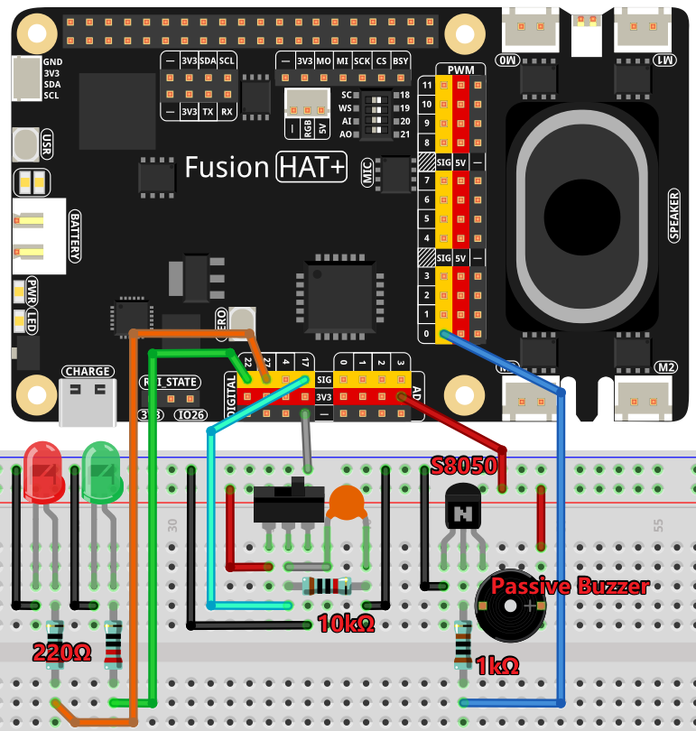

.. note::

    Hello, welcome to the SunFounder Raspberry Pi & Arduino & ESP32 Enthusiasts Community on Facebook! Dive deeper into Raspberry Pi, Arduino, and ESP32 with fellow enthusiasts.

    **Why Join?**

    - **Expert Support**: Solve post-sale issues and technical challenges with help from our community and team.
    - **Learn & Share**: Exchange tips and tutorials to enhance your skills.
    - **Exclusive Previews**: Get early access to new product announcements and sneak peeks.
    - **Special Discounts**: Enjoy exclusive discounts on our newest products.
    - **Festive Promotions and Giveaways**: Take part in giveaways and holiday promotions.

    👉 Ready to explore and create with us? Click [|link_sf_facebook|] and join today!

.. _4.1.12_py:

4.1.12 Alarm Bell
==================

**Introduction**

In this project, we will create a simple manual alarm system using a toggle switch, LEDs, and a buzzer. The toggle switch triggers the alarm, causing the buzzer to emit a sound and LEDs to flash alternately. Additionally, this project can be modified by replacing the toggle switch with a thermistor or a photosensitive sensor to create a temperature or light alarm system.

----------------------------------------------

**What You’ll Need**

Here are the components required for the project:

.. list-table::
    :widths: 30 20
    :header-rows: 1

    *   - COMPONENT INTRODUCTION
        - PURCHASE LINK

    *   - Breadboard
        - |link_breadboard_buy|
    *   - Wires
        - |link_wires_buy|
    *   - Resistors
        - |link_resistor_buy|
    *   - LED
        - |link_led_buy|
    *   - Buzzer (Tonal)
        - |link_passive_buzzer_buy|
    *   - Slide Switch
        - |link_slide_switch_buy|
    *   - Transistor
        - |link_transistor_buy|
    *   - Capacitor
        - |link_capacitor_buy|
    *   - Fusion HAT
        - 
    *   - Raspberry Pi Zero 2 W
        -

----------------------------------------------

**Circuit Diagram**

The schematic diagram for the alarm bell is shown below:

.. image:: ../python/img/4.1.15_ala
   :width: 600
   :align: center

----------------------------------------------

**Wiring Diagram**

Follow the wiring diagram to set up the circuit:

----------------------------------------------

**Writing the Code**

Below is the Python code for the alarm system:

.. code-block:: python

   #!/usr/bin/env python3
   from fusion_hat import Pin,Buzzer,PWM
   import time
   import threading

   # Initialize TonalBuzzer on GPIO pin 22
   BeepPin = Buzzer(PWM('P0'))  # Update this pin number based on your setup

   # Initialize LEDs on GPIO pins 17 and 27
   ALedPin = Pin(22,Pin.OUT)
   BLedPin = Pin(27,Pin.OUT)

   # Initialize Button on GPIO pin 17
   switchPin = Pin(17,Pin.IN, Pin.PULL_DOWN)

   # Global flag to control the buzzer and LED states
   flag = 0

   def ledWork():
      """
      Control LED blinking pattern based on the flag state.
      When flag is set, alternately blink ALedPin and BLedPin.
      """
      while True:
         if flag:
               # Alternate blinking of LEDs
               ALedPin.on()
               time.sleep(0.5)
               ALedPin.off()
               BLedPin.on()
               time.sleep(0.5)
               BLedPin.off()
         else:
               # Turn off both LEDs if flag is not set
               ALedPin.off()
               BLedPin.off()

   # Define the musical tune as a list of notes and their durations
   tune = [
      ('C4', 0.1), ('E4', 0.1), ('G4', 0.1), 
      (None, 0.1), 
      ('E4', 0.1), ('G4', 0.1), ('C5', 0.1), 
      (None, 0.1), 
      ('C5', 0.1), ('G4', 0.1), ('E4', 0.1), 
      (None, 0.1), 
      ('G4', 0.1), ('E4', 0.1), ('C4', 0.1), 
      (None, 0.1)
   ]

   def buzzerWork():
      """
      Play a tune using the buzzer based on the flag state.
      The tune is played only when the flag is set.
      """
      while True:
         for note, duration in tune:
               if flag == 0:
                  break
               print(note)  # Output the current note to the console
               BeepPin.play(note,duration)  # Play the current note
         BeepPin.off()  # Stop the buzzer after playing the tune

   def main():
      """
      Monitor button press to update the flag state.
      Sets the flag when the button is pressed.
      """
      global flag
      while True:
         flag = 1 if switchPin.value()==1 else 0

   try:
      # Initialize and start threads for buzzer and LED control
      tBuzz = threading.Thread(target=buzzerWork)
      tBuzz.start()
      tLed = threading.Thread(target=ledWork)
      tLed.start()
      main()

   except KeyboardInterrupt:
      # Stop the buzzer and turn off LEDs on program interruption
      BeepPin.off()
      ALedPin.off()    
      BLedPin.off()

This Python script creates an alarm system that integrates LEDs, a buzzer, and a switch. The program operates as follows:

1. **Alarm Activation**: When the button (``switchPin``) is pressed, the alarm is activated:

     - **LEDs**: Two LEDs (``ALedPin`` and ``BLedPin``) blink alternately every 0.5 seconds.
     - **Buzzer**: The buzzer plays a predefined musical tune repeatedly.

2. **Alarm Deactivation**: Releasing the button immediately deactivates the alarm:

     - The LEDs turn off.
     - The buzzer stops playing.

3. **Multi-Threading**: Separate threads are used to control the LEDs and buzzer, ensuring smooth operation and responsiveness.

4. **Continuous Monitoring**: The system continuously monitors the button state, toggling the alarm on or off based on the input.

5. **Graceful Exit**: On ``Ctrl+C``, the program stops all threads, turns off the LEDs, and stops the buzzer.

----------------------------------------------

**Understanding the Code**

1. **Components Setup:**

   * The buzzer is connected to P0.  
   * Two LEDs are connected to GPIO pins 22 and 27.  
   * A button is connected to GPIO pin 17, serving as the toggle switch.  

2. **Global Flag:**

   The ``flag`` variable is used to control the alarm state. When the switch is pressed, the flag is set to 1, activating the buzzer and LEDs.  

3. **LED Blinking:**

   The ``ledWork`` function alternates the LEDs’ blinking pattern when the flag is set.  

4. **Buzzer Tune:**

   The ``buzzerWork`` function plays a predefined tune using the buzzer. The tune stops immediately if the flag is unset.  

5. **Main Function:**

   Continuously monitors the state of the button to control the flag.  

6. **Threads:**

   Separate threads are used to run the ``ledWork`` and ``buzzerWork`` functions concurrently.  

----------------------------------------------

**Troubleshooting**

1. **LEDs Do Not Blink**:

   - **Cause**: Incorrect wiring or GPIO configuration.
   - **Solution**:

     - Verify that ``ALedPin`` and ``BLedPin`` are connected to GPIO 22 and 27, respectively.
     - Test the LEDs independently with a simple GPIO script.

2. **Buzzer Does Not Sound**:

   - **Cause**: Faulty buzzer connection or incorrect GPIO pin.
   - **Solution**:

     - Ensure the buzzer is connected to P0 and ground.
     - Test the buzzer by manually calling ``BeepPin.play()`` with a single note.

3. **Button Does Not Toggle Alarm**:

   - **Cause**: Button not wired correctly or GPIO pin mismatch.
   - **Solution**:

     - Check the button connection to GPIO 17.
     - Ensure the button properly closes the circuit when pressed.

4. **High CPU Usage**:

   - **Cause**: Threads running without delays when the alarm is off.
   - **Solution**: Add small delays to reduce CPU load when ``flag`` is 0:

   .. code-block:: python

      if not flag:
            time.sleep(0.1)

5. **Buzzer Plays Incorrect Notes**:

   - **Cause**: Incorrect ``tune`` sequence or timing.
   - **Solution**: Verify that the ``tune`` list contains valid note and duration pairs.

----------------------------------------------

**Extendable Ideas**

1. **Adjustable Alarm Duration**: Add functionality to set a timer for how long the alarm remains active.

2. **Visual Indicator for Alarm Status**: Use an additional LED to indicate whether the alarm is currently active or inactive.

3. **Multiple Alarm Modes**: Add different alarm patterns for LEDs and buzzer based on specific triggers or user input.

4. **Customizable Tune**: Allow users to input their own musical tune for the buzzer.

5. **Emergency Override**: Add a second button to immediately disable the alarm, overriding other inputs.

----------------------------------------------

**Conclusion**

This project demonstrates the integration of basic electronic components to create an alarm system. By modifying the input trigger, this project can be adapted for various use cases, such as temperature or light alarms. Experiment with the code and components to explore more possibilities!
