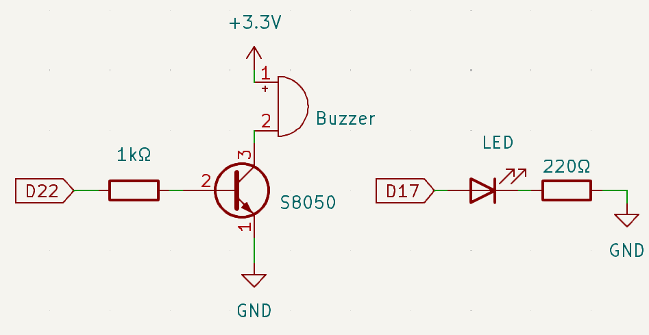
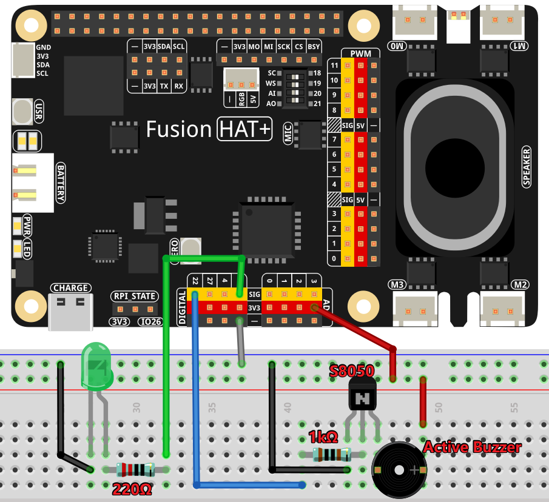

.. note::

    Hello, welcome to the SunFounder Raspberry Pi & Arduino & ESP32 Enthusiasts Community on Facebook! Dive deeper into Raspberry Pi, Arduino, and ESP32 with fellow enthusiasts.

    **Why Join?**

    - **Expert Support**: Solve post-sale issues and technical challenges with help from our community and team.
    - **Learn & Share**: Exchange tips and tutorials to enhance your skills.
    - **Exclusive Previews**: Get early access to new product announcements and sneak peeks.
    - **Special Discounts**: Enjoy exclusive discounts on our newest products.
    - **Festive Promotions and Giveaways**: Take part in giveaways and holiday promotions.

    👉 Ready to explore and create with us? Click [|link_sf_facebook|] and join today!

.. _4.1.13_py:

4.1.13 Morse Code Generator
===========================

**Introduction**

In this project, we will create a Morse code generator using a Raspberry Pi. You can input a series of characters via the terminal, and the system will output the corresponding Morse code signals using a buzzer and an LED. This project not only demonstrates basic GPIO control but also introduces Morse code, a fascinating communication method used historically for telegraphy.

----------------------------------------------

**What You’ll Need**

The following components are required:

.. list-table::
    :widths: 30 20
    :header-rows: 1

    *   - COMPONENT INTRODUCTION
        - PURCHASE LINK

    *   - :ref:`cpn_breadboard`
        - |link_breadboard_buy|
    *   - :ref:`cpn_wires`
        - |link_wires_buy|
    *   - :ref:`cpn_resistor`
        - |link_resistor_buy|
    *   - :ref:`cpn_led`
        - |link_led_buy|
    *   - :ref:`cpn_buzzer`
        - \-
    *   - :ref:`cpn_transistor`
        - |link_transistor_buy|
    *   - Fusion HAT
        - 
    *   - Raspberry Pi Zero 2 W
        -

----------------------------------------------

**Circuit Diagram**

The schematic diagram is shown below:

----------------------------------------------

**Wiring Diagram**

Build the circuit following the diagram below. Ensure correct polarity for the buzzer (the terminal with the "+" sign is the positive pole):

----------------------------------------------

**Running the Example**

All example code used in this tutorial is available in the ``ai-explorer-lab-kit`` directory. 
Follow these steps to run the example:

.. code-block:: shell
   
   cd ai-explorer-lab-kit/python/
   sudo python3 4.1.13_MorseCodeGenerator_zero.py 

----------------------------------------------

**Writing the Code**

Below is the Python code for this project:

.. code-block:: python

   #!/usr/bin/env python3
   from fusion_hat import Pin
   import time

   # Initialize Buzzer and LED to GPIO pins
   BeepPin = Pin(22, Pin.OUT)
   ALedPin = Pin(17, Pin.OUT)

   # Morse code representation for characters
   MORSECODE = {
      'A': '01', 'B': '1000', 'C': '1010', 'D': '100', 'E': '0', 'F': '0010', 'G': '110',
      'H': '0000', 'I': '00', 'J': '0111', 'K': '101', 'L': '0100', 'M': '11', 'N': '10',
      'O': '111', 'P': '0110', 'Q': '1101', 'R': '010', 'S': '000', 'T': '1',
      'U': '001', 'V': '0001', 'W': '011', 'X': '1001', 'Y': '1011', 'Z': '1100',
      '1': '01111', '2': '00111', '3': '00011', '4': '00001', '5': '00000',
      '6': '10000', '7': '11000', '8': '11100', '9': '11110', '0': '11111',
      '?': '001100', '/': '10010', ',': '110011', '.': '010101', ';': '101010',
      '!': '101011', '@': '011010', ':': '111000',
   }

   def on():
      """ Turn on the buzzer and LED. """
      BeepPin.on()
      ALedPin.on()

   def off():
      """ Turn off the buzzer and LED. """
      BeepPin.off()
      ALedPin.off()

   def beep(dt):  # dt for delay time.
      """
      Produce a beep sound and LED flash for the specified duration.
      :param dt: Duration for the beep and flash.
      """
      on()
      time.sleep(dt)
      off()
      time.sleep(dt)

   def morsecode(code):
      """
      Convert the input code into Morse code and signal it using the buzzer and LED.
      :param code: The text to be converted to Morse code.
      """
      pause = 0.25
      for letter in code:
         for tap in MORSECODE[letter]:
               if tap == '0':
                  beep(pause / 2)  # Short beep for dot
               if tap == '1':
                  beep(pause)      # Long beep for dash
         time.sleep(pause)  # Pause between letters

   def destroy():
      """ Clean up resources on script termination. """
      print("")
      BeepPin.off()
      ALedPin.off()

   try:
      while True:
         code = input("Please input the messenger:")
         code = code.upper()  # Convert to uppercase for Morse code lookup
         print(code)
         morsecode(code)
   except KeyboardInterrupt:
      destroy()

This Python script converts a user-provided message into Morse code and signals it using a buzzer and LED. Here's how it works:

1. **Morse Code Conversion**: The script translates the input text (letters, numbers, and some special characters) into Morse code using a predefined dictionary ``MORSECODE``.

2. **Audio-Visual Morse Code Output**:

   - For each dot (``0``), the buzzer and LED are activated for a short duration (half of the pause time).
   - For each dash (``1``), the buzzer and LED are activated for a longer duration (equal to the pause time).

3. **User Interaction**:

   - Users input a message, and the system converts and emits the corresponding Morse code.
   - The program continuously asks for new messages until interrupted.

4. **Graceful Exit**: On ``Ctrl+C``, the script stops, turns off the buzzer and LED, and exits cleanly.

----------------------------------------------

**Understanding the Code**

1. **Components Setup:**  

   The buzzer and LED are initialized on GPIO pins 22 and 17, respectively.

2. **Morse Code Dictionary:**  

   Morse code is represented using '0' for dots (short signals) and '1' for dashes (long signals). For example, 'A' is represented as "01".

3. **Signal Functions:**  

   * The ``on()`` and ``off()`` functions activate or deactivate the buzzer and LED.  
   * The ``beep()`` function combines these to create a signal with a specified duration.  

4. **Morse Code Conversion:**  

   The ``morsecode()`` function processes each letter of the input message. It emits a series of signals for each character using the Morse code dictionary.

5. **Main Loop:**  

   The program continuously prompts for user input and converts the input to Morse code signals. The loop can be terminated safely with ``Ctrl+C``.

----------------------------------------------

**Troubleshooting**

1. **Buzzer or LED Does Not Work**:

   - **Cause**: Incorrect wiring or GPIO pin configuration.
   - **Solution**:

     - Verify the buzzer is connected to GPIO 22 and the LED to GPIO 17.
     - Test the buzzer and LED independently using simple GPIO control scripts.

2. **Morse Code Output Is Inaccurate**:

   - **Cause**: Input characters not in the ``MORSECODE`` dictionary.
   - **Solution**:

     - Ensure the input contains only supported characters (A-Z, 0-9, and select symbols).
     - Extend the ``MORSECODE`` dictionary to include additional characters.

3. **Fast or Overlapping Signals**:

   - **Cause**: Inadequate timing for pauses or signal durations.
   - **Solution**: Adjust the ``pause`` variable in the ``morsecode()`` function for clearer signaling:

       .. code-block:: python

           pause = 0.5  # Increase pause duration for slower output

4. **Input Not Detected**:

   - **Cause**: Input issues in the runtime environment (e.g., no console).
   - **Solution**: Ensure the script is run in a terminal or environment that supports ``input()``.

----------------------------------------------

**Extendable Ideas**

1. **Adjustable Speed**: Allow users to set the Morse code signaling speed by inputting a custom pause value.

     .. code-block:: python

         pause = float(input("Enter pause duration (seconds): "))

2. **Multi-Device Output**: Add another LED or buzzer to display the Morse code simultaneously on different devices.

3. **Morse Code Logging**: Log the Morse code sequence to a file for each message:

     .. code-block:: python

         with open("morse_log.txt", "a") as log_file:
             log_file.write(f"{message} -> {morse_sequence}\n")

4. **Real-Time Translation**: Display the Morse code as dots and dashes in the console during output.

5. **Input Validation**: Notify users if unsupported characters are included in the input.

6. **Interactive Features**: Add a mode where users can input Morse code (via a button) and decode it into text.

7. **Wireless Morse Communication**: Use RF modules to transmit Morse code signals wirelessly to another device.

----------------------------------------------

**Conclusion**

This project is a fun way to explore Morse code and its application using Raspberry Pi. By leveraging simple components like a buzzer and LED, you can create a system that bridges historical communication methods with modern electronics. Experiment with the code to enhance your understanding and make it your own!
