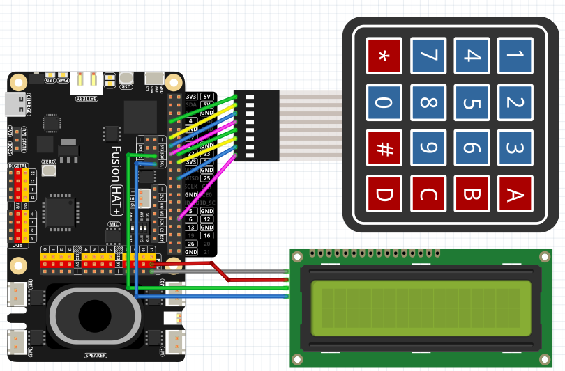

.. note::

    Hello, welcome to the SunFounder Raspberry Pi & Arduino & ESP32 Enthusiasts Community on Facebook! Dive deeper into Raspberry Pi, Arduino, and ESP32 with fellow enthusiasts.

    **Why Join?**

    - **Expert Support**: Solve post-sale issues and technical challenges with help from our community and team.
    - **Learn & Share**: Exchange tips and tutorials to enhance your skills.
    - **Exclusive Previews**: Get early access to new product announcements and sneak peeks.
    - **Special Discounts**: Enjoy exclusive discounts on our newest products.
    - **Festive Promotions and Giveaways**: Take part in giveaways and holiday promotions.

    👉 Ready to explore and create with us? Click [|link_sf_facebook|] and join today!

.. _4.1.14_py:

4.1.14 GAME - Guess Number
==============================

**Introduction**

The "Guess the Number" game is a classic party activity where players take turns guessing a hidden number within a specified range. With each guess, the range narrows based on whether the guess is too high or too low, until someone correctly identifies the hidden number. In this project, we bring this game to life using a Raspberry Pi, a keypad for input, and an LCD to display outcomes and guide gameplay.

----------------------------------------------

**What You’ll Need**

Below is the list of components required for this project:

.. list-table::
    :widths: 30 20
    :header-rows: 1

    *   - COMPONENT INTRODUCTION
        - PURCHASE LINK

    *   - Breadboard
        - |link_breadboard_buy|
    *   - Wires
        - |link_wires_buy|
    *   - Resistors
        - |link_resistor_buy|
    *   - Keypad
        - |link_keypad_buy|
    *   - I2C LCD
        - |link_i2clcd1602_buy|
    *   - Fusion HAT
        - 
    *   - Raspberry Pi Zero 2 W
        -

----------------------------------------------

**Circuit Diagram**

Below is the schematic diagram for the "Guess the Number" game:

.. image:: ../python/img/4.1.17_game_guess_number
   :align: center

----------------------------------------------

**Wiring Diagram**

Follow the wiring instructions shown below to set up the circuit:

----------------------------------------------

**Writing the Code**

.. code-block:: python

   #!/usr/bin/env python3
   from fusion_hat import Pin,LCD1602,Keypad
   from time import sleep
   import random

   # Game-related variables
   count = 0
   pointValue = 0
   upper = 99
   lower = 0

   """
   Setup function for initializing the keypad and LCD display.
   """
   global keypad, last_key_pressed, keys
   # Configure rows, columns, and keypad layout
   # pin from left to right - 4 17 27 22 23 24 25 12
   rows_pins = [4, 17, 27, 22]
   cols_pins = [23, 24, 25, 12]
   keys = ["1", "2", "3", "A",
         "4", "5", "6", "B",
         "7", "8", "9", "C",
         "*", "0", "#", "D"]

   # Create an instance of the Keypad class
   keypad = Keypad(rows_pins, cols_pins, keys)
   last_key_pressed = []

   lcd = LCD1602(address=0x27, backlight=1)
   lcd.clear()
   lcd.write(0, 0, 'Welcome!')
   lcd.write(0, 1, 'Press A to Start!')

   def init_new_value():
      """
      Initialize a new target value and reset game parameters.
      """
      global pointValue, upper, lower, count
      pointValue = random.randint(0, 99)
      upper = 99
      lower = 0
      count = 0
      print('point is %d' % pointValue)

   def detect_point():
      """
      Check if the guessed number is the target, too high, or too low.
      :return: 1 if correct guess, 0 otherwise.
      """
      global count, upper, lower
      if count > pointValue and count < upper:
         upper = count
      elif count < pointValue and count > lower:
         lower = count
      elif count == pointValue:
         count = 0
         return 1
      count = 0
      return 0

   def lcd_show_input(result):
      """
      Display the current game state and results on the LCD.
      :param result: Result of the last guess (0 or 1).
      """
      lcd.clear()
      if result == 1:
         lcd.write(0, 1, 'You have got it!')
         sleep(5)
         init_new_value()
         lcd_show_input(0)
      else:
         lcd.write(0, 0, 'Enter number:')
         lcd.write(13, 0, str(count))
         lcd.write(0, 1, str(lower))
         lcd.write(3, 1, ' < Point < ')
         lcd.write(13, 1, str(upper))

   def loop():
      """
      Main game loop for handling keypad input and updating game state.
      """
      global keypad, last_key_pressed, count
      while True:
         result = 0
         pressed_keys = keypad.read()
         if pressed_keys and pressed_keys != last_key_pressed:
               if pressed_keys == ["A"]:
                  init_new_value()
                  lcd_show_input(0)
               elif pressed_keys == ["D"]:
                  result = detect_point()
                  lcd_show_input(result)
               elif pressed_keys[0] in keys:
                  if pressed_keys[0] in ["A", "B", "C", "D", "#", "*"]:
                     continue
                  count = count * 10 + int(pressed_keys[0])
                  if count >= 10:
                     result = detect_point()
                  lcd_show_input(result)
               print(pressed_keys)
         last_key_pressed = pressed_keys
         sleep(0.1)

   try:
      loop()
   except KeyboardInterrupt:
      lcd.clear()  # Clear LCD on interrupt

* When the program starts, the LCD displays the following prompt:

   .. code-block::

      Welcome!
      Press A to go!

* Press ``A`` on the keypad to begin the game. The game page will display:

   .. code-block::

      Enter number:
      0 < point < 99

* The Raspberry Pi generates a hidden random number (``point``) within the range of 0 to 99. Players must guess the number based on the range displayed on the LCD. After entering a number:

  * Press ``D`` to confirm the guess.
  * If the guess is incorrect, the range narrows.
  * If the correct number is guessed, the LCD displays:

   .. code-block::

      You've got it!

----------------------------------------------

**Understanding the Code**

1. **Keypad Class:**  

   * Initializes row and column pins for the keypad.
   * Detects and returns the pressed keys.

2. **Game Logic:**  

   - Players input guesses using the keypad.
   - Pressing "D" submits the current guess.
   - The LCD provides feedback:

     - Displays the guessed number and the current range of possible values.
     - Updates the range dynamically based on whether the guess is too high or too low.

3. **Win Condition**:

   - When the player guesses the correct number, the LCD displays: ``You have got it!``
   - A new random target number is generated automatically after a brief delay.

4. **Continuous Play**: The game resets after each win and allows for multiple rounds.

5. **Graceful Exit**: On ``Ctrl+C``, the LCD is cleared, and the program exits cleanly.

----------------------------------------------

**Troubleshooting**

1. **Keypad Does Not Respond**:

   - **Cause**: Incorrect wiring or GPIO pin configuration.
   - **Solution**:

      - Verify the keypad's row and column pins are correctly connected as defined in ``rowsPins`` and ``colsPins``.
      - Test the keypad independently with a simple script.

2. **LCD Not Displaying Correctly**:

   - **Cause**: Incorrect I2C address or wiring.
   - **Solution**:

      - Use ``i2cdetect -y 1`` to confirm the LCD's I2C address.
      - Update ``lcd = LCD1602(address=0x27, backlight=1)`` with the correct address.

3. **Game Logic Fails (e.g., Wrong Range Updates)**:

   - **Cause**: Logical error in the ``detect_point()`` function.
   - **Solution**:

      - Verify the conditions for updating ``upper`` and ``lower`` bounds.
      - Add debug prints to monitor variable values:

      .. code-block:: python

         print(f"Target: {pointValue}, Guess: {count}, Lower: {lower}, Upper: {upper}")

4. **No Feedback on "A" or "D" Keys**:

   - **Cause**: Incorrect handling of special keys.
   - **Solution**: Ensure the keys "A" and "D" are recognized in the ``loop()`` function.

5. **Input Issues with Digits**:

   - **Cause**: Incorrect handling of numeric inputs.
   - **Solution**: Ensure only valid digits (0-9) update the ``count`` variable.

----------------------------------------------

**Extendable Ideas**

1. **Difficulty Levels**: Add an option to select difficulty levels (e.g., Easy: 0-50, Medium: 0-99, Hard: 0-999).

2. **Game Timer**: Introduce a timer to limit the time available for each round, displaying the remaining time on the LCD.

3. **Score Tracking**: Keep track of the number of guesses and display the score on the LCD after each round.

4. **Hint System**: Provide hints (e.g., "Much Higher" or "Slightly Lower") based on how close the guess is to the target number.

5. **Multiplayer Mode**: Allow two players to compete by taking turns guessing, with the winner being the one who guesses correctly first.

6. **Randomized Feedback**: Display varied congratulatory messages upon winning, such as "Great Job!" or "You Nailed It!"

7. **Audio Feedback**: Use a buzzer to emit different tones for correct and incorrect guesses.

----------------------------------------------

**Conclusion**

The "Guess the Number" game combines entertainment with practical Raspberry Pi programming. It introduces core concepts such as GPIO control, random number generation, and user interface design using an LCD and keypad. Expand on this foundation to create more engaging interactive projects!
