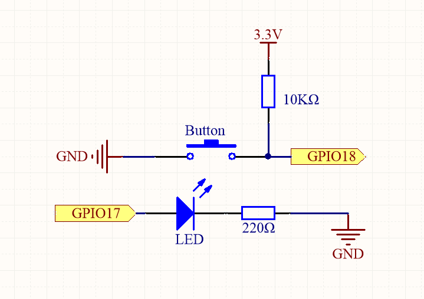
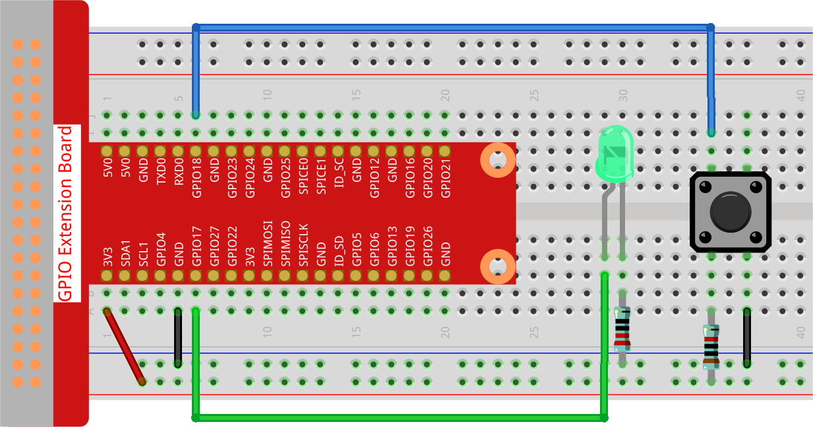

.. note::

    Hello, welcome to the SunFounder Raspberry Pi & Arduino & ESP32 Enthusiasts Community on Facebook! Dive deeper into Raspberry Pi, Arduino, and ESP32 with fellow enthusiasts.

    **Why Join?**

    - **Expert Support**: Solve post-sale issues and technical challenges with help from our community and team.
    - **Learn & Share**: Exchange tips and tutorials to enhance your skills.
    - **Exclusive Previews**: Get early access to new product announcements and sneak peeks.
    - **Special Discounts**: Enjoy exclusive discounts on our newest products.
    - **Festive Promotions and Giveaways**: Take part in giveaways and holiday promotions.

    👉 Ready to explore and create with us? Click [|link_sf_facebook|] and join today!

.. _4.1.1_py:

4.1.1 Camera
===================

**Introduction**

This project demonstrates how to create a simple camera system with a shutter button using the Raspberry Pi Zero. When you press the button, the camera captures a photo, and an LED flashes to indicate the action. This is a great way to get hands-on experience with GPIO control and the Raspberry Pi Camera Module.

----------------------------------------------

**What You’ll Need**

The following components are required for this project:

.. list-table::
    :widths: 30 20
    :header-rows: 1

    * - COMPONENT INTRODUCTION
      - PURCHASE LINK
    * - GPIO Extension Board
      - |link_gpio_board_buy|
    * - Breadboard
      - |link_breadboard_buy|
    * - Wires
      - |link_wires_buy|
    * - Resistor
      - |link_resistor_buy|
    * - LED
      - |link_led_buy|
    * - Button
      - |link_button_buy|
    * - Camera Module
      - |link_camera_buy|

----------------------------------------------

**Circuit Diagram**

Below is the GPIO pin mapping for this project:

----------------------------------------------

**Wiring Diagram**

Follow this wiring diagram to set up the circuit:

----------------------------------------------

**Writing the Code**

Navigate to the directory containing the Python script:

.. code-block:: bash

    cd ~/zero-w-ai-kit/python

Run the script using the following command:

.. code-block:: bash

    sudo python3 4.1.1_Camera_zero.py

Once the script is running, pressing the button will make the LED flash and capture a photo named ``my_photo.jpg``, saved in the ``~`` directory.

.. note::
    You can also open the script ``4.1.1_Camera_zero.py`` in a Python IDE, execute it by clicking the "Run" button, and stop it with the "Stop" button.

To download the photo to your PC, refer to :ref:`filezilla`.

----------------------------------------------

**Code**

Here is the Python code used for this project:

.. code-block:: python

   #!/usr/bin/env python3
   from picamera2 import Picamera2, Preview
   from gpiozero import LED, Button
   import time
   import os

   # Get the current user's home directory
   user_home = os.path.expanduser('~')

   # Initialize the camera
   camera = Picamera2()
   camera.start()

   # Initialize LED and button
   led = LED(17)  # LED connected to GPIO pin 17
   button = Button(18)  # Button connected to GPIO pin 18

   # Variable to track the camera's status
   global status
   status = False

   def take_photos():
       """Triggers the camera to capture a photo when the button is pressed."""
       global status
       status = True

   try:
       # Assign the function to the button press event
       button.when_pressed = take_photos

       # Main loop
       while True:
           if status:
               # Blink the LED to indicate a photo is being taken
               for _ in range(5):
                   led.on()
                   time.sleep(0.1)
                   led.off()
                   time.sleep(0.1)

               # Capture and save the photo
               camera.capture_file(f'{user_home}/my_photo.jpg')
               print("Photo captured!")
               status = False
           else:
               led.off()
           time.sleep(1)

   except KeyboardInterrupt:
       # Cleanup on exit
       camera.stop_preview()
       led.off()

This Python script integrates a Raspberry Pi camera with an LED and a button to create an interactive photo capture system. When executed:

1. **Initial Setup**:

   - The camera starts and is ready to capture photos.
   - An LED (connected to GPIO pin 17) and a button (connected to GPIO pin 18) are initialized.

2. **Photo Capture Trigger**:

   - When the button is pressed, the LED blinks to indicate the camera is capturing a photo.
   - The camera captures a photo and saves it to the user's home directory as ``my_photo.jpg``.
   - The console displays the message ``Photo captured!``.

3. **Continuous Monitoring**:

   - The script continuously monitors the button press event to trigger photo capture.

4. **Graceful Exit**:

   - On ``Ctrl+C``, the script stops the camera preview and turns off the LED.

----------------------------------------------

**Understanding the Code**

1. **Imports:**

   The script uses ``Picamera2`` to control the camera, ``gpiozero`` for GPIO management, and ``os`` for file handling.

   .. code-block:: python

       from picamera2 import Picamera2, Preview
       from gpiozero import LED, Button
       import time
       import os

2. **User Home Directory:**

   The photo is saved in the user's home directory for easy access.

   .. code-block:: python

       user_home = os.path.expanduser('~')

3. **Camera Initialization:**

   Initializes the camera and starts it for capturing photos.

   .. code-block:: python

       camera = Picamera2()
       camera.start()

4. **GPIO Setup:**

   Configures the LED and button using GPIO pins 17 and 18, respectively.

   .. code-block:: python

       led = LED(17)
       button = Button(18)

5. **Button Press Event:**

   Assigns the ``take_photos`` function to execute whenever the button is pressed.

   .. code-block:: python

       button.when_pressed = take_photos

6. **Main Loop:**

   Continuously checks the ``status`` variable. When a button press is detected, the LED blinks five times, and the camera captures a photo.

   .. code-block:: python

       while True:
           if status:
               for _ in range(5):
                   led.on()
                   time.sleep(0.1)
                   led.off()
                   time.sleep(0.1)
               camera.capture_file(f'{user_home}/my_photo.jpg')
               status = False
           time.sleep(1)

7. **Graceful Exit:**

   Handles keyboard interrupts to stop the camera preview and turn off the LED.

   .. code-block:: python

       except KeyboardInterrupt:
           camera.stop_preview()
           led.off()

----------------------------------------------

**Troubleshooting**

1. **Photo Not Captured**:

   - **Cause**: The button is not wired correctly or the camera is not initialized.
   - **Solution**:

     - Ensure the button is connected to GPIO pin 18 and ground.
     - Verify that the camera is properly connected and enabled via ``raspi-config``.

2. **LED Does Not Blink**:

   - **Cause**: Incorrect LED wiring or GPIO configuration.
   - **Solution**:

     - Ensure the LED is connected to GPIO pin 17 with an appropriate resistor.
     - Test the LED separately to confirm it functions correctly.

3. **Photo Overwritten**:

   - **Cause**: The file ``my_photo.jpg`` is overwritten each time a photo is taken.
   - **Solution**: Save photos with unique filenames using timestamps:

     .. code-block:: python

         timestamp = time.strftime("%Y%m%d-%H%M%S")
         camera.capture_file(f'{user_home}/photo_{timestamp}.jpg')

4. **Script Crashes with Camera Error**:

   - **Cause**: The camera module is not detected or in use by another process.
   - **Solution**:

     - Ensure the camera is properly connected and restart the Raspberry Pi.
     - Check for conflicting processes using ``sudo lsof /dev/video*``.

5. **Button Press Not Detected**:

   - **Cause**: Incorrect button wiring or configuration.
   - **Solution**:

     - Verify the button is connected to GPIO pin 18 and ground.
     - Ensure the internal pull-up resistor is configured correctly in the ``gpiozero.Button`` class.

----------------------------------------------

**Extendable Ideas**

1. **Multiple Photos**: Allow multiple photos to be captured in a session, each with a unique filename:

     .. code-block:: python

         counter = 0
         camera.capture_file(f'{user_home}/photo_{counter}.jpg')
         counter += 1

2. **Video Recording**: Extend the functionality to record videos when the button is pressed:

     .. code-block:: python

         camera.start_recording(f'{user_home}/my_video.h264')
         time.sleep(10)
         camera.stop_recording()

3. **LED Status Indicator**: Use the LED to indicate the camera's readiness or status:

     - Solid light: Ready.
     - Blinking: Capturing a photo.

4. **Photo Gallery Management**: Organize captured photos into folders based on date or event.

5. **Timelapse Photography**: Capture photos at regular intervals to create a timelapse:

     .. code-block:: python

         for i in range(10):
             camera.capture_file(f'{user_home}/timelapse_{i}.jpg')
             time.sleep(5)

----------------------------------------------

**Conclusion**

This project introduces a basic camera setup with a button-triggered shutter mechanism. It combines GPIO control with the Picamera2 library to demonstrate how to create interactive Raspberry Pi projects. Experiment further to expand its functionality and create more engaging applications.
