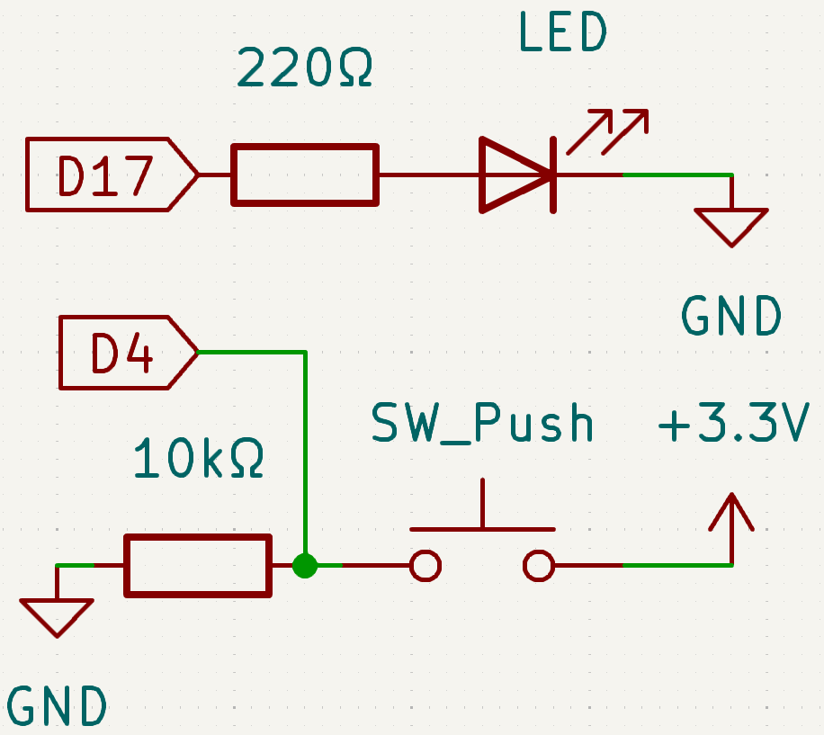

.. note::

    Hello, welcome to the SunFounder Raspberry Pi & Arduino & ESP32 Enthusiasts Community on Facebook! Dive deeper into Raspberry Pi, Arduino, and ESP32 with fellow enthusiasts.

    **Why Join?**

    - **Expert Support**: Solve post-sale issues and technical challenges with help from our community and team.
    - **Learn & Share**: Exchange tips and tutorials to enhance your skills.
    - **Exclusive Previews**: Get early access to new product announcements and sneak peeks.
    - **Special Discounts**: Enjoy exclusive discounts on our newest products.
    - **Festive Promotions and Giveaways**: Take part in giveaways and holiday promotions.

    👉 Ready to explore and create with us? Click [|link_sf_facebook|] and join today!

.. _4.1.1_py:

4.1.1 Camera
===================

**Introduction**

This project demonstrates how to create a simple camera system with a shutter button using the Raspberry Pi Zero. When you press the button, the camera captures a photo, and an LED flashes to indicate the action. This is a great way to get hands-on experience with GPIO control and the Raspberry Pi Camera Module.

----------------------------------------------

**What You’ll Need**

The following components are required for this project:

.. list-table::
    :widths: 30 20
    :header-rows: 1

    *   - COMPONENT INTRODUCTION
        - PURCHASE LINK

    *   - Breadboard
        - |link_breadboard_buy|
    *   - Wires
        - |link_wires_buy|
    *   - Resistor
        - |link_resistor_buy|
    *   - LED
        - |link_led_buy|
    *   - Button
        - |link_button_buy|
    *   - Camera Module
        - |link_camera_buy|
    *   - Fusion HAT
        - 
    *   - Raspberry Pi Zero 2 W
        -

----------------------------------------------

**Circuit Diagram**

Below is the GPIO pin mapping for this project:

----------------------------------------------

**Wiring Diagram**

Follow this wiring diagram to set up the circuit:

----------------------------------------------

**Writing the Code**

Here is the Python code used for this project:

.. code-block:: python

   from picamera2 import Picamera2, Preview
   from fusion_hat import Pin
   import time
   import os

   # Get the current user's login name and home directory
   user = os.getlogin()
   user_home = os.path.expanduser(f'~{user}')

   # Initialize the camera
   camera = Picamera2()
   camera.start()

   # Initialize a variable to track the camera's status
   global status
   status = False

   # Set up LED and button with their GPIO pin numbers
   led = Pin(17, Pin.OUT)
   button = Pin(4, Pin.IN, Pin.PULL_DOWN)

   def takePhotos(pin):
      """Function to set the camera's status to True when the button is pressed."""
      global status
      status = True

   try:
      # Assign the function to be called when the button is pressed
      button.when_activated = takePhotos
      
      # Main loop
      while True:
         # Check if the button has been pressed
         if status:
               # Blink the LED five times
               for i in range(5):
                  led.on()
                  time.sleep(0.1)
                  led.off()
                  time.sleep(0.1)
               # Capture and save a photo
               camera.capture_file(f'{user_home}/my_photo.jpg')
               print('Take a photo!')          
               # Reset the status
               status = False
         else:
               # Turn off the LED if not capturing
               led.off()
         
         # Wait for a short period before checking the button status again
         time.sleep(1)

   except KeyboardInterrupt:
      # Stop the camera and turn off the LED if a KeyboardInterrupt occurs
      camera.stop_preview()
      led.off()
      pass

This Python script integrates a Raspberry Pi camera with an LED and a button to create an interactive photo capture system. When executed:

1. **Initial Setup**:

   - The camera starts and is ready to capture photos.
   - An LED (connected to GPIO pin 17) and a button (connected to GPIO pin 4) are initialized.

2. **Photo Capture Trigger**:

   - When the button is pressed, the LED blinks to indicate the camera is capturing a photo.
   - The camera captures a photo and saves it to the user's home directory as ``my_photo.jpg``.
   - The console displays the message ``Photo captured!``.

3. **Continuous Monitoring**:

   - The script continuously monitors the button press event to trigger photo capture.

4. **Graceful Exit**:

   - On ``Ctrl+C``, the script stops the camera preview and turns off the LED.

To download the photo to your PC, refer to :ref:`filezilla`.

----------------------------------------------

**Understanding the Code**

1. **Imports:**

   .. code-block:: python

      from picamera2 import Picamera2, Preview
      from fusion_hat import Pin
      import time
      import os

   The script uses ``Picamera2`` to control the camera, ``fusion_hat`` for GPIO management, and ``os`` for file handling.

2. **User Home Directory:**

   .. code-block:: python

      user = os.getlogin()
      user_home = os.path.expanduser(f'~{user}')

   The photo is saved in the user's home directory for easy access.

3. **Camera Initialization:**

   .. code-block:: python

      camera = Picamera2()
      camera.start()

   Initializes the camera and starts it for capturing photos.

4. **GPIO Setup:**

   .. code-block:: python

      led = Pin(17, Pin.OUT)
      button = Pin(4, Pin.IN, Pin.PULL_DOWN)

   Configures the LED and button using GPIO pins 17 and 4, respectively.

5. **Button Press Event:**

   .. code-block:: python

      button.when_activated = takePhotos

   Assigns the ``take_photos`` function to execute whenever the button is pressed.

6. **Main Loop:**

   .. code-block:: python

      while True:
         # Check if the button has been pressed
         if status:
               # Blink the LED five times
               for i in range(5):
                  led.on()
                  time.sleep(0.1)
                  led.off()
                  time.sleep(0.1)
               # Capture and save a photo
               camera.capture_file(f'{user_home}/my_photo.jpg')
               print('Take a photo!')          
               # Reset the status
               status = False
         else:
               # Turn off the LED if not capturing
               led.off()

   Continuously checks the ``status`` variable. When a button press is detected, the LED blinks five times, and the camera captures a photo.

7. **Graceful Exit:**

   Handles keyboard interrupts to stop the camera preview and turn off the LED.

   .. code-block:: python

      except KeyboardInterrupt:
         camera.stop_preview()
         led.off()

----------------------------------------------

**Troubleshooting**

1. **Photo Not Captured**:

   - **Cause**: The button is not wired correctly or the camera is not initialized.
   - **Solution**:

     - Ensure the button is connected to GPIO pin 4 and ground.
     - Verify that the camera is properly connected and enabled via ``raspi-config``.

2. **LED Does Not Blink**:

   - **Cause**: Incorrect LED wiring or GPIO configuration.
   - **Solution**:

     - Ensure the LED is connected to GPIO pin 17 with an appropriate resistor.
     - Test the LED separately to confirm it functions correctly.

3. **Photo Overwritten**:

   - **Cause**: The file ``my_photo.jpg`` is overwritten each time a photo is taken.
   - **Solution**: Save photos with unique filenames using timestamps:

     .. code-block:: python

         timestamp = time.strftime("%Y%m%d-%H%M%S")
         camera.capture_file(f'{user_home}/photo_{timestamp}.jpg')

4. **Script Crashes with Camera Error**:

   - **Cause**: The camera module is not detected or in use by another process.
   - **Solution**:

     - Ensure the camera is properly connected and restart the Raspberry Pi.
     - Check for conflicting processes using ``sudo lsof /dev/video*``.

----------------------------------------------

**Extendable Ideas**

1. **Multiple Photos**: Allow multiple photos to be captured in a session, each with a unique filename:

     .. code-block:: python

         counter = 0
         camera.capture_file(f'{user_home}/photo_{counter}.jpg')
         counter += 1

2. **Video Recording**: Extend the functionality to record videos when the button is pressed:

     .. code-block:: python

         camera.start_recording(f'{user_home}/my_video.h264')
         time.sleep(10)
         camera.stop_recording()

3. **LED Status Indicator**: Use the LED to indicate the camera's readiness or status:

     - Solid light: Ready.
     - Blinking: Capturing a photo.

4. **Photo Gallery Management**: Organize captured photos into folders based on date or event.

5. **Timelapse Photography**: Capture photos at regular intervals to create a timelapse:

     .. code-block:: python

         for i in range(10):
             camera.capture_file(f'{user_home}/timelapse_{i}.jpg')
             time.sleep(5)

----------------------------------------------

**Conclusion**

This project introduces a basic camera setup with a button-triggered shutter mechanism. It combines GPIO control with the Picamera2 library to demonstrate how to create interactive projects. Experiment further to expand its functionality and create more engaging applications.
