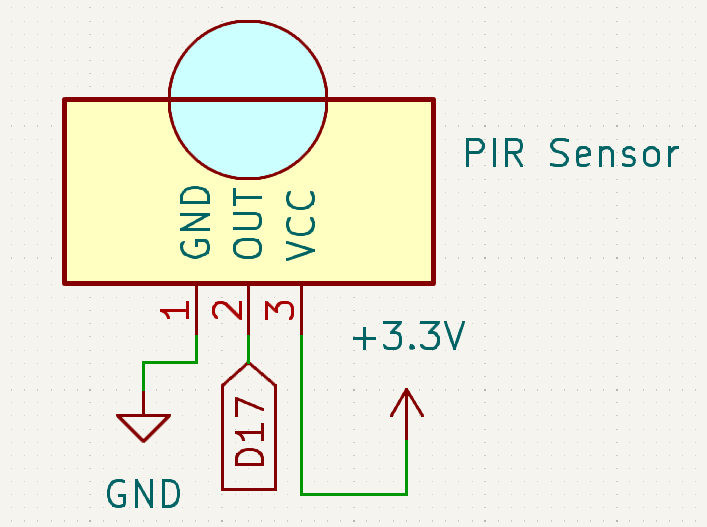
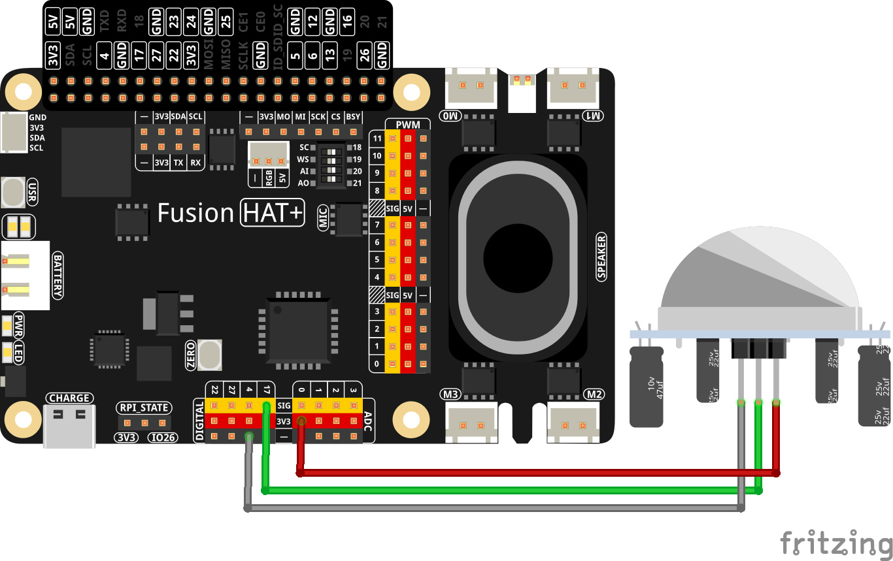

.. note::

    Hello, welcome to the SunFounder Raspberry Pi & Arduino & ESP32 Enthusiasts Community on Facebook! Dive deeper into Raspberry Pi, Arduino, and ESP32 with fellow enthusiasts.

    **Why Join?**

    - **Expert Support**: Solve post-sale issues and technical challenges with help from our community and team.
    - **Learn & Share**: Exchange tips and tutorials to enhance your skills.
    - **Exclusive Previews**: Get early access to new product announcements and sneak peeks.
    - **Special Discounts**: Enjoy exclusive discounts on our newest products.
    - **Festive Promotions and Giveaways**: Take part in giveaways and holiday promotions.

    👉 Ready to explore and create with us? Click [|link_sf_facebook|] and join today!

.. _4.1.2_py:

4.1.2 Automatic Capture Camera
===================================

**Introduction**

Imagine you’re away, and a curious little squirrel visits your windowsill. With this project, you can create an automatic capture camera to snap pictures of these delightful moments. Using a motion sensor, the camera detects movement and captures photos at regular intervals.

----------------------------------------------

**What You’ll Need**

The following components are required for this project:

.. list-table::
    :widths: 30 20
    :header-rows: 1

    *   - COMPONENT INTRODUCTION
        - PURCHASE LINK

    *   - :ref:`cpn_breadboard`
        - |link_breadboard_buy|
    *   - :ref:`cpn_wires`
        - |link_wires_buy|
    *   - :ref:`cpn_resistor`
        - |link_resistor_buy|
    *   - :ref:`cpn_pir`
        - |link_pir_buy|
    *   - :ref:`cpn_camera_module`
        - |link_camera_buy|
    *   - Fusion HAT
        - 
    *   - Raspberry Pi Zero 2 W
        -

----------------------------------------------

**Circuit Diagram**

Below is the circuit diagram for this project:

----------------------------------------------

**Wiring Diagram**

Follow this wiring diagram to set up the circuit:

For best performance, adjust the two potentiometers on the PIR module: one controls sensitivity, and the other adjusts detection distance. Turn both counterclockwise to the end.

.. image:: ../python/img/4.1.4_PIR_TTE.png
   :width: 400
   :align: center

----------------------------------------------

**Writing the Code**

Here is the Python code used for this project:

.. code-block:: python

   #!/usr/bin/env python3
   from picamera2 import Picamera2, Preview
   from fusion_hat import Pin
   import time
   import os

   # Retrieve the current user's login name and home directory
   user = os.getlogin()
   user_home = os.path.expanduser(f'~{user}')

   # Initialize the camera
   camera = Picamera2()
   camera.start()

   # Initialize the motion sensor on GPIO pin 17
   pir = Pin(17, Pin.IN, Pin.PULL_DOWN) 

   try:
      i = 1  # Initialize the image count
      while True:
         if pir.value() == 1:
               # Capture an image when motion is detected and save it with a unique number
               camera.capture_file(f'{user_home}/capture%s.jpg' % i)
               print('The number is %s' % i)  # Print the image count
               time.sleep(3)  # Wait for 3 seconds before next detection
               i += 1  # Increment the image count
         else:
               # print('waiting')  # Print 'waiting' when no motion is detected
               time.sleep(0.5)  # Check for motion every 0.5 seconds

   except KeyboardInterrupt:
      # Stop the camera and turn off the LED if a KeyboardInterrupt occurs
      camera.stop_preview()
      pass

This Python script integrates a PIR motion sensor and a Raspberry Pi camera to create a motion-triggered photo capture system. When executed:

1. **Setup**:

   - The PIR motion sensor is initialized on GPIO pin 17 to detect motion.
   - The Raspberry Pi camera is started and ready to capture photos.

2. **Motion Detection**:

   - When the PIR sensor detects motion, the camera captures a photo and saves it to the user's home directory with filenames like ``capture_1.jpg``, ``capture_2.jpg``, etc.
   - The console displays a message such as ``Captured photo #<i>``.

3. **Continuous Monitoring**:

   - The script continuously checks for motion every 0.5 seconds when no motion is detected.
   - After capturing a photo, the script waits for 3 seconds before checking for motion again.

4. **Graceful Exit**:

   - On ``Ctrl+C``, the script stops the camera preview and exits cleanly.

----------------------------------------------

**Understanding the Code**

1. **Imports:**

   .. code-block:: python

      from picamera2 import Picamera2, Preview
      from fusion_hat import Pin
      import time
      import os

   The script imports necessary libraries for camera control (``Picamera2``), motion detection (``Pin``), and system utilities (``os`` and ``time``).

2. **Camera Initialization:**

   .. code-block:: python

       camera = Picamera2()
       camera.start()

   Initializes the ``Picamera2`` instance and starts the camera.

3. **PIR Sensor Setup:**

   .. code-block:: python

      # Initialize the motion sensor on GPIO pin 17
      pir = Pin(17, Pin.IN, Pin.PULL_DOWN) 

   Configures the motion sensor on GPIO pin 17 to detect movement.

4. **Motion Detection Loop:**

   .. code-block:: python

       i = 1
       while True:
           if pir.motion_detected:
               camera.capture_file(f'{user_home}/capture_{i}.jpg')
               print(f'Captured photo #{i}')
               time.sleep(3)
               i += 1
           else:
               print('Waiting for motion...')
               time.sleep(0.5)

   In the main loop, the script:

   * Captures and saves a photo when motion is detected.
   * Prints the number of photos captured.
   * Waits for 3 seconds between captures to avoid duplicates.
   * Prints "Waiting for motion..." if no motion is detected and checks every 0.5 seconds.

5. **Graceful Exit:**

   .. code-block:: python

      except KeyboardInterrupt:
         camera.stop_preview()

   Handles a keyboard interrupt (Ctrl+C) to stop the script and clean up resources.

----------------------------------------------

**Troubleshooting**

1. **Photos Are Not Captured**:

   - **Cause**: PIR motion sensor is not working or incorrectly wired.
   - **Solution**:

     - Verify the PIR sensor is connected to GPIO pin 17, power, and ground.
     - Adjust the PIR sensor's sensitivity and delay potentiometers if available.

2. **File Overwriting**:

   - **Cause**: Photos are saved with the same name, overwriting previous captures.
   - **Solution**: The script already uses a counter ``i`` to create unique filenames. Ensure ``i`` increments correctly.

3. **PIR Sensor Always Detects Motion**:

   - **Cause**: Faulty PIR sensor or excessive environmental interference.
   - **Solution**:

     - Test the sensor with a multimeter to ensure it detects motion correctly.
     - Place the sensor in a stable, controlled environment to avoid false positives.

4. **Script Crashes with Camera Error**:

   - **Cause**: Camera is not properly initialized or in use by another process.
   - **Solution**:

     - Ensure the camera is connected and enabled via ``raspi-config``.
     - Restart the Raspberry Pi to release any conflicting processes.

----------------------------------------------

**Extendable Ideas**

1. **Timestamped Filenames**: Save photos with timestamps in their filenames for better organization:

   .. code-block:: python

      timestamp = time.strftime("%Y%m%d-%H%M%S")
      camera.capture_file(f'{user_home}/capture_{timestamp}.jpg')

2. **LED Indicator**: Add an LED that lights up when the PIR sensor detects motion:

   .. code-block:: python

      from fusion_hat import Pin
      led = Pin(27)
      if pir.value() == 1:
         led.on()
      else:
         led.off()

3. **Photo Gallery Management**: Automatically organize captured photos into folders based on date or event.

----------------------------------------------

**Conclusion**

This project demonstrates how to build an automated camera system using a PIR motion sensor and a Raspberry Pi Camera Module. It’s a great way to capture unexpected moments and explore the possibilities of IoT and computer vision. Try expanding its functionality to include additional features like video recording or cloud uploads for real-time monitoring.
