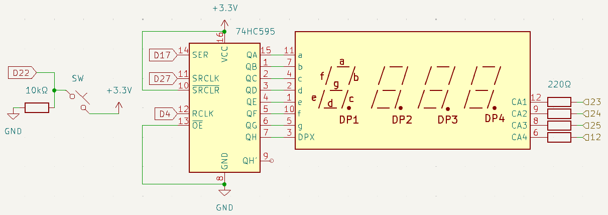
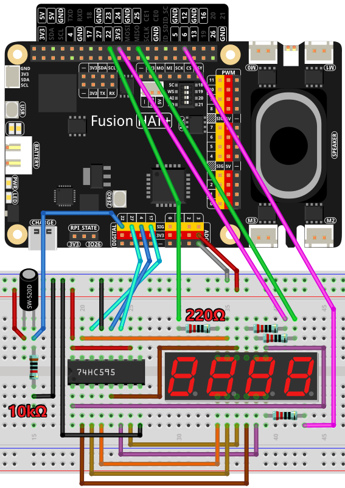

.. note::

    Hello, welcome to the SunFounder Raspberry Pi & Arduino & ESP32 Enthusiasts Community on Facebook! Dive deeper into Raspberry Pi, Arduino, and ESP32 with fellow enthusiasts.

    **Why Join?**

    - **Expert Support**: Solve post-sale issues and technical challenges with help from our community and team.
    - **Learn & Share**: Exchange tips and tutorials to enhance your skills.
    - **Exclusive Previews**: Get early access to new product announcements and sneak peeks.
    - **Special Discounts**: Enjoy exclusive discounts on our newest products.
    - **Festive Promotions and Giveaways**: Take part in giveaways and holiday promotions.

    👉 Ready to explore and create with us? Click [|link_sf_facebook|] and join today!

.. _4.1.15_py:

4.1.3 GAME - 10 Second Challenge
=================================

**Introduction**

Test your focus and timing with the "10 Second Challenge" game! In this project, you'll create a magic wand by attaching a tilt switch to a stick. Shake the wand to start a timer on a 4-digit segment display. Shake it again to stop the timer. The goal is to stop the timer as close to **10.00 seconds** as possible. Compete with friends to see who is the ultimate time wizard!

----------------------------------------------

**What You’ll Need**

Below is the list of components required for this project:

.. list-table::
    :widths: 30 20
    :header-rows: 1

    *   - COMPONENT INTRODUCTION
        - PURCHASE LINK

    *   - :ref:`cpn_breadboard`
        - |link_breadboard_buy|
    *   - :ref:`cpn_wires`
        - |link_wires_buy|
    *   - :ref:`cpn_resistor`
        - |link_resistor_buy|
    *   - :ref:`cpn_4_digit`
        - \-
    *   - :ref:`cpn_74hc595`
        - |link_74hc595_buy|
    *   - :ref:`cpn_tilt_switch`
        - \-
    *   - Fusion HAT
        - 
    *   - Raspberry Pi Zero 2 W
        -

----------------------------------------------

**Circuit Diagram**

Below is the schematic diagram for the "10 Second Challenge":

----------------------------------------------

**Wiring Diagram**

Follow the wiring instructions shown below to set up the circuit:

----------------------------------------------

**Running the Example**

All example code used in this tutorial is available in the ``ai-explorer-lab-kit`` directory. 
Follow these steps to run the example:

.. code-block:: shell
   
   cd ai-explorer-lab-kit/python/
   sudo python3 4.1.3_GAME_10Second_zero.py

----------------------------------------------

**Writing the Code**

Here is the Python code for the project:

.. raw:: html

   <run></run>

.. code-block:: python

   #!/usr/bin/env python3

   from fusion_hat import Pin
   import time
   import threading

   # Initialize the button connected to GPIO 26
   sensorPin = Pin(22, Pin.IN, Pin.PULL_DOWN)

   # Define GPIO pins for the 74HC595 shift register
   SDI = Pin(17,Pin.OUT)   # Serial Data Input
   RCLK = Pin(4,Pin.OUT)  # Register Clock
   SRCLK = Pin(27,Pin.OUT) # Shift Register Clock

   # Define GPIO pins for digit selection on the 7-segment display
   placePin = [Pin(pin,Pin.OUT) for pin in (23, 24, 25, 12)]

   # Define segment codes for numbers 0 to 9 on the 7-segment display
   number = (0xc0, 0xf9, 0xa4, 0xb0, 0x99, 0x92, 0x82, 0xf8, 0x80, 0x90)

   # Counter and timer variables
   counter = 0
   timer1 = None
   gameState = 0

   def clearDisplay():
      """ Clear all segments on the 7-segment display. """
      for _ in range(8):
         SDI.on()
         SRCLK.on()
         SRCLK.off()
      RCLK.on()
      RCLK.off()

   def hc595_shift(data):
      """ Shift data to the 74HC595 shift register to display a digit. """
      for i in range(8):
         SDI.value(0x80 & (data << i))
         SRCLK.on()
         SRCLK.off()
      RCLK.on()
      RCLK.off()

   def pickDigit(digit):
      """ Select which digit to display on the 7-segment display. """
      for pin in placePin:
         pin.off()
      placePin[digit].on()

   def display():
      """ Display the current counter value on the 7-segment display. """
      global counter
      clearDisplay()
      pickDigit(0)
      hc595_shift(number[counter % 10])

      clearDisplay()
      pickDigit(1)
      hc595_shift(number[counter % 100 // 10])

      clearDisplay()
      pickDigit(2)
      hc595_shift(number[counter % 1000 // 100] - 0x80)

      clearDisplay()
      pickDigit(3)
      hc595_shift(number[counter % 10000 // 1000])

   def stateChange():
      """ Handle state changes for the counter based on button presses. """
      global gameState, counter, timer1
      if gameState == 0:
         counter = 0
         time.sleep(1)
         timer()
      elif gameState == 1 and timer1 is not None:
         timer1.cancel()
         time.sleep(1)
      gameState = (gameState + 1) % 2

   def loop():
      """ Main loop to check for button presses and update the display. """
      global counter
      currentState = 0
      lastState = 0
      while True:
         display()
         currentState = sensorPin.value()
         if (currentState == 0) and (lastState == 1):
               stateChange()
         lastState = currentState

   def timer():
      """ Timer function that increments the counter every 0.01 second. """
      global counter, timer1
      timer1 = threading.Timer(0.01, timer)
      timer1.start()
      counter += 1

   try:
      loop()
   except KeyboardInterrupt:
      if timer1:
         timer1.cancel()

#. Shake the wand to start the timer on the 4-digit segment display.

#. Shake the wand again to stop the timer.

#. If the timer reads 10.00 seconds, you win the round!

#. Shake the wand one more time to reset the game and start a new round.

----------------------------------------------

**Understanding the Code**

1. **Button Input:**  
   The tilt switch is connected to GPIO pin 22, which detects when the wand is shaken.

2. **74HC595 Shift Register:**  
   The shift register controls which digits are illuminated on the 7-segment display.

3. **Timer Logic:**  
   A threading timer increments the counter every 0.01 seconds, ensuring precise timing.

4. **State Management:**  
   The game switches between states (start, stop) based on button input, resetting the counter as needed.

5. **Display Update:**  
   The 7-segment display shows the timer value, formatted to two decimal places.

----------------------------------------------

**Troubleshooting**

1. **7-Segment Display Not Showing Numbers**:

   - **Cause**: Incorrect wiring or GPIO pin configuration.
   - **Solution**:

     - Verify connections to the 74HC595 shift register and 7-segment display.
     - Ensure the ``number`` segment codes match the display's configuration.

2. **Switch Tilts Not Detected**:

   - **Cause**: Tilt switch wiring or debounce issues.
   - **Solution**:

     - Confirm the tilt switch is connected to GPIO 22.
     - Add a short debounce delay in the ``loop()`` function:

       .. code-block:: python

           time.sleep(0.05)

3. **Counter Not Incrementing**:

   - **Cause**: Timer function not starting correctly.
   - **Solution**:

     - Check the ``timer()`` function and ensure ``timer1.start()`` is called.
     - Debug by printing the ``counter`` value inside ``timer()``.

4. **Display Shows Incorrect Digits**:

   - **Cause**: Segment codes in the ``number`` list do not match the hardware.
   - **Solution**: Test individual digits with static segment codes to verify the mapping.

----------------------------------------------

**Extendable Ideas**

1. **Adjustable Timer Speed**: Add a mechanism to change the timer's increment rate (e.g., using a second button to switch between 0.01, 0.1, and 1-second increments).

2. **Countdown Mode**: Implement a countdown mode where the counter starts at a predefined value and decrements to 0.

3. **Pause and Resume**: Add a separate button to pause and resume the counter without resetting.

4. **Audio Feedback**: Use a buzzer to emit beeps when the counter reaches certain milestones (e.g., multiples of 10).

----------------------------------------------

**Conclusion**

The "10 Second Challenge" demonstrates how simple components like a tilt switch and a 7-segment display can create an engaging interactive game. This project highlights the use of GPIO control, timers, and state management in Python, making it a fun and educational experience. Challenge yourself and your friends to achieve perfect timing!
