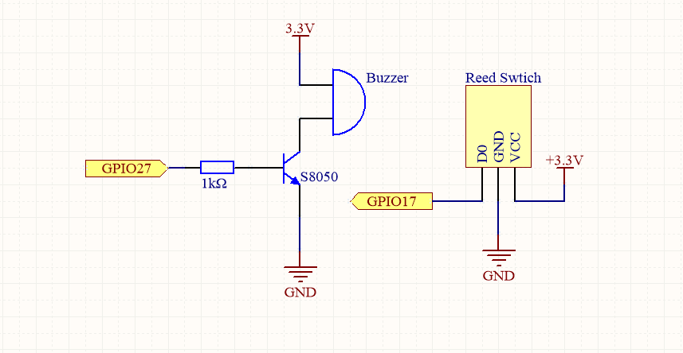
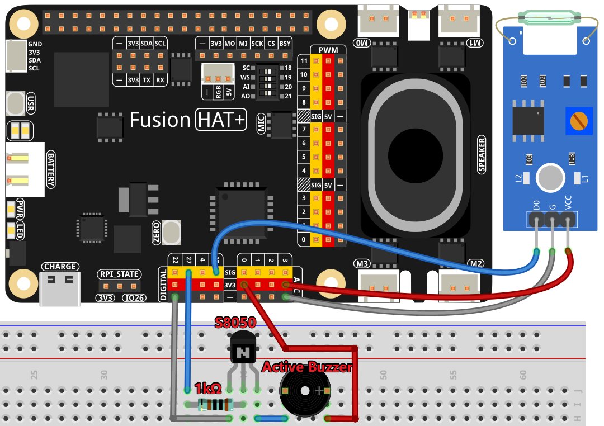

.. note::

    Hello, welcome to the SunFounder Raspberry Pi & Arduino & ESP32 Enthusiasts Community on Facebook! Dive deeper into Raspberry Pi, Arduino, and ESP32 with fellow enthusiasts.

    **Why Join?**

    - **Expert Support**: Solve post-sale issues and technical challenges with help from our community and team.
    - **Learn & Share**: Exchange tips and tutorials to enhance your skills.
    - **Exclusive Previews**: Get early access to new product announcements and sneak peeks.
    - **Special Discounts**: Enjoy exclusive discounts on our newest products.
    - **Festive Promotions and Giveaways**: Take part in giveaways and holiday promotions.

    👉 Ready to explore and create with us? Click [|link_sf_facebook|] and join today!

.. _4.1.3_py:

4.1.3 Magnetic Induction Alarm System
============================================

**Introduction**

Imagine you own a priceless vase and want to protect it. A magnetic induction alarm system is a great way to keep it safe. If anyone moves the vase, the alarm will notify you instantly! This project uses a reed switch and a buzzer to create a simple yet effective security system.

----------------------------------------------

**What You’ll Need**

In this project, you will need the following components:

.. list-table::
    :widths: 30 20
    :header-rows: 1

    *   - COMPONENT INTRODUCTION
        - PURCHASE LINK

    *   - :ref:`cpn_breadboard`
        - |link_breadboard_buy|
    *   - :ref:`cpn_wires`
        - |link_wires_buy|
    *   - :ref:`cpn_resistor`
        - |link_resistor_buy|
    *   - :ref:`cpn_buzzer`
        - |link_passive_buzzer_buy|
    *   - :ref:`cpn_transistor`
        - |link_transistor_buy|
    *   - :ref:`cpn_reed_switch`
        - |link_reed_switch_buy|
    *   - Fusion HAT
        - 
    *   - Raspberry Pi Zero 2 W
        -

----------------------------------------------

**Circuit Diagram**

----------------------------------------------

**Wiring Diagram**

----------------------------------------------

**Writing the Code**

.. raw:: html

    <run></run>

.. code-block:: python

   #!/usr/bin/env python3
   from fusion_hat import Pin, Buzzer
   import time

   # Initialize the buzzer on GPIO pin 27
   buzzer = Buzzer(Pin(27))
   # Initialize the reed switch on GPIO pin 17 with pull-up resistor enabled
   reed_switch = Pin(17, Pin.IN, Pin.PULL_UP)

   try:
      while True:
         # Check if the reed switch (the window) is closed
         if reed_switch.value() == 1:
               # Turn off the buzzer if reed switch (the window) closed
               buzzer.off()
         else:
               # If reed switch (the window) is not closed, beep the buzzer
               buzzer.on()
               time.sleep(0.1)  # Buzzer on for 0.1 seconds
               buzzer.off()
               time.sleep(0.1)  # Buzzer off for 0.1 seconds

   except KeyboardInterrupt:
      # Turn off the buzzer when the program is interrupted (e.g., keyboard interrupt)
      buzzer.off()
      pass

This Python script integrates a reed switch and a buzzer to create a simple alarm system. When executed:

1. **Reed Switch Pressed**: The buzzer (connected to GPIO pin 27) is turned off when the reed switch (connected to GPIO pin 17) is pressed (indicating a closed circuit).

2. **Reed Switch Not Pressed**: The buzzer beeps intermittently (0.1 seconds on, 0.1 seconds off) when the reed switch is not pressed (indicating an open circuit).

3. **Continuous Monitoring**: The script continuously monitors the reed switch state and updates the buzzer behavior in real time.

4. **Graceful Exit**: On ``Ctrl+C`` or program interruption, the buzzer is turned off, and the program exits cleanly.

----------------------------------------------

**Understanding the Code**

#. Import necessary libraries: The ``fusion_hat`` library provides classes for controlling GPIO pins, while the ``time`` module handles delays.

   .. code-block:: python

      from fusion_hat import Pin, Buzzer
      import time

#. Initialize the buzzer and reed switch:

   .. code-block:: python

      # Initialize the buzzer on GPIO pin 27
      buzzer = Buzzer(Pin(27))
      # Initialize the reed switch on GPIO pin 17 with pull-up resistor enabled
      reed_switch = Pin(17, Pin.IN, Pin.PULL_UP)

#. Monitor the reed switch state:

   .. code-block:: python

      if reed_switch.value() == 1:
         buzzer.off()
      else:
         buzzer.on()
         time.sleep(0.1)
         buzzer.off()
         time.sleep(0.1)

   - If the reed switch is pressed (magnet in place), the buzzer remains off.
   - If the reed switch is released (magnet removed), the buzzer beeps intermittently.

#. Graceful shutdown: Use a ``KeyboardInterrupt`` exception to ensure the buzzer is turned off when the program is interrupted.

   .. code-block:: python

      except KeyboardInterrupt:
         buzzer.off()
         pass

----------------------------------------------

**Troubleshooting**

1. **Buzzer Does Not Beep**:

   - **Cause**: Incorrect GPIO wiring or buzzer configuration.
   - **Solution**:

     - Verify the buzzer is connected to GPIO pin 27 and ground.
     - Ensure the buzzer is functional by testing it independently.

2. **Reed Switch Always Triggered**:

   - **Cause**: Faulty reed switch or incorrect wiring.
   - **Solution**:

     - Ensure the reed switch is properly connected to GPIO pin 17 and ground.
     - Test the reed switch with a multimeter to verify it closes the circuit when a magnet is near.

3. **Buzzer Stays On Constantly**:

   - **Cause**: Reed switch logic is inverted or misconfigured.
   - **Solution**: Confirm the reed switch's ``value()`` state matches its wiring (pull-up resistor enabled).

----------------------------------------------

**Extendable Ideas**

1. **LED Indicator**: Add an LED to visually indicate the reed switch's state:

   .. code-block:: python

      from fusion_hat import Pin
      led = Pin(22, Pin.OUT)
      if reed_switch.value()==0:
         led.on()
      else:
         led.off()

2. **Event Logging**: Log the reed switch state changes with timestamps to a file:

   .. code-block:: python

      with open("reed_switch_log.txt", "a") as log_file:
         timestamp = time.strftime("%Y-%m-%d %H:%M:%S")
         log_file.write(f"{timestamp} - Switch state: {'Pressed' if reed_switch.value()==0 else 'Not Pressed'}\n")

3. **Custom Buzzer Patterns**: Implement different buzzer patterns based on the reed switch state:

   .. code-block:: python

      def buzzer_pattern():
         for _ in range(3):
            buzzer.on()
            time.sleep(0.2)
            buzzer.off()
            time.sleep(0.2)

----------------------------------------------

**Conclusion**

This magnetic induction alarm system is a practical and engaging project. It demonstrates how to use simple components like reed switches and buzzers to create an effective security system. Try experimenting further to make your system even more robust and versatile!

