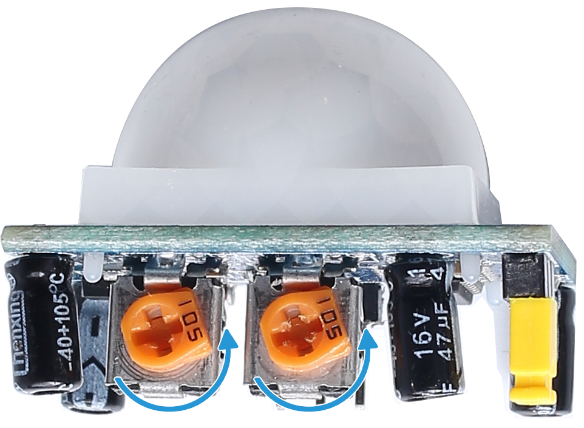

.. note::

    Hello, welcome to the SunFounder Raspberry Pi & Arduino & ESP32 Enthusiasts Community on Facebook! Dive deeper into Raspberry Pi, Arduino, and ESP32 with fellow enthusiasts.

    **Why Join?**

    - **Expert Support**: Solve post-sale issues and technical challenges with help from our community and team.
    - **Learn & Share**: Exchange tips and tutorials to enhance your skills.
    - **Exclusive Previews**: Get early access to new product announcements and sneak peeks.
    - **Special Discounts**: Enjoy exclusive discounts on our newest products.
    - **Festive Promotions and Giveaways**: Take part in giveaways and holiday promotions.

    👉 Ready to explore and create with us? Click [|link_sf_facebook|] and join today!

.. _4.1.4_py:

4.1.4 Counting Device
=======================

**Introduction**

In this project, you will build a people-counting system using a PIR motion sensor and a 4-digit 7-segment display. The system increments the count displayed whenever the PIR sensor detects motion. This project is ideal for monitoring foot traffic in a hallway or entrance, and it provides hands-on experience with GPIO programming and display control.

----------------------------------------------

**What You’ll Need**

The following components are required for this project:

.. list-table::
    :widths: 30 20
    :header-rows: 1

    *   - COMPONENT INTRODUCTION
        - PURCHASE LINK
    *   - GPIO Extension Board
        - |link_gpio_board_buy|
    *   - Breadboard
        - |link_breadboard_buy|
    *   - Wires
        - |link_wires_buy|
    *   - Resistors
        - |link_resistor_buy|
    *   - 4-Digit 7-Segment Display
        - Not Applicable
    *   - 74HC595 Shift Register
        - |link_74hc595_buy|
    *   - PIR Motion Sensor
        - Not Applicable

----------------------------------------------

**Circuit Diagram**

Below is the circuit diagram for the project:

.. image:: ../python/img/4.1.7_counting_device_schematic.png
   :align: center

----------------------------------------------

**Wiring Diagram**

Follow the wiring diagram to connect the components correctly:

.. image:: ../python/img/4.1.7_counting_device_circuit.png
   :align: center

----------------------------------------------

**Writing the Code**

1. Open the Raspberry Pi terminal and navigate to the code directory:

   .. code-block:: bash

       cd ~/zero-w-ai-kit/python

2. Run the Python script:

   .. code-block:: bash

       sudo python3 4.1.7_CountingDevice_zero.py

Once the script runs, the number displayed on the 4-digit 7-segment display will increment by 1 each time the PIR sensor detects motion.

.. note::

   Adjust the two potentiometers on the PIR module for optimal sensitivity and detection distance. Turn both counterclockwise to their maximum setting for best results.

----------------------------------------------

**Code**

Below is the Python script used in this project:

.. code-block:: python

    #!/usr/bin/env python3
    from gpiozero import OutputDevice, MotionSensor

    # Initialize PIR motion sensor on GPIO 26
    pir = MotionSensor(26)

    # Initialize shift register pins
    SDI = OutputDevice(24)    # Serial Data Input
    RCLK = OutputDevice(23)   # Register Clock Input
    SRCLK = OutputDevice(18)  # Shift Register Clock Input

    # Initialize 7-segment display pins
    placePin = [OutputDevice(pin) for pin in (10, 22, 27, 17)]

    # Define digit codes for 7-segment display
    number = (0xc0, 0xf9, 0xa4, 0xb0, 0x99, 0x92, 0x82, 0xf8, 0x80, 0x90)

    # Counter for the displayed number
    counter = 0

    def clearDisplay():
        """Clears the display by turning off all segments."""
        for _ in range(8):
            SDI.on()
            SRCLK.on()
            SRCLK.off()
        RCLK.on()
        RCLK.off()

    def hc595_shift(data):
        """Shifts data into the 74HC595 shift register."""
        for i in range(8):
            SDI.value = 0x80 & (data << i)
            SRCLK.on()
            SRCLK.off()
        RCLK.on()
        RCLK.off()

    def pickDigit(digit):
        """Activates a specific digit of the 7-segment display."""
        for pin in placePin:
            pin.off()
        placePin[digit].on()

    def display():
        """Updates the 7-segment display with the current counter value."""
        global counter
        clearDisplay()
        pickDigit(0)
        hc595_shift(number[counter % 10])

        clearDisplay()
        pickDigit(1)
        hc595_shift(number[counter % 100 // 10])

        clearDisplay()
        pickDigit(2)
        hc595_shift(number[counter % 1000 // 100])

        clearDisplay()
        pickDigit(3)
        hc595_shift(number[counter % 10000 // 1000])

    def loop():
        """Main loop to update the display and check for motion."""
        global counter
        currentState = 0
        lastState = 0
        while True:
            display()
            currentState = 1 if pir.motion_detected else 0
            if currentState == 1 and lastState == 0:
                counter += 1
            lastState = currentState

    try:
        loop()
    except KeyboardInterrupt:
        # Turn off all pins when the script is interrupted
        SDI.off()
        SRCLK.off()
        RCLK.off()
        pass

This Python script integrates a PIR motion sensor and a 7-segment display driven by a 74HC595 shift register. The script performs the following:

1. **Motion Detection**: A PIR motion sensor connected to GPIO 26 detects motion. Each motion detection increments a counter.

2. **Number Display**: 

   - The current counter value is displayed on a 4-digit 7-segment display.
   - The display updates dynamically as motion is detected, incrementing the value.

3. **Continuous Monitoring**: The script continuously monitors for motion and updates the display in real-time.

4. **Graceful Exit**: On ``Ctrl+C``, all pins are turned off, ensuring a clean shutdown of the script.

----------------------------------------------

**Understanding the Code**

1. **Motion Detection:**

   The PIR sensor detects motion and sends a signal to increment the counter.

2. **Display Update:**

   The ``hc595_shift`` and ``pickDigit`` functions work together to control the 7-segment display and update the counter in real time.

3. **Main Loop:**

   The ``loop`` function continuously checks the PIR sensor and updates the display when motion is detected.

4. **Interrupt Handling:**

   The script ensures all GPIO pins are safely turned off when interrupted, preventing unexpected behavior.

----------------------------------------------

**Troubleshooting**

1. **Display Not Working**:

   - **Cause**: Incorrect wiring of the 7-segment display or shift register.
   - **Solution**:

     - Verify connections between the GPIO pins and the SDI, SRCLK, and RCLK pins of the shift register.
     - Ensure all ``placePin`` connections match the corresponding digit pins.

2. **Motion Sensor Not Triggering**:

   - **Cause**: PIR sensor wiring or environmental interference.
   - **Solution**:

     - Check the PIR sensor connections to GPIO 26, power, and ground.
     - Adjust the sensitivity and delay potentiometers on the PIR sensor if available.

3. **Counter Does Not Increment**:

   - **Cause**: Motion sensor state changes not detected.
   - **Solution**:

     - Ensure the ``pir.motion_detected`` value updates correctly.
     - Add debugging prints to confirm state transitions in the ``loop()`` function.

4. **Flickering Display**:

   - **Cause**: Insufficient delay or improper timing in the display update.
   - **Solution**:
     - Add a small delay in the ``display()`` function to stabilize the display:

       .. code-block:: python

           import time
           time.sleep(0.01)

----------------------------------------------

**Extendable Ideas**

1. **Bidirectional Counter**: Add another PIR sensor to detect motion in opposite directions and decrement the counter:

     .. code-block:: python

         pir2 = MotionSensor(27)
         if pir2.motion_detected:
             counter -= 1

2. **Threshold-Based Alerts**: Trigger an alert (e.g., LED or buzzer) when the counter exceeds a predefined value:

     .. code-block:: python

         from gpiozero import Buzzer
         buzzer = Buzzer(22)
         if counter > 50:
             buzzer.on()
         else:
             buzzer.off()

3. **Data Logging**: Log the counter value and timestamps to a file for analysis:

     .. code-block:: python

         with open("motion_log.txt", "a") as log_file:
             log_file.write(f"{time.time():.3f}, Counter: {counter}\n")

4. **Timer-Based Reset**: Reset the counter after a specific period of inactivity:

     .. code-block:: python

         last_motion_time = time.time()
         if time.time() - last_motion_time > 300:  # 5 minutes
             counter = 0

5. **Event-Based Triggers**: Trigger specific actions (e.g., controlling appliances) when the counter reaches specific values.

----------------------------------------------

**Conclusion**

This project introduces the basics of motion detection and display control using a PIR sensor and 7-segment display. It provides a practical foundation for more advanced IoT and data visualization projects.

