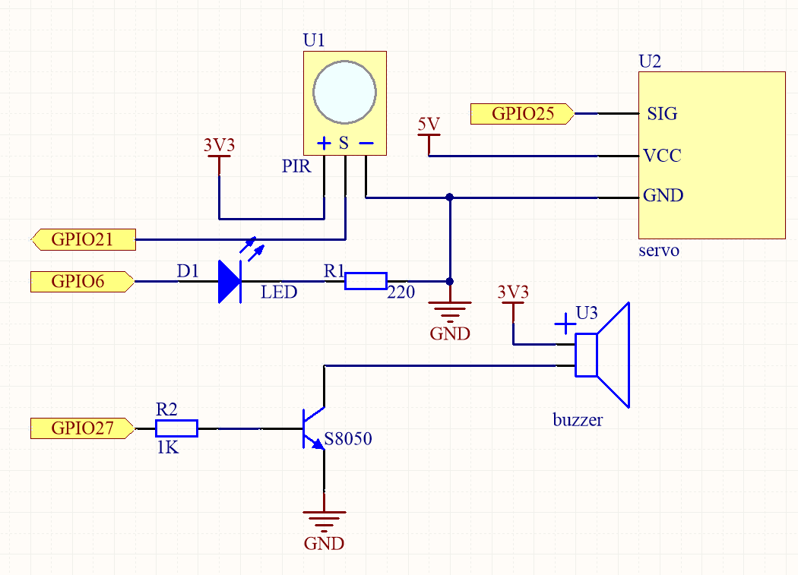
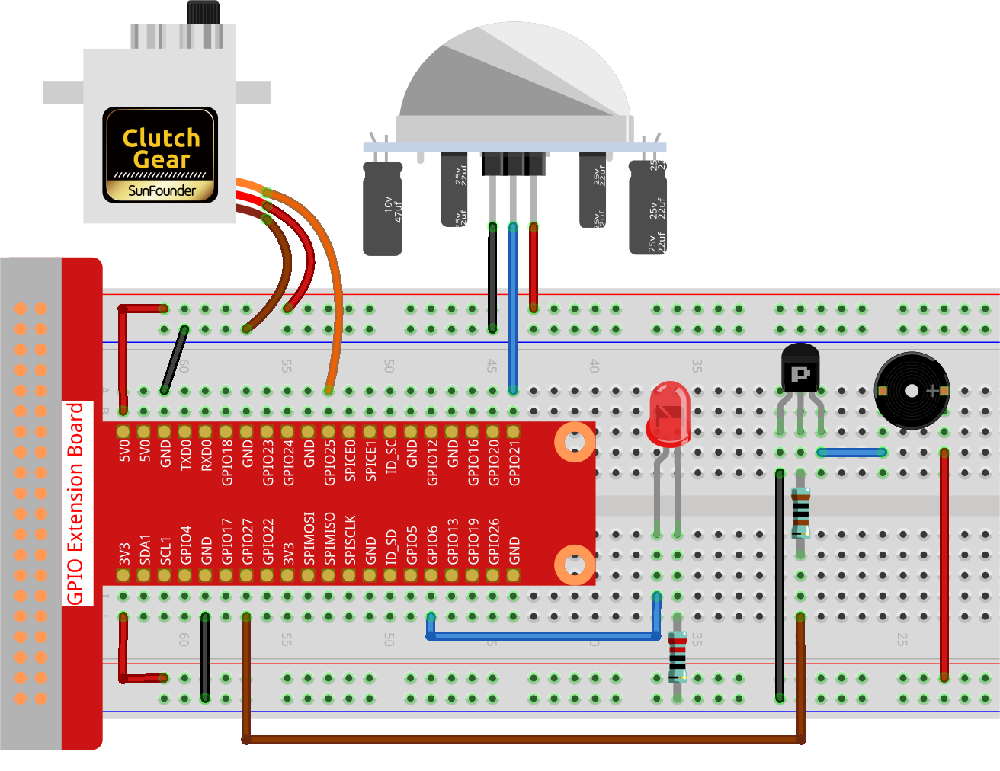

.. note::

    Hello, welcome to the SunFounder Raspberry Pi & Arduino & ESP32 Enthusiasts Community on Facebook! Dive deeper into Raspberry Pi, Arduino, and ESP32 with fellow enthusiasts.

    **Why Join?**

    - **Expert Support**: Solve post-sale issues and technical challenges with help from our community and team.
    - **Learn & Share**: Exchange tips and tutorials to enhance your skills.
    - **Exclusive Previews**: Get early access to new product announcements and sneak peeks.
    - **Special Discounts**: Enjoy exclusive discounts on our newest products.
    - **Festive Promotions and Giveaways**: Take part in giveaways and holiday promotions.

    👉 Ready to explore and create with us? Click [|link_sf_facebook|] and join today!

.. _4.1.5_py:

4.1.5 Welcome
==============================

**Introduction**

Have you ever noticed the automatic doors in convenience stores that open with a welcoming chime when someone approaches? This project replicates that functionality on a smaller scale. Using a PIR sensor, servo motor, LED, and buzzer, you’ll create a miniature "automatic door" system. When motion is detected, the system lights an LED, "opens" the door using a servo, and plays a welcoming chime with a buzzer.

----------------------------------------------

**What You’ll Need**

Below are the components required for this project:

.. list-table::
    :widths: 30 20
    :header-rows: 1

    *   - COMPONENT INTRODUCTION
        - PURCHASE LINK
    *   - GPIO Extension Board
        - |link_gpio_board_buy|
    *   - Breadboard
        - |link_breadboard_buy|
    *   - Wires
        - |link_wires_buy|
    *   - Resistors
        - |link_resistor_buy|
    *   - LED
        - |link_led_buy|
    *   - PIR Motion Sensor
        - Not Applicable
    *   - Servo Motor
        - |link_servo_buy|
    *   - Buzzer
        - |link_passive_buzzer_buy|
    *   - Transistor
        - |link_transistor_buy|

----------------------------------------------

**Circuit Diagram**

Below is the circuit diagram for this project:

----------------------------------------------

**Wiring Diagram**

Follow the wiring diagram to assemble the circuit:

----------------------------------------------

**Writing the Code**

1. Open the Raspberry Pi terminal and navigate to the project folder:

   .. code-block:: bash

       cd ~/zero-w-ai-kit/python

2. Run the Python script:

   .. code-block:: bash

       sudo python3 4.1.8_Welcome_zero.py

Once the script runs, the system will detect motion using the PIR sensor. When motion is detected:

* The LED turns on.
* The servo motor simulates the door opening.
* The buzzer plays a welcoming chime.

The system resets after the chime, closing the door and turning off the LED, ready for the next person.

.. note::

   Adjust the potentiometers on the PIR sensor module for optimal sensitivity and detection range. Rotate both potentiometers fully counterclockwise for best performance.

.. image:: ../python/img/4.1.8_PIR_TTE.png
   :width: 400
   :align: center

----------------------------------------------

**Code**

Below is the Python script for the project:

.. code-block:: python

    #!/usr/bin/env python3
    from gpiozero import LED, MotionSensor, Servo, TonalBuzzer
    import time

    # GPIO setup
    ledPin = LED(6)
    pirPin = MotionSensor(21)
    buzPin = TonalBuzzer(27)

    # Servo setup with pulse width correction
    correction = 0.45
    maxPW = (2.0 + correction) / 1000
    minPW = (1.0 - correction) / 1000
    servoPin = Servo(25, min_pulse_width=minPW, max_pulse_width=maxPW)

    # Chime tune
    tune = [('C#4', 0.2), ('D4', 0.2), (None, 0.2),
            ('Eb4', 0.2), ('E4', 0.2), (None, 0.6),
            ('F#4', 0.2), ('G4', 0.2), (None, 0.6)]

    def setAngle(angle):
        """Move the servo to a specific angle."""
        servoPin.value = angle / 180
        time.sleep(0.001)

    def doorbell():
        """Play a welcoming chime."""
        for note, duration in tune:
            buzPin.play(note)
            time.sleep(duration)
        buzPin.stop()

    def closedoor():
        """Close the door and turn off the LED."""
        ledPin.off()
        for angle in range(180, -1, -1):
            setAngle(angle)
            time.sleep(0.01)

    def opendoor():
        """Open the door, play chime, and reset."""
        ledPin.on()
        for angle in range(0, 181):
            setAngle(angle)
            time.sleep(0.01)
        doorbell()
        closedoor()

    def loop():
        """Main loop to detect motion and operate the system."""
        while True:
            if pirPin.motion_detected:
                opendoor()
            time.sleep(0.1)

    try:
        loop()
    except KeyboardInterrupt:
        buzPin.stop()
        ledPin.off()

This Python script integrates a PIR motion sensor, servo motor, LED, and buzzer to create an automated welcoming system. When executed:

1. **Motion Detection**: A PIR motion sensor connected to GPIO pin 21 detects motion.

2. **Door Automation**: When motion is detected:

     - The servo motor (on GPIO pin 25) opens a door by moving from 0° to 180°.
     - The LED (on GPIO pin 6) turns on.
     - A welcoming chime is played through the buzzer (on GPIO pin 27).
     - The servo motor closes the door by moving back from 180° to 0°.
     - The LED turns off.

3. **Continuous Monitoring**: The system continuously monitors for motion and triggers the above sequence whenever motion is detected.

4. **Graceful Exit**: On ``Ctrl+C``, the buzzer and LED are turned off, and the script exits cleanly.

----------------------------------------------

**Understanding the Code**

1. **Motion Detection:** The PIR sensor detects motion and triggers the system.

2. **Servo Control:** The servo motor opens and closes the door using angles from 0° to 180°.

3. **Buzzer Melody:** A welcoming tune is played using the ``TonalBuzzer``.

4. **Reset:** After the chime, the system closes the door and turns off the LED, ready for the next event.

----------------------------------------------

**Troubleshooting**

1. **Motion Not Detected**:

   - **Cause**: PIR sensor not wired correctly or environmental interference.
   - **Solution**:

     - Ensure the PIR sensor is connected to GPIO pin 21, power, and ground.
     - Adjust the sensor's sensitivity and delay potentiometers if available.

2. **Servo Not Moving**:

   - **Cause**: Incorrect servo configuration or power supply issues.
   - **Solution**:

     - Verify the servo is connected to GPIO pin 25 and powered correctly.
     - Check the ``min_pulse_width`` and ``max_pulse_width`` values in the servo setup.

3. **Chime Not Playing**:

   - **Cause**: Buzzer misconfiguration or incorrect tune format.
   - **Solution**:

     - Ensure the buzzer is connected to GPIO pin 27.
     - Verify the ``tune`` list contains valid note and duration pairs.

4. **LED Not Turning On**:

   - **Cause**: LED wiring or GPIO configuration issues.
   - **Solution**: Verify the LED is connected to GPIO pin 6 with an appropriate resistor.

----------------------------------------------

**Extendable Ideas**

1. **Adjustable Chime**: Add more melodies or allow the user to select different chimes for different events.

2. **Time-Based Operation**: Disable the system during specific hours (e.g., at night):

     .. code-block:: python

         from datetime import datetime
         if 8 <= datetime.now().hour < 22:  # Operate only between 8 AM and 10 PM
             opendoor()

3. **Data Logging**: Log motion detection events and timestamps to a file for analysis:

     .. code-block:: python

         with open("motion_log.txt", "a") as log_file:
             log_file.write(f"{time.strftime('%Y-%m-%d %H:%M:%S')} - Motion detected\n")

4. **Voice Greetings**: Replace the buzzer chime with pre-recorded voice messages using a speaker.

----------------------------------------------

**Conclusion**

This project replicates the functionality of automatic doors in a fun and educational way. It introduces concepts like motion detection, servo control, and sound generation, making it a great entry point for IoT and automation projects. Try expanding it by adding features like remote notifications or cloud integration for real-time monitoring.
