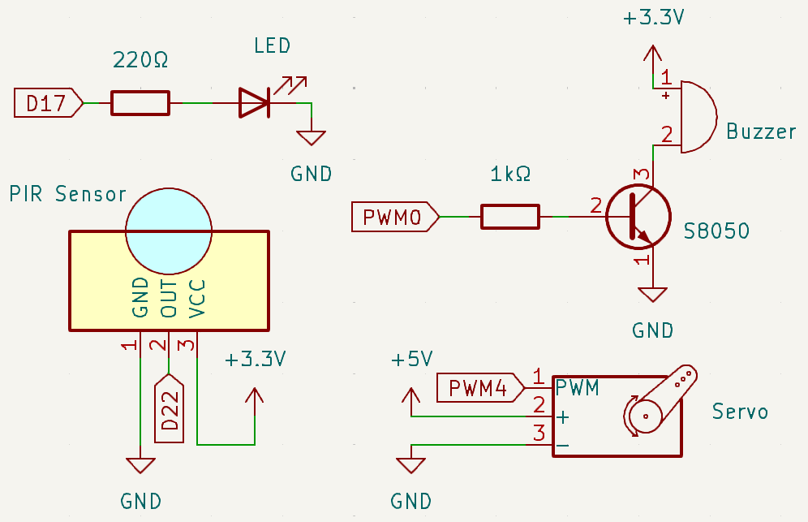
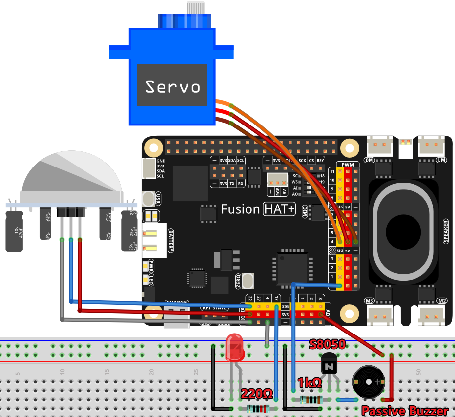

.. note::

    Hello, welcome to the SunFounder Raspberry Pi & Arduino & ESP32 Enthusiasts Community on Facebook! Dive deeper into Raspberry Pi, Arduino, and ESP32 with fellow enthusiasts.

    **Why Join?**

    - **Expert Support**: Solve post-sale issues and technical challenges with help from our community and team.
    - **Learn & Share**: Exchange tips and tutorials to enhance your skills.
    - **Exclusive Previews**: Get early access to new product announcements and sneak peeks.
    - **Special Discounts**: Enjoy exclusive discounts on our newest products.
    - **Festive Promotions and Giveaways**: Take part in giveaways and holiday promotions.

    👉 Ready to explore and create with us? Click [|link_sf_facebook|] and join today!

.. _4.1.5_py:

4.1.5 Welcome
==============================

**Introduction**

Have you ever noticed the automatic doors in convenience stores that open with a welcoming chime when someone approaches? This project replicates that functionality on a smaller scale. Using a PIR sensor, servo motor, LED, and buzzer, you’ll create a miniature "automatic door" system. When motion is detected, the system lights an LED, "opens" the door using a servo, and plays a welcoming chime with a buzzer.

----------------------------------------------

**What You’ll Need**

Below are the components required for this project:

.. list-table::
    :widths: 30 20
    :header-rows: 1

    *   - COMPONENT INTRODUCTION
        - PURCHASE LINK

    *   - :ref:`cpn_breadboard`
        - |link_breadboard_buy|
    *   - :ref:`cpn_wires`
        - |link_wires_buy|
    *   - :ref:`cpn_resistor`
        - |link_resistor_buy|
    *   - :ref:`cpn_pir`
        - |link_pir_buy|
    *   - :ref:`cpn_servo`
        - |link_servo_buy|
    *   - :ref:`cpn_buzzer`
        - |link_passive_buzzer_buy|
    *   - :ref:`cpn_transistor`
        - |link_transistor_buy|
    *   - Fusion HAT
        - 
    *   - Raspberry Pi Zero 2 W
        -

----------------------------------------------

**Circuit Diagram**

Below is the circuit diagram for this project:

----------------------------------------------

**Wiring Diagram**

Follow the wiring diagram to assemble the circuit:

.. note::

   Adjust the potentiometers on the PIR sensor module for optimal sensitivity and detection range. Rotate both potentiometers fully counterclockwise for best performance.

.. image:: ../python/img/4.1.8_PIR_TTE.png
   :width: 400
   :align: center

----------------------------------------------

**Running the Example**

All example code used in this tutorial is available in the ``ai-explorer-lab-kit`` directory. 
Follow these steps to run the example:

.. code-block:: shell
   
   cd ai-explorer-lab-kit/python/
   sudo python3 4.1.5_Welcome_zero.py 

----------------------------------------------

**Code**

Below is the Python script for the project:

.. raw:: html

   <run></run>

.. code-block:: python

   from fusion_hat import Pin, Servo, Buzzer,PWM
   import time

   # GPIO pin setup for LED, motion sensor (PIR), and buzzer
   ledPin = Pin(17, Pin.OUT)
   pirPin = Pin(22, Pin.IN, Pin.PULL_DOWN)
   buzPin = Buzzer(PWM('P0'))

   # Initialize servo with custom pulse widths
   servoPin = Servo('P4')

   # Musical tune for buzzer, with notes and durations
   tune = [('C#4', 0.2), ('D4', 0.2), (None, 0.2),
         ('Eb4', 0.2), ('E4', 0.2), (None, 0.6),
         ('F#4', 0.2), ('G4', 0.2), (None, 0.6),
         ('Eb4', 0.2), ('E4', 0.2), (None, 0.2),
         ('F#4', 0.2), ('G4', 0.2), (None, 0.2),
         ('C4', 0.2), ('B4', 0.2), (None, 0.2),
         ('F#4', 0.2), ('G4', 0.2), (None, 0.2),
         ('B4', 0.2), ('Bb4', 0.5), (None, 0.6),
         ('A4', 0.2), ('G4', 0.2), ('E4', 0.2), 
         ('D4', 0.2), ('E4', 0.2)]

   def setAngle(angle):
      """
      Move the servo to a specified angle.
      :param angle: Angle in degrees (0-180).
      """
      servoPin.angle(angle)       # Set servo position
      time.sleep(0.001)           # Short delay for servo movement

   def doorbell():
      """
      Play a musical tune using the buzzer.
      """
      for note, duration in tune:
         buzPin.play(note,float(duration))       # Play the note
      buzPin.off()               # Stop buzzer after playing the tune

   def closedoor():
      # Turn off LED and move servo to close door
      ledPin.off()
      for i in range(180, -1, -1):
         setAngle(i)             # Move servo from 180 to 0 degrees
         time.sleep(0.001)       # Short delay for smooth movement
      time.sleep(1)               # Wait after closing door

   def opendoor():
      # Turn on LED, open door (move servo), play tune, close door
      ledPin.on()
      for i in range(0, 181):
         setAngle(i)             # Move servo from 0 to 180 degrees
         time.sleep(0.001)       # Short delay for smooth movement
      time.sleep(1)               # Wait before playing the tune
      doorbell()                  # Play the doorbell tune
      closedoor()                 # Close the door after the tune

   def loop():
      # Main loop to check for motion and operate door
      while True:
         if pirPin.value()==1:
               opendoor()               # Open door if motion detected
         time.sleep(0.1)              # Short delay in loop

   try:
      loop()
   except KeyboardInterrupt:
      # Clean up GPIO on user interrupt (e.g., Ctrl+C)
      buzPin.off()
      ledPin.off()

This Python script integrates a PIR motion sensor, servo motor, LED, and buzzer to create an automated welcoming system. When executed:

1. **Motion Detection**: A PIR motion sensor connected to GPIO pin 22 detects motion.

2. **Door Automation**: When motion is detected:

     - The servo motor (on PWM 4) opens a door by moving from 0° to 180°.
     - The LED (on GPIO pin 17) turns on.
     - A welcoming chime is played through the buzzer (on PWM 0).
     - The servo motor closes the door by moving back from 180° to 0°.
     - The LED turns off.

3. **Continuous Monitoring**: The system continuously monitors for motion and triggers the above sequence whenever motion is detected.

4. **Graceful Exit**: On ``Ctrl+C``, the buzzer and LED are turned off, and the script exits cleanly.

----------------------------------------------

**Understanding the Code**

1. **Motion Detection:** The PIR sensor detects motion and triggers the system.

2. **Servo Control:** The servo motor opens and closes the door using angles from 0° to 180°.

3. **Buzzer Melody:** A welcoming tune is played using the ``Buzzer``.

4. **Reset:** After the chime, the system closes the door and turns off the LED, ready for the next event.

----------------------------------------------

**Troubleshooting**

1. **Motion Not Detected**:

   - **Cause**: PIR sensor not wired correctly or environmental interference.
   - **Solution**:

     - Ensure the PIR sensor is connected to GPIO pin 22, power, and ground.
     - Adjust the sensor's sensitivity and delay potentiometers if available.

2. **Servo Not Moving**:

   - **Cause**: Incorrect servo configuration or power supply issues.
   - **Solution**:

     - Verify the servo is connected to P4 and powered correctly.

3. **Chime Not Playing**:

   - **Cause**: Buzzer misconfiguration or incorrect tune format.
   - **Solution**:

     - Ensure the buzzer is connected to P0.
     - Verify the ``tune`` list contains valid note and duration pairs.

4. **LED Not Turning On**:

   - **Cause**: LED wiring or GPIO configuration issues.
   - **Solution**: Verify the LED is connected to GPIO pin 17 with an appropriate resistor.

----------------------------------------------

**Extendable Ideas**

1. **Adjustable Chime**: Add more melodies or allow the user to select different chimes for different events.

2. **Time-Based Operation**: Disable the system during specific hours (e.g., at night):

     .. code-block:: python

         from datetime import datetime
         if 8 <= datetime.now().hour < 22:  # Operate only between 8 AM and 10 PM
             opendoor()

3. **Data Logging**: Log motion detection events and timestamps to a file for analysis:

     .. code-block:: python

         with open("motion_log.txt", "a") as log_file:
             log_file.write(f"{time.strftime('%Y-%m-%d %H:%M:%S')} - Motion detected\n")

4. **Voice Greetings**: Replace the buzzer chime with pre-recorded voice messages using a speaker.

----------------------------------------------

**Conclusion**

This project replicates the functionality of automatic doors in a fun and educational way. It introduces concepts like motion detection, servo control, and sound generation, making it a great entry point for IoT and automation projects. Try expanding it by adding features like remote notifications or cloud integration for real-time monitoring.
