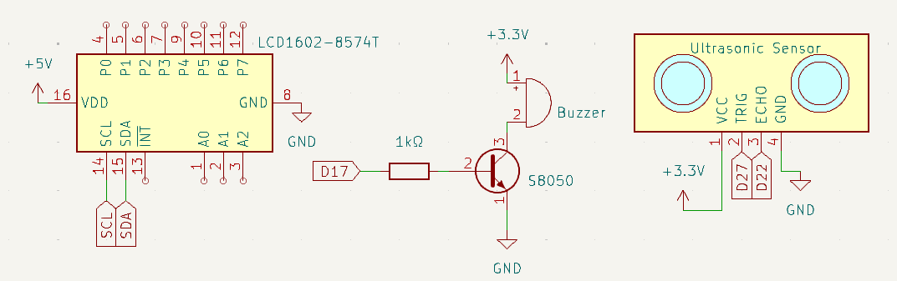
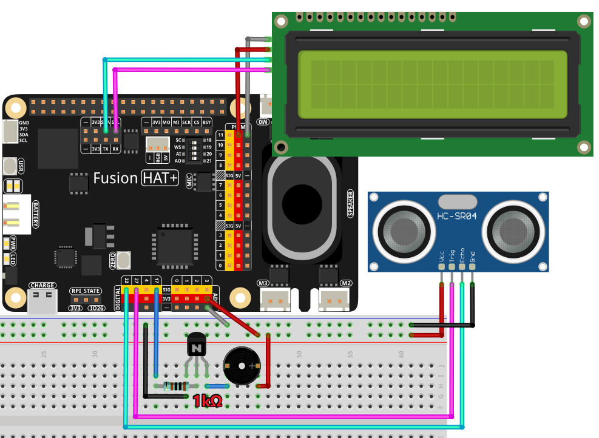

.. note::

    Hello, welcome to the SunFounder Raspberry Pi & Arduino & ESP32 Enthusiasts Community on Facebook! Dive deeper into Raspberry Pi, Arduino, and ESP32 with fellow enthusiasts.

    **Why Join?**

    - **Expert Support**: Solve post-sale issues and technical challenges with help from our community and team.
    - **Learn & Share**: Exchange tips and tutorials to enhance your skills.
    - **Exclusive Previews**: Get early access to new product announcements and sneak peeks.
    - **Special Discounts**: Enjoy exclusive discounts on our newest products.
    - **Festive Promotions and Giveaways**: Take part in giveaways and holiday promotions.

    👉 Ready to explore and create with us? Click [|link_sf_facebook|] and join today!

.. _4.1.6_py:

4.1.6 Reversing Alarm
==============================

**Introduction**

Parking a car safely into a garage often requires careful navigation, especially in tight spaces. In this project, you’ll create a reversing alarm system using an ultrasonic sensor, an LCD, and a buzzer. This system mimics the functionality of a real-world parking sensor, providing both visual and auditory feedback about the distance to obstacles.

----------------------------------------------

**What You’ll Need**

Below are the components required for this project:

.. list-table::
    :widths: 30 20
    :header-rows: 1

    *   - COMPONENT INTRODUCTION
        - PURCHASE LINK

    *   - :ref:`cpn_breadboard`
        - |link_breadboard_buy|
    *   - :ref:`cpn_wires`
        - |link_wires_buy|
    *   - :ref:`cpn_resistor`
        - |link_resistor_buy|
    *   - :ref:`cpn_buzzer`
        - |link_passive_buzzer_buy|
    *   - :ref:`cpn_transistor`
        - |link_transistor_buy|
    *   - :ref:`cpn_ultrasonic_sensor`
        - |link_ultrasonic_buy|
    *   - :ref:`cpn_i2c_lcd`
        - |link_i2clcd1602_buy|
    *   - Fusion HAT
        - 
    *   - Raspberry Pi Zero 2 W
        -

----------------------------------------------

**Circuit Diagram**

The system uses an ultrasonic sensor to measure the distance to obstacles. The distance is displayed on an I2C LCD screen, and the buzzer emits warning tones of varying frequency depending on the distance.

----------------------------------------------

**Wiring Diagram**

Follow this wiring diagram to set up your system:

----------------------------------------------

**Writing the Code**

Here is the Python code for the project:

.. raw:: html

   <run></run>

.. code-block:: python

    #!/usr/bin/env python3

    import time
    from fusion_hat import Ultrasonic, Buzzer, Pin,LCD1602

    # Trigger pin is connected to GPIO 27, Echo pin to GPIO 22
    sensor = Ultrasonic(trig=Pin(27), echo=Pin(22))

    # Initialize the buzzer connected to GPIO pin 17
    buzzer = Buzzer(Pin(17))

    # Initialize the LCD with I2C address and enable backlight
    lcd = LCD1602(address=0x27, backlight=1)
    lcd.clear()  # Clear the LCD display
    # Display startup messages on LCD
    lcd.write(0, 0, 'Ultrasonic Starting')
    lcd.write(1, 1, 'By SunFounder')
    time.sleep(2)  # Wait for 2 seconds

    def distance():
        # Calculate and return the distance measured by the sensor
        dis = sensor.read() # Convert distance to centimeters
        print('Distance: {:.2f} cm'.format(dis))  # Print distance with two decimal places
        time.sleep(0.3)  # Wait for 0.3 seconds before next measurement
        return dis

    def loop():
        # Continuously measure distance and update LCD and buzzer
        while True:
            dis = distance()  # Get the current distance
            # Display distance and handle alerts based on distance
            if dis > 400:  # Check if distance is out of range
                lcd.clear()
                lcd.write(0, 0, 'Error')
                lcd.write(3, 1, 'Out of range')
                time.sleep(0.5)
            else:
                # Display current distance on LCD
                lcd.clear()
                lcd.write(0, 0, 'Distance is')
                lcd.write(5, 1, str(round(dis, 2)) + ' cm')
                # Adjust buzzer frequency based on distance
                if dis >= 50:
                    time.sleep(0.5)
                elif 20 < dis < 50:
                    # Medium distance: medium buzzer frequency
                    for _ in range(2):
                        buzzer.on()
                        time.sleep(0.05)
                        buzzer.off()
                        time.sleep(0.2)
                elif dis <= 20:
                    # Close distance: high buzzer frequency
                    for _ in range(5):
                        buzzer.on()
                        time.sleep(0.05)
                        buzzer.off()
                        time.sleep(0.05)

    try:
        loop()      # Start the measurement loop
    except KeyboardInterrupt:
        # Turn off buzzer and clear LCD on user interrupt (e.g., Ctrl+C)
        buzzer.off()
        lcd.clear()

This Python script integrates an ultrasonic distance sensor, a buzzer, and an LCD1602 display to create a real-time distance monitoring system. When executed:

1. **System Initialization**:

   - The LCD initializes with a welcome message: 

   .. code-block:: python

      Ultrasonic Starting
      By SunFounder

   - The welcome message is displayed for 2 seconds before transitioning to real-time distance monitoring.

2. **Distance Measurement**: The ultrasonic sensor measures the distance to the nearest object in front of it and converts the value to centimeters.

3. **LCD Output**:

   - The measured distance is displayed on the LCD in real-time:

   .. code-block:: python

      Distance is
      XX.XX cm

   - If the distance exceeds 400 cm, the LCD displays an error message:

   .. code-block:: python

      Error
      Out of range

4. **Buzzer Alerts**: Based on the measured distance:

     - **More than 50 cm**: No buzzer sound.
     - **Between 20 cm and 50 cm**: The buzzer beeps twice with a short interval.
     - **20 cm or less**: The buzzer emits rapid beeps to indicate proximity.

----------------------------------------------

**Understanding the Code**

1. **LCD Initialization:** The LCD is initialized and displays a startup message.

   .. code-block:: python

      # Initialize the LCD with I2C address and enable backlight
      lcd = LCD1602(address=0x27, backlight=1)
      lcd.clear()  # Clear the LCD display
      # Display startup messages on LCD
      lcd.write(0, 0, 'Ultrasonic Starting')
      lcd.write(1, 1, 'By SunFounder')
      time.sleep(2)  # Wait for 2 seconds

2. **Distance Measurement:** The ultrasonic sensor calculates the distance, which is displayed on the LCD.

   .. code-block:: python

      def distance():
         # Calculate and return the distance measured by the sensor
         dis = sensor.read() # Convert distance to centimeters
         print('Distance: {:.2f} cm'.format(dis))  # Print distance with two decimal places
         time.sleep(0.3)  # Wait for 0.3 seconds before next measurement
         return dis

3. **Auditory Alerts:** The buzzer's frequency changes based on the proximity of obstacles:

   * **>50 cm:** No sound.
   * **20-50 cm:** Beeps twice with medium intervals.
   * **≤20 cm:** Rapid beeping for urgent warning.

----------------------------------------------

**Troubleshooting**

1. **LCD Does Not Display Anything**:

   - **Cause**: Incorrect I2C address or wiring.
   - **Solution**:

     - Verify the LCD's I2C address using ``i2cdetect -y 1`` and update ``LCD1602.init()`` with the correct address.
     - Ensure SDA and SCL pins are connected properly.

2. **Distance Not Measured**:

   - **Cause**: Incorrect wiring or sensor malfunction.
   - **Solution**:

     - Ensure the ultrasonic sensor's ``echo`` and ``trigger`` pins are connected to GPIO 22 and GPIO 27, respectively.
     - Test the sensor independently to confirm functionality.

3. **Buzzer Does Not Sound**:

   - **Cause**: Buzzer not connected or faulty.
   - **Solution**:

     - Verify the buzzer is connected to GPIO 17 and ground.
     - Test the buzzer by turning it on manually:
       
       .. code-block:: python

           buzzer.on()
           time.sleep(1)
           buzzer.off()

4. **LCD Displays 'Out of Range' Constantly**:

   - **Cause**: Sensor is unable to detect objects within its range.
   - **Solution**:

     - Ensure there are no obstructions or interference in the sensor's path.
     - Place objects within the sensor's effective range (usually 2 cm to 400 cm).

----------------------------------------------

**Extendable Ideas**

1. **Adjustable Alert Thresholds**: Allow users to set custom distance thresholds for the buzzer alerts.

2. **Data Logging**: Log distance measurements to a file for later analysis:

   .. code-block:: python

      with open("distance_log.txt", "a") as log_file:
            log_file.write(f"{time.time():.3f}, {dis:.2f} cm\n")

3. **Visual Alerts**: Use LEDs of different colors to indicate proximity levels (e.g., green for safe, yellow for caution, red for danger).

4. **Dynamic Messages**: Display custom messages on the LCD based on distance, such as:

   - ``Too Close!``
   - ``Safe Distance``

----------------------------------------------

**Conclusion**

This project demonstrates a practical application of ultrasonic sensors, combining auditory and visual feedback for an intuitive reversing alarm system. Such systems are valuable in vehicles and robotics, offering insights into proximity detection and IoT integrations. Extend its functionality to suit your innovative ideas!
