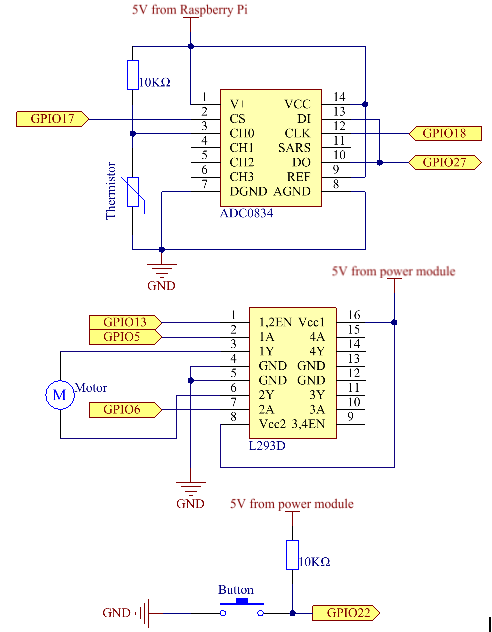
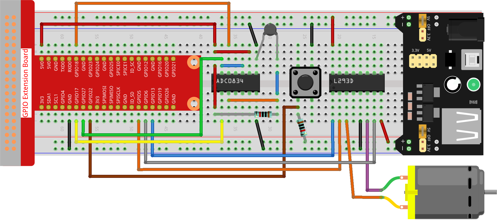

.. note::

    Hello, welcome to the SunFounder Raspberry Pi & Arduino & ESP32 Enthusiasts Community on Facebook! Dive deeper into Raspberry Pi, Arduino, and ESP32 with fellow enthusiasts.

    **Why Join?**

    - **Expert Support**: Solve post-sale issues and technical challenges with help from our community and team.
    - **Learn & Share**: Exchange tips and tutorials to enhance your skills.
    - **Exclusive Previews**: Get early access to new product announcements and sneak peeks.
    - **Special Discounts**: Enjoy exclusive discounts on our newest products.
    - **Festive Promotions and Giveaways**: Take part in giveaways and holiday promotions.

    👉 Ready to explore and create with us? Click [|link_sf_facebook|] and join today!

.. _4.1.7_py:

4.1.7 Smart Fan
=========================

**Introduction**

In this project, you’ll build a "smart fan" that operates in both manual and automatic modes. By combining motors, buttons, and a thermistor, the fan can have adjustable wind speeds and respond to changes in temperature. This makes it a perfect experiment for learning about motor control, temperature sensing, and GPIO usage.

----------------------------------------------

**What You’ll Need**

Here are the components you’ll need for this project:

.. list-table::
    :widths: 30 20
    :header-rows: 1

    *   - COMPONENT INTRODUCTION
        - PURCHASE LINK
    *   - GPIO Extension Board
        - |link_gpio_board_buy|
    *   - Breadboard
        - |link_breadboard_buy|
    *   - Wires
        - |link_wires_buy|
    *   - Resistors
        - |link_resistor_buy|
    *   - Power Module
        - N/A
    *   - Thermistor
        - |link_thermistor_buy|
    *   - L293D Motor Driver
        - N/A
    *   - ADC0834 Module
        - N/A
    *   - Button
        - |link_button_buy|
    *   - Motor
        - |link_motor_buy|

----------------------------------------------

**Circuit Diagram**

The circuit diagram below illustrates how to connect the thermistor, button, motor driver, and motor:

----------------------------------------------

**Wiring Diagram**

Refer to the following image for the breadboard layout and wiring connections:

----------------------------------------------

**Power Supply Note:**

Use a 9V battery for the power module. Connect the module’s jumper cap to the 5V bus strip on the breadboard.

.. image:: ../python/img/4.1.10_smart_fan_battery.jpeg
   :align: center

----------------------------------------------

**Writing the Code**

1. Navigate to the project directory:

   .. code-block:: bash

       cd ~/zero-w-ai-kit/python

2. Run the Python script:

   .. code-block:: bash

       sudo python3 4.1.10_SmartFan_zero.py

   Once the code is running:

   * Press the button to adjust the fan speed through five levels: **0-4**. When at level 4, pressing the button again will stop the fan.
   * The fan speed adjusts automatically if the temperature rises or falls by more than 2°C, increasing or decreasing the speed by one level.

----------------------------------------------

**Code**

Here’s the Python script for this project:

.. code-block:: python

    #!/usr/bin/env python3
    from gpiozero import Motor, Button
    from time import sleep
    import ADC0834
    import math

    # Initialize button, motor, and ADC0834 for temperature sensing
    BtnPin = Button(22)
    motor = Motor(forward=5, backward=6, enable=13)
    ADC0834.setup()

    # Initialize speed level and temperature tracking variables
    level = 0
    currentTemp = 0
    markTemp = 0

    def temperature():
        """
        Reads and calculates the current temperature in Celsius.
        """
        analogVal = ADC0834.getResult()
        Vr = 5 * float(analogVal) / 255
        Rt = 10000 * Vr / (5 - Vr)
        temp = 1 / (((math.log(Rt / 10000)) / 3950) + (1 / (273.15 + 25)))
        return temp - 273.15

    def motor_run(level):
        """
        Adjusts motor speed based on the speed level.
        """
        if level == 0:
            motor.stop()
        else:
            motor.forward(speed=level / 4)
        return level

    def changeLevel():
        """
        Handles button press to cycle through speed levels and updates reference temperature.
        """
        global level, markTemp
        level = (level + 1) % 5
        markTemp = currentTemp

    BtnPin.when_pressed = changeLevel

    def main():
        """
        Monitors temperature and adjusts fan speed accordingly.
        """
        global currentTemp, markTemp
        markTemp = temperature()
        while True:
            currentTemp = temperature()
            if level > 0:
                if currentTemp - markTemp >= 2:
                    level = min(level + 1, 4)
                    markTemp = currentTemp
                elif currentTemp - markTemp <= -2:
                    level = max(level - 1, 0)
                    markTemp = currentTemp
            motor_run(level)

    try:
        main()
    except KeyboardInterrupt:
        motor.stop()

This Python script integrates a motor, button, and ADC0834-based temperature sensor to create a temperature-controlled fan system with adjustable speed. When executed:

1. **Temperature Sensing**: Reads the current temperature in Celsius using the ADC0834 module and a thermistor.

2. **Manual Speed Adjustment**:

   - A button connected to GPIO 22 allows the user to cycle through five speed levels (0 to 4).
   - Pressing the button increases the speed level, and the motor runs at the corresponding speed. Speed level 0 stops the motor.

3. **Automatic Speed Control**: The system adjusts the motor speed automatically based on temperature changes:

   - If the temperature increases by 2°C or more, the speed level increases (up to level 4).
   - If the temperature decreases by 2°C or more, the speed level decreases (down to level 0).

4. **Continuous Monitoring**: The system continuously monitors the temperature and adjusts the fan speed accordingly.

5. **Graceful Exit**: On ``Ctrl+C``, the motor stops, and the script exits cleanly.

----------------------------------------------

**Understanding the Code**

1. **Temperature Calculation:**

   The ``temperature()`` function reads the thermistor’s analog value, converts it into resistance, and calculates the corresponding temperature using a mathematical formula.

   .. code-block:: python

       def temperature():
           analogVal = ADC0834.getResult()
           Vr = 5 * float(analogVal) / 255
           Rt = 10000 * Vr / (5 - Vr)
           temp = 1 / (((math.log(Rt / 10000)) / 3950) + (1 / (273.15 + 25)))
           return temp - 273.15

2. **Motor Speed Control:**

   The ``motor_run()`` function adjusts the motor’s speed based on the ``level`` variable. The speed is normalized to a value between 0 and 1.

   .. code-block:: python

       def motor_run(level):
           if level == 0:
               motor.stop()
           else:
               motor.forward(speed=level / 4)
           return level

3. **Manual Speed Adjustment:**

   The ``changeLevel()`` function cycles through speed levels 0-4 when the button is pressed.

   .. code-block:: python

       def changeLevel():
           global level, markTemp
           level = (level + 1) % 5
           markTemp = currentTemp

4. **Automatic Speed Adjustment:**

   The ``main()`` function continuously monitors temperature and adjusts the fan speed if the temperature deviates by more than 2°C from the reference temperature.

   .. code-block:: python

       def main():
           global currentTemp, markTemp
           markTemp = temperature()
           while True:
               currentTemp = temperature()
               if level > 0:
                   if currentTemp - markTemp >= 2:
                       level = min(level + 1, 4)
                       markTemp = currentTemp
                   elif currentTemp - markTemp <= -2:
                       level = max(level - 1, 0)
                       markTemp = currentTemp
               motor_run(level)

----------------------------------------------

**Troubleshooting**

1. **Motor Does Not Run**:

   - **Cause**: Incorrect wiring or insufficient power supply.
   - **Solution**:

     - Verify the motor is connected to GPIO pins 5 (forward), 6 (backward), and 13 (enable).
     - Ensure the motor's power supply matches its voltage requirements.

2. **Temperature Reading is Incorrect**:

   - **Cause**: Incorrect ADC0834 setup or faulty thermistor.
   - **Solution**:

     - Verify the ADC0834 module is properly connected and initialized with ``ADC0834.setup()``.
     - Check the thermistor wiring and ensure it is within the specified range.

3. **Button Press Not Detected**:

   - **Cause**: Incorrect button wiring or GPIO configuration.
   - **Solution**:

     - Verify the button is connected to GPIO 22 and ground.
     - Test the button independently to confirm it closes the circuit when pressed.

4. **Speed Level Does Not Change Automatically**:

   - **Cause**: Incorrect temperature difference calculation.
   - **Solution**: Ensure the ``currentTemp`` and ``markTemp`` values update correctly in the ``main()`` function.

----------------------------------------------

**Extendable Ideas**

1. **Display Temperature and Speed**: Use an LCD or OLED screen to show the current temperature and fan speed level.

     .. code-block:: python

         from LCD1602 import write
         write(0, 0, f"Temp: {currentTemp:.2f}C")
         write(1, 0, f"Speed: {level}")

2. **Overheat Alert**: Add a buzzer or LED to alert the user when the temperature exceeds a critical threshold.

     .. code-block:: python

         if currentTemp > 50:
             buzzer.on()

3. **Smart Button Functions**: Long-press the button to reset the speed level to 0 or toggle automatic/manual modes.

----------------------------------------------

**Conclusion**

The Smart Fan project demonstrates how to combine manual and automatic control in a single system. It’s a practical example of integrating sensors, motors, and user interaction into a functional and efficient design. Try enhancing it with additional features to create your personalized climate control solution!
