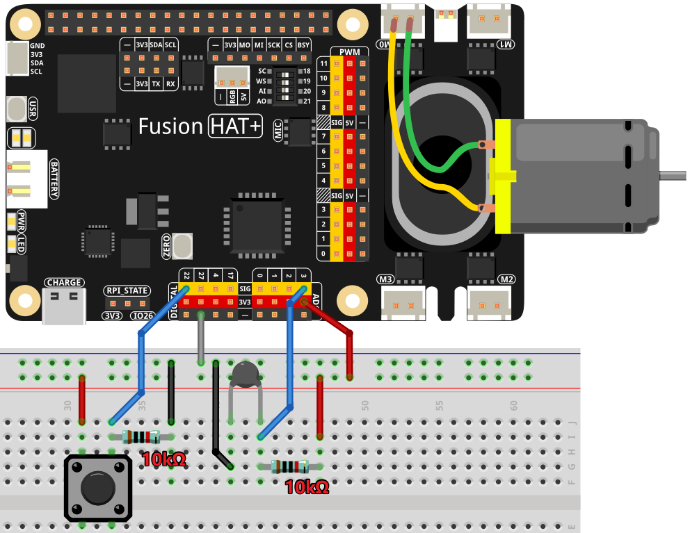

.. note::

    Hello, welcome to the SunFounder Raspberry Pi & Arduino & ESP32 Enthusiasts Community on Facebook! Dive deeper into Raspberry Pi, Arduino, and ESP32 with fellow enthusiasts.

    **Why Join?**

    - **Expert Support**: Solve post-sale issues and technical challenges with help from our community and team.
    - **Learn & Share**: Exchange tips and tutorials to enhance your skills.
    - **Exclusive Previews**: Get early access to new product announcements and sneak peeks.
    - **Special Discounts**: Enjoy exclusive discounts on our newest products.
    - **Festive Promotions and Giveaways**: Take part in giveaways and holiday promotions.

    👉 Ready to explore and create with us? Click [|link_sf_facebook|] and join today!

.. _4.1.7_py:

4.1.7 Smart Fan
=========================

**Introduction**

In this project, you’ll build a "smart fan" that operates in both manual and automatic modes. By combining motors, buttons, and a thermistor, the fan can have adjustable wind speeds and respond to changes in temperature. This makes it a perfect experiment for learning about motor control, temperature sensing, and GPIO usage.

----------------------------------------------

**What You’ll Need**

Here are the components you’ll need for this project:

.. list-table::
    :widths: 30 20
    :header-rows: 1

    *   - COMPONENT INTRODUCTION
        - PURCHASE LINK

    *   - :ref:`cpn_breadboard`
        - |link_breadboard_buy|
    *   - :ref:`cpn_wires`
        - |link_wires_buy|
    *   - :ref:`cpn_resistor`
        - |link_resistor_buy|
    *   - :ref:`cpn_thermistor`
        - |link_thermistor_buy|
    *   - :ref:`cpn_button`
        - |link_button_buy|
    *   - :ref:`cpn_motor`
        - |link_motor_buy|
    *   - Fusion HAT
        - 
    *   - Raspberry Pi Zero 2 W
        -

----------------------------------------------

**Circuit Diagram**

The circuit diagram below illustrates how to connect the thermistor, button, motor driver, and motor:

----------------------------------------------

**Wiring Diagram**

Refer to the following image for the breadboard layout and wiring connections:

----------------------------------------------

**Writing the Code**

Here’s the Python script for this project:

.. code-block:: python

    #!/usr/bin/env python3

    from fusion_hat import Motor, PWM, Pin, ADC
    from time import sleep
    import math

    # Initialize GPIO pins for the button and motor control
    BtnPin = Pin(22, Pin.IN, Pin.PULL_DOWN)
    motor = Motor('M0')
    thermistor = ADC('A3')

    # Initialize variables to track the motor speed level and temperatures
    level = 0
    currentTemp = 0
    markTemp = 0

    def temperature():
        """
        Reads and calculates the current temperature from the sensor.
        Returns:
            float: The current temperature in Celsius.
        """
        # Read analog value from the thermistor
        analogVal = thermistor.read()
        # Convert analog value to voltage and then to resistance
        Vr = 3.3 * float(analogVal) / 4095
        if 3.3 - Vr <= 0.1:
            print("Please check the sensor")
            return None
        Rt = 10000 * Vr / (3.3 - Vr)
        # Calculate temperature in Celsius
        temp = 1 / (((math.log(Rt / 10000)) / 3950) + (1 / (273.15 + 25)))
        Cel = temp - 273.15
        return Cel

    def motor_run(level):
        """
        Adjusts the motor speed based on the specified level.
        Args:
            level (int): Desired motor speed level.
        Returns:
            int: Adjusted motor speed level.
        """
        # Stop the motor if the level is 0
        if level == 0:
            motor.speed(0)
            return 0
        # Cap the level at 4 for maximum speed
        if level >= 4:
            level = 4
        # Set the motor speed
        motor.speed(level*25)
        return level

    def changeLevel():
        """
        Changes the motor speed level when the button is pressed and updates the reference temperature.
        """
        global level, currentTemp, markTemp
        
        # Cycle through levels 0-4
        level = (level + 1) % 5
        print("Button pressed, level changed to:", level)
        # Update the reference temperature
        markTemp = currentTemp

    # Bind the button press event to changeLevel function
    BtnPin.when_activated = changeLevel

    def main():
        """
        Main function to continuously monitor and respond to temperature changes.
        """
        global level, currentTemp, markTemp
        # Set initial reference temperature
        markTemp = temperature()
        while True:
            # Continuously read current temperature
            currentTemp = temperature()
            if currentTemp == None:
                continue
            # Adjust motor level based on temperature difference
            if level != 0:
                if currentTemp - markTemp <= -5:
                    level -= 1
                    markTemp = currentTemp
                    print("Temperature decreased, level changed to:", level," ,temperature:",currentTemp)
                elif currentTemp - markTemp >= 5:
                    if level < 4:
                        level += 1
                    markTemp = currentTemp
                    print("Temperature increased, level changed to:", level," ,temperature:",currentTemp)
            # Run the motor at the adjusted level
            level = motor_run(level)
            sleep(0.5)

    # Run the main function and handle KeyboardInterrupt
    try:
        main()
    except KeyboardInterrupt:
        # Stop the motor when the script is interrupted
        motor.speed(0)

This Python script integrates a motor, button, and temperature sensor to create a temperature-controlled fan system with adjustable speed. When executed:

1. **Temperature Sensing**: Reads the current temperature in Celsius using the thermistor.

2. **Manual Speed Adjustment**:

   - A button connected to GPIO 22 allows the user to cycle through five speed levels (0 to 4).
   - Pressing the button increases the speed level, and the motor runs at the corresponding speed. Speed level 0 stops the motor.

3. **Automatic Speed Control**: The system adjusts the motor speed automatically based on temperature changes:

   - If the temperature increases by 2°C or more, the speed level increases (up to level 4).
   - If the temperature decreases by 2°C or more, the speed level decreases (down to level 0).

4. **Continuous Monitoring**: The system continuously monitors the temperature and adjusts the fan speed accordingly.

5. **Graceful Exit**: On ``Ctrl+C``, the motor stops, and the script exits cleanly.

----------------------------------------------

**Understanding the Code**

1. **Temperature Calculation:**

   .. code-block:: python

      def temperature():
         """
         Reads and calculates the current temperature from the sensor.
         Returns:
            float: The current temperature in Celsius.
         """
         # Read analog value from the thermistor
         analogVal = thermistor.read()
         # Convert analog value to voltage and then to resistance
         Vr = 3.3 * float(analogVal) / 4095
         if 3.3 - Vr <= 0.1:
            print("Please check the sensor")
            return None
         Rt = 10000 * Vr / (3.3 - Vr)
         # Calculate temperature in Celsius
         temp = 1 / (((math.log(Rt / 10000)) / 3950) + (1 / (273.15 + 25)))
         Cel = temp - 273.15
         return Cel

   The ``temperature()`` function reads the thermistor’s analog value, converts it into resistance, and calculates the corresponding temperature using a mathematical formula.

2. **Motor Speed Control:**

   .. code-block:: python

      def motor_run(level):
         """
         Adjusts the motor speed based on the specified level.
         Args:
            level (int): Desired motor speed level.
         Returns:
            int: Adjusted motor speed level.
         """
         # Stop the motor if the level is 0
         if level == 0:
            motor.speed(0)
            return 0
         # Cap the level at 4 for maximum speed
         if level >= 4:
            level = 4
         # Set the motor speed
         motor.speed(level*25)
         return level

   The ``motor_run()`` function adjusts the motor’s speed based on the ``level`` variable. The speed is normalized to a value between 0 and 1.

3. **Manual Speed Adjustment:**

   .. code-block:: python

      def changeLevel():
         """
         Changes the motor speed level when the button is pressed and updates the reference temperature.
         """
         global level, currentTemp, markTemp
         
         # Cycle through levels 0-4
         level = (level + 1) % 5
         print("Button pressed, level changed to:", level)
         # Update the reference temperature
         markTemp = currentTemp

      # Bind the button press event to changeLevel function
      BtnPin.when_activated = changeLevel

   The ``changeLevel()`` function cycles through speed levels 0-4 when the button is pressed.

4. **Automatic Speed Adjustment:**

   .. code-block:: python

      def main():
         """
         Main function to continuously monitor and respond to temperature changes.
         """
         global level, currentTemp, markTemp
         # Set initial reference temperature
         markTemp = temperature()
         while True:
            # Continuously read current temperature
            currentTemp = temperature()
            if currentTemp == None:
                  continue
            # Adjust motor level based on temperature difference
            if level != 0:
                  if currentTemp - markTemp <= -5:
                     level -= 1
                     markTemp = currentTemp
                     print("Temperature decreased, level changed to:", level," ,temperature:",currentTemp)
                  elif currentTemp - markTemp >= 5:
                     if level < 4:
                        level += 1
                     markTemp = currentTemp
                     print("Temperature increased, level changed to:", level," ,temperature:",currentTemp)
            # Run the motor at the adjusted level
            level = motor_run(level)
            sleep(0.5)

   The ``main()`` function continuously monitors temperature and adjusts the fan speed if the temperature deviates by more than 2°C from the reference temperature.

----------------------------------------------

**Troubleshooting**

1. **Motor Does Not Run**:

   - **Cause**: Incorrect wiring or insufficient power supply.
   - **Solution**:

     - Verify the motor is connected to M0.
     - Ensure the motor's power supply matches its voltage requirements.

2. **Temperature Reading is Incorrect**:

   - **Cause**: Faulty thermistor.
   - **Solution**:

     - Check the thermistor wiring and ensure it is within the specified range.

3. **Button Press Not Detected**:

   - **Cause**: Incorrect button wiring or GPIO configuration.
   - **Solution**:

     - Verify the button is connected to GPIO 22 and ground.
     - Test the button independently to confirm it closes the circuit when pressed.

4. **Speed Level Does Not Change Automatically**:

   - **Cause**: Incorrect temperature difference calculation.
   - **Solution**: Ensure the ``currentTemp`` and ``markTemp`` values update correctly in the ``main()`` function.

----------------------------------------------

**Extendable Ideas**

1. **Overheat Alert**: Add a buzzer or LED to alert the user when the temperature exceeds a critical threshold.

     .. code-block:: python

         if currentTemp > 50:
             buzzer.on()

2. **Smart Button Functions**: Long-press the button to reset the speed level to 0 or toggle automatic/manual modes.

----------------------------------------------

**Conclusion**

The Smart Fan project demonstrates how to combine manual and automatic control in a single system. It’s a practical example of integrating sensors, motors, and user interaction into a functional and efficient design. Try enhancing it with additional features to create your personalized climate control solution!
