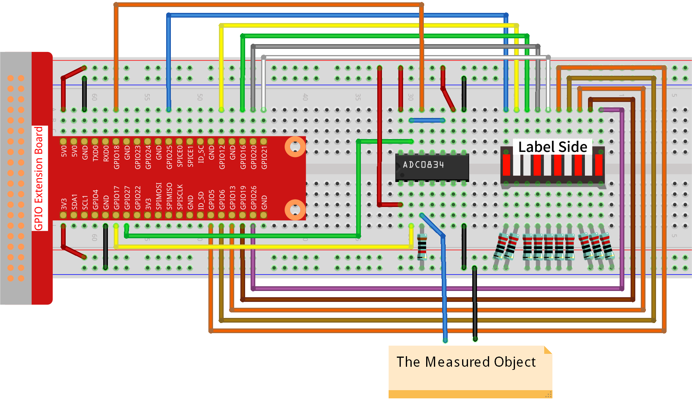

.. note::

    Hello, welcome to the SunFounder Raspberry Pi & Arduino & ESP32 Enthusiasts Community on Facebook! Dive deeper into Raspberry Pi, Arduino, and ESP32 with fellow enthusiasts.

    **Why Join?**

    - **Expert Support**: Solve post-sale issues and technical challenges with help from our community and team.
    - **Learn & Share**: Exchange tips and tutorials to enhance your skills.
    - **Exclusive Previews**: Get early access to new product announcements and sneak peeks.
    - **Special Discounts**: Enjoy exclusive discounts on our newest products.
    - **Festive Promotions and Giveaways**: Take part in giveaways and holiday promotions.

    👉 Ready to explore and create with us? Click [|link_sf_facebook|] and join today!

.. _4.1.8_py:

4.1.8 Battery Indicator
===================================

**Introduction**

This project involves creating a simple yet effective battery indicator that visually displays the battery level using an LED bar graph. It's a practical application of analog-to-digital conversion (ADC) and GPIO control, making it an excellent learning opportunity for understanding how to measure and visualize voltage levels.

----------------------------------------------

**What You’ll Need**

The following components are required for this project:

.. list-table::
    :widths: 30 20
    :header-rows: 1

    *   - COMPONENT INTRODUCTION
        - PURCHASE LINK
    *   - GPIO Extension Board
        - |link_gpio_board_buy|
    *   - Breadboard
        - |link_breadboard_buy|
    *   - Wires
        - |link_wires_buy|
    *   - Resistors
        - |link_resistor_buy|
    *   - LED Bar Graph
        - N/A
    *   - ADC0834 Module
        - N/A

----------------------------------------------

**Circuit Diagram**

The schematic diagram below shows how the components are connected:

.. image:: ../python/img/4.1.11_battery_indicator_schematic.png
   :align: center

----------------------------------------------

**Wiring Diagram**

Refer to the following diagram for setting up the circuit on a breadboard:

----------------------------------------------

**Writing the Code**

1. Navigate to the project directory:

   .. code-block:: bash

       cd ~/zero-w-ai-kit/python

2. Run the Python script:

   .. code-block:: bash

       sudo python3 4.1.11_BatteryIndicator_zero.py

   After running the program:
   
   - Connect the ADC0834 module's third pin and GND to the two terminals of a battery.
   - Observe the corresponding LEDs on the bar graph light up, representing the battery's voltage level (0-5V).

----------------------------------------------

**Code**

Here is the Python code for the battery indicator project:

.. code-block:: python

   #!/usr/bin/env python3
   from gpiozero import LED
   import ADC0834
   import time

   # List of GPIO pins connected to the LEDs
   ledPins = [25, 12, 16, 20, 21, 5, 6, 13, 19, 26]
   leds = [LED(pin) for pin in ledPins]  # Initialize LEDs for each pin

   # Initialize the ADC0834 module
   ADC0834.setup()

   def LedBarGraph(value):
      """
      Update the LED bar graph to display the specified level.
      :param value: Number of LEDs to light up (0-10).
      """
      for i in range(10):
         leds[i].off()  # Turn off all LEDs
      for i in range(value):
         leds[i].on()  # Turn on LEDs up to the specified value

   try:
      # Main loop to continuously read ADC values and update LEDs
      while True:
         analogVal = ADC0834.getResult()  # Read ADC value
         LedBarGraph(int(analogVal / 25))  # Scale and update LEDs
   except KeyboardInterrupt:
      # Turn off all LEDs when the program is interrupted
      for led in leds:
         led.off()

This Python script uses an ADC0834 analog-to-digital converter to control a 10-LED bar graph based on the analog input value. When executed:

1. **Analog Input Reading**:

   - The ADC0834 module continuously reads analog input values from a connected sensor.

2. **LED Bar Graph Display**:

   - The analog input value (0-255) is scaled to a range of 0-10.
   - The corresponding number of LEDs light up on the bar graph to represent the input level.

3. **Dynamic Updates**:

   - As the analog input changes, the number of illuminated LEDs updates in real-time, providing a visual representation of the input value.

4. **Graceful Exit**:

   - On ``Ctrl+C``, all LEDs are turned off, and the script exits cleanly.

----------------------------------------------

**Understanding the Code**

1. **Library Imports:**

   * ``gpiozero`` is used for controlling LEDs.
   * ``ADC0834`` is used for interfacing with the ADC module.
   * ``time`` is used for timing-related functions.

   .. code-block:: python

       from gpiozero import LED
       import ADC0834
       import time

2. **LED Initialization:**

   * The GPIO pins for the LEDs are defined, and LED objects are initialized for easy control.

   .. code-block:: python

       ledPins = [25, 12, 16, 20, 21, 5, 6, 13, 19, 26]
       leds = [LED(pin) for pin in ledPins]

3. **ADC Setup:**

   * The ADC0834 module is initialized to enable analog-to-digital conversion.

   .. code-block:: python

       ADC0834.setup()

4. **Bar Graph Logic:**

   * The ``LedBarGraph`` function turns on LEDs corresponding to the battery level.

   .. code-block:: python

       def LedBarGraph(value):
           for i in range(10):
               leds[i].off()
           for i in range(value):
               leds[i].on()

5. **Main Loop:**

   * Continuously reads the analog value, scales it, and updates the LED bar graph.
   * Handles a keyboard interrupt to ensure all LEDs are turned off before exiting.

   .. code-block:: python

       try:
           while True:
               analogVal = ADC0834.getResult()
               LedBarGraph(int(analogVal / 25))
       except KeyboardInterrupt:
           for led in leds:
               led.off()

----------------------------------------------

**Troubleshooting**

1. **LEDs Do Not Light Up**:

   - **Cause**: Incorrect wiring or GPIO configuration.
   - **Solution**:

     - Ensure each LED is connected to the correct GPIO pin listed in ``ledPins``.
     - Verify that the LEDs are functional and properly powered.

2. **Analog Input Not Detected**:

   - **Cause**: Faulty ADC0834 setup or sensor connection.
   - **Solution**: Confirm the ADC0834 module is properly connected and initialized with ``ADC0834.setup()``.

3. **LED Bar Graph Does Not Update**:

   - **Cause**: Incorrect ADC value scaling or logic error in ``LedBarGraph``.
   - **Solution**:

     - Verify that ``analogVal`` is being read correctly and scaled to the range 0-10.
     - Add debug prints to confirm correct values:
       
       .. code-block:: python

           print(f"Analog Value: {analogVal}, LEDs On: {int(analogVal / 25)}")

4. **Flickering LEDs**:

   - **Cause**: Rapid updates without sufficient delay.
   - **Solution**: Add a small delay in the main loop to stabilize the updates:

     .. code-block:: python

         time.sleep(0.1)

----------------------------------------------

**Extendable Ideas**

1. **Adjustable Brightness**: Use PWM to control the brightness of each LED based on the analog input value.

     .. code-block:: python

         from gpiozero import PWMLED
         leds = [PWMLED(pin) for pin in ledPins]
         leds[i].value = analogVal / 255

2. **Real-Time Data Logging**: Log analog input values and corresponding LED levels to a file for analysis:

     .. code-block:: python

         with open("log.txt", "a") as log_file:
             log_file.write(f"Analog Value: {analogVal}, LEDs On: {int(analogVal / 25)}\n")

3. **Interactive Control**: Use buttons or a rotary encoder to adjust the scaling factor or sensitivity of the bar graph.

4. **Custom Threshold Alerts**: Trigger an alert (e.g., buzzer or flashing LEDs) when the analog value exceeds a threshold.

     .. code-block:: python

         if analogVal > 200:
             for led in leds:
                 led.blink(on_time=0.1, off_time=0.1)

----------------------------------------------

**Conclusion**

This battery indicator project demonstrates how to use an ADC module and an LED bar graph to visualize voltage levels. It’s a simple yet powerful tool to learn about analog voltage measurement and GPIO control. Try enhancing it with additional features like a digital readout or integrating it into a larger project for real-world applications.
