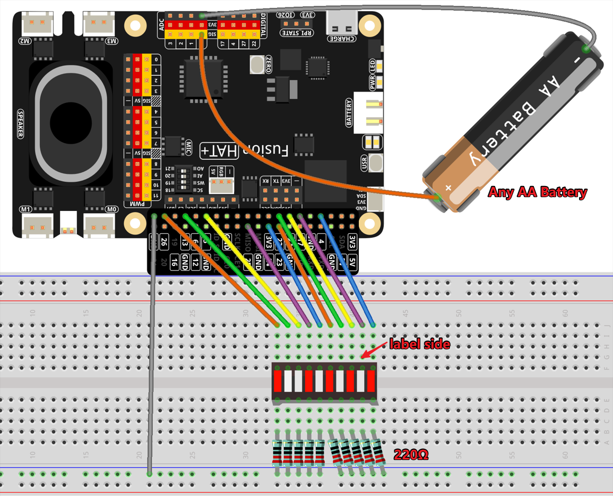

.. note::

    Hello, welcome to the SunFounder Raspberry Pi & Arduino & ESP32 Enthusiasts Community on Facebook! Dive deeper into Raspberry Pi, Arduino, and ESP32 with fellow enthusiasts.

    **Why Join?**

    - **Expert Support**: Solve post-sale issues and technical challenges with help from our community and team.
    - **Learn & Share**: Exchange tips and tutorials to enhance your skills.
    - **Exclusive Previews**: Get early access to new product announcements and sneak peeks.
    - **Special Discounts**: Enjoy exclusive discounts on our newest products.
    - **Festive Promotions and Giveaways**: Take part in giveaways and holiday promotions.

    👉 Ready to explore and create with us? Click [|link_sf_facebook|] and join today!

.. _4.1.8_py:

4.1.8 Battery Indicator
===================================

**Introduction**

This project involves creating a simple yet effective battery indicator that visually displays the battery level using an LED bar graph. It's a practical application of analog-to-digital conversion (ADC) and GPIO control, making it an excellent learning opportunity for understanding how to measure and visualize voltage levels.

----------------------------------------------

**What You’ll Need**

The following components are required for this project:

.. list-table::
    :widths: 30 20
    :header-rows: 1

    *   - COMPONENT INTRODUCTION
        - PURCHASE LINK

    *   - :ref:`cpn_breadboard`
        - |link_breadboard_buy|
    *   - :ref:`cpn_wires`
        - |link_wires_buy|
    *   - :ref:`cpn_resistor`
        - |link_resistor_buy|
    *   - :ref:`cpn_bar_graph`
        - 
    *   - Fusion HAT
        - 
    *   - Raspberry Pi Zero 2 W
        -

----------------------------------------------

**Circuit Diagram**

The schematic diagram below shows how the components are connected:

----------------------------------------------

**Wiring Diagram**

Refer to the following diagram for setting up the circuit on a breadboard:

----------------------------------------------

**Writing the Code**

Here is the Python code for the battery indicator project:

.. raw:: html

   <run></run>

.. code-block:: python

    #!/usr/bin/env python3
    from fusion_hat import Pin,ADC
    from time import sleep

    # Define GPIO pins where LEDs are connected
    led_pins = [4, 17, 27, 22, 23, 24, 25, 5, 13, 26]

    # Create LED objects for each pin
    leds = [Pin(pin, Pin.OUT) for pin in led_pins]

    # Set up the detection pin for the battery
    btr = ADC('A0')

    def MAP(x, in_min, in_max, out_min, out_max):
        """
        Map a value from one range to another.
        :param x: The value to be mapped.
        :param in_min: The lower bound of the value's current range.
        :param in_max: The upper bound of the value's current range.
        :param out_min: The lower bound of the value's target range.
        :param out_max: The upper bound of the value's target range.
        :return: The mapped value.
        """
        return (x - in_min) * (out_max - out_min) / (in_max - in_min) + out_min

    def LedBarGraph(value):
        # Turn off all LEDs
        for i in range(10):
            leds[i].off()
        # Turn on LEDs up to the specified value
        for i in range(value):
            leds[i].on()

    try:
        # Main loop to continuously update LED bar graph
        while True:
            # Read voltage value 
            voltage = btr.read_voltage()
            print('voltage = %.2f' %(voltage))

            # Convert analog value to LED bar graph level
            LedBarGraph(int(MAP(voltage, 0, 3.3, 0, 10)))
            sleep(0.5)
            
    except KeyboardInterrupt: 
        # Turn off all LEDs when program is interrupted
        for i in range(10):
            leds[i].off()

This Python script control a 10-LED bar graph based on the analog input value. When executed:

1. **Analog Input Reading**:

   - The Fusion HAT continuously reads analog input values from a battery.

2. **LED Bar Graph Display**:

   - The voltage is scaled to a range of 0-10.
   - The corresponding number of LEDs light up on the bar graph to represent the input level.

3. **Dynamic Updates**:

   - As the analog input changes, the number of illuminated LEDs updates in real-time, providing a visual representation of the input value.

4. **Graceful Exit**:

   - On ``Ctrl+C``, all LEDs are turned off, and the script exits cleanly.

----------------------------------------------

**Understanding the Code**

1. **Library Imports:**

   .. code-block:: python

      from fusion_hat import Pin,ADC
      from time import sleep

   * ``fusion_hat`` is used for interfacing with the ADC module and LED Bar Graph.
   * ``time`` is used for timing-related functions.

2. **LED Initialization:**

   .. code-block:: python

      # Define GPIO pins where LEDs are connected
      led_pins = [4, 17, 27, 22, 23, 24, 25, 5, 13, 26]

      # Create LED objects for each pin
      leds = [Pin(pin, Pin.OUT) for pin in led_pins]

   * The GPIO pins for the LEDs are defined, and LED objects are initialized for easy control.

3. **ADC Setup:**

   .. code-block:: python

      # Set up the detection pin for the battery
      btr = ADC('A0')

   * The ADC object is initialized to enable analog-to-digital conversion.

4. **Bar Graph Logic:**

   .. code-block:: python

       def LedBarGraph(value):
           for i in range(10):
               leds[i].off()
           for i in range(value):
               leds[i].on()

   * The ``LedBarGraph`` function turns on LEDs corresponding to the battery level.

5. **Main Loop:**

   .. code-block:: python

      try:
         # Main loop to continuously update LED bar graph
         while True:
            # Read voltage value 
            voltage = btr.read_voltage()
            print('voltage = %.2f' %(voltage))

            # Convert analog value to LED bar graph level
            LedBarGraph(int(MAP(voltage, 0, 3.3, 0, 10)))
            sleep(0.5)
            
      except KeyboardInterrupt: 
         # Turn off all LEDs when program is interrupted
         for i in range(10):
            leds[i].off()

   * Continuously reads the voltage from the battery, scales it, and updates the LED bar graph.
   * Handles a keyboard interrupt to ensure all LEDs are turned off before exiting.

----------------------------------------------

**Troubleshooting**

1. **LEDs Do Not Light Up**:

   - **Cause**: Incorrect wiring or GPIO configuration.
   - **Solution**:

     - Ensure each LED is connected to the correct GPIO pin listed in ``ledPins``.
     - Verify that the LEDs are functional and properly powered.

2. **LED Bar Graph Does Not Update**:

   - **Cause**: Incorrect ADC value scaling or logic error in ``LedBarGraph``.
   - **Solution**:

     - Verify that ``voltage`` is being read correctly and scaled to the range 0-10.
     - Add debug prints to confirm correct values:
       
       .. code-block:: python

           print(f"Analog Value: {voltage}, LEDs On: {int(MAP(voltage, 0, 3.3, 0, 10))}")

4. **Flickering LEDs**:

   - **Cause**: Rapid updates without sufficient delay.
   - **Solution**: Add a small delay in the main loop to stabilize the updates:

     .. code-block:: python

         time.sleep(0.1)

----------------------------------------------

**Extendable Ideas**

1. **Real-Time Data Logging**: Log analog input values and corresponding LED levels to a file for analysis:

   .. code-block:: python

      with open("log.txt", "a") as log_file:
            log_file.write(f"Analog Value: {voltage}, LEDs On: {int(MAP(voltage, 0, 3.3, 0, 10))}\n")

2. **Interactive Control**: Use buttons or a rotary encoder to adjust the scaling factor or sensitivity of the bar graph.

3. **Custom Threshold Alerts**: Trigger an alert (e.g., buzzer or flashing LEDs) when the analog value exceeds a threshold.

     .. code-block:: python

        if voltage > 2.5:
            for led in leds:
                led.on()
                time.sleep(0.5)
            for led in leds:
                led.off()

----------------------------------------------

**Conclusion**

This battery indicator project demonstrates how to use the Fusion HAT and an LED bar graph to visualize voltage levels. It’s a simple yet powerful tool to learn about analog voltage measurement and GPIO control. Try enhancing it with additional features like a digital readout or integrating it into a larger project for real-world applications.
