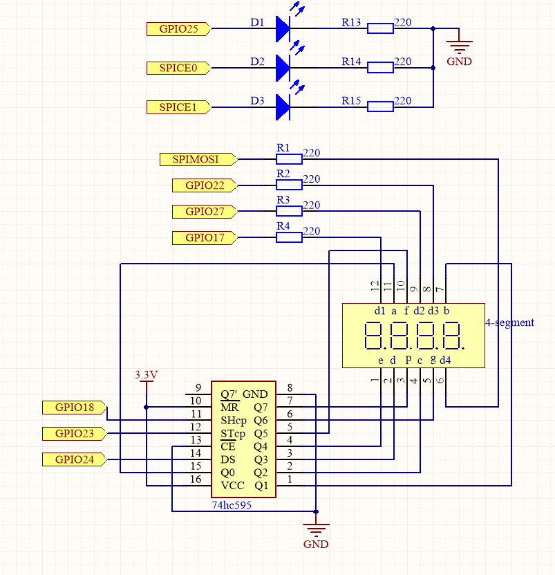

.. note::

    Hello, welcome to the SunFounder Raspberry Pi & Arduino & ESP32 Enthusiasts Community on Facebook! Dive deeper into Raspberry Pi, Arduino, and ESP32 with fellow enthusiasts.

    **Why Join?**

    - **Expert Support**: Solve post-sale issues and technical challenges with help from our community and team.
    - **Learn & Share**: Exchange tips and tutorials to enhance your skills.
    - **Exclusive Previews**: Get early access to new product announcements and sneak peeks.
    - **Special Discounts**: Enjoy exclusive discounts on our newest products.
    - **Festive Promotions and Giveaways**: Take part in giveaways and holiday promotions.

    👉 Ready to explore and create with us? Click [|link_sf_facebook|] and join today!

.. _4.1.9_py:

4.1.9 Traffic Light Simulation
==============================

**Introduction**

This project demonstrates the use of LEDs and a 4-digit 7-segment display to simulate a real-world traffic light system. The LEDs represent the red, yellow, and green lights, while the 7-segment display counts down the time remaining for each light. It provides an engaging way to learn about GPIO control, timing, and 7-segment displays in an educational or prototype setting.

----------------------------------------------

**What You’ll Need**

The following components are required for this project:

.. list-table::
    :widths: 30 20
    :header-rows: 1

    *   - COMPONENT INTRODUCTION
        - PURCHASE LINK
    *   - GPIO Extension Board
        - |link_gpio_board_buy|
    *   - Breadboard
        - |link_breadboard_buy|
    *   - Wires
        - |link_wires_buy|
    *   - Resistors
        - |link_resistor_buy|
    *   - LEDs (Red, Green, Yellow)
        - |link_led_buy|
    *   - 4-Digit 7-Segment Display
        - N/A
    *   - 74HC595 Shift Register
        - |link_74hc595_buy|

----------------------------------------------

**Circuit Diagram**

Below is the schematic diagram for the traffic light simulation project:

----------------------------------------------

**Wiring Diagram**

Refer to the wiring diagram for assembling the components:

.. image:: ../python/img/4.1.12_traffic_light_circuit.png

----------------------------------------------

**Writing the Code**

1. Navigate to the project directory:

   .. code-block:: bash

       cd ~/zero-w-ai-kit/python

2. Run the Python script:

   .. code-block:: bash

       sudo python3 4.1.12_TrafficLight_zero.py

   Once the program is running:

   * The red LED will light up for 60 seconds, followed by the green LED for 30 seconds, and the yellow LED for 5 seconds.
   * This sequence repeats continuously, with the 4-digit 7-segment display showing the countdown for each state.

----------------------------------------------

**Code**

Here is the Python script for the traffic light simulation:

.. code-block:: python

    #!/usr/bin/env python3

    from gpiozero import OutputDevice, LED
    import threading

    # Setup GPIO pins for 74HC595 shift register
    SDI = OutputDevice(24)   # Serial Data Input
    RCLK = OutputDevice(23)  # Register Clock
    SRCLK = OutputDevice(18) # Shift Register Clock

    # Setup GPIO pins for digit selection on 7-segment display
    placePin = [OutputDevice(pin) for pin in (10, 22, 27, 17)]

    # Segment codes for numbers 0-9 on 7-segment display
    number = (0xc0, 0xf9, 0xa4, 0xb0, 0x99, 0x92, 0x82, 0xf8, 0x80, 0x90)

    # Setup GPIO pins for traffic light LEDs
    ledPinR = LED(25) # Red LED
    ledPinG = LED(8)  # Green LED
    ledPinY = LED(7)  # Yellow LED

    # Duration settings for traffic lights
    greenLight = 30
    yellowLight = 5
    redLight = 60

    # Traffic light color names
    lightColor = ("Red", "Green", "Yellow")

    # Initialize state variables
    colorState = 0
    counter = redLight
    timer1 = None

    def setup():
        """ Initialize the traffic light system and start the timer. """
        global timer1
        timer1 = threading.Timer(1.0, timer)
        timer1.start()

    def clearDisplay():
        """ Clear the 7-segment display. """
        for _ in range(8):
            SDI.on()
            SRCLK.on()
            SRCLK.off()
        RCLK.on()
        RCLK.off()

    def hc595_shift(data):
        """ Shift data to the 74HC595 shift register for digit display. """
        for i in range(8):
            SDI.value = 0x80 & (data << i)
            SRCLK.on()
            SRCLK.off()
        RCLK.on()
        RCLK.off()

    def pickDigit(digit):
        """ Select a specific digit to display on the 7-segment display. """
        for pin in placePin:
            pin.off()
        placePin[digit].on()

    def timer():
        """ Handle the timing for traffic light changes. """
        global counter, colorState, timer1
        timer1 = threading.Timer(1.0, timer)
        timer1.start()
        counter -= 1
        if counter == 0:
            counter = [redLight, greenLight, yellowLight][colorState]
            colorState = (colorState + 1) % 3
        print(f"Counter: {counter}, Current Light: {lightColor[colorState]}")

    def lightup():
        """ Update the traffic light LED based on the current state. """
        ledPinR.off()
        ledPinG.off()
        ledPinY.off()
        [ledPinR, ledPinG, ledPinY][colorState].on()

    def display():
        """ Display the current counter value on the 7-segment display. """
        global counter
        for i in range(4):
            digit = counter // (10 ** (3 - i)) % 10
            clearDisplay()
            pickDigit(3 - i)
            hc595_shift(number[digit])

    def loop():
        """ Main loop to continuously update display and lights. """
        while True:
            display()
            lightup()

    def destroy():
        """ Clean up resources when the script is terminated. """
        global timer1
        timer1.cancel()
        ledPinR.off()
        ledPinG.off()
        ledPinY.off()

    try:
        setup()
        loop()
    except KeyboardInterrupt:
        destroy()

This Python script simulates a traffic light system with a countdown timer displayed on a 7-segment display. It includes the following functionalities:

1. **Traffic Light Control**:

   - Three LEDs (Red, Green, Yellow) represent the traffic lights.
   - The traffic light cycles through:

     - Red light for 60 seconds.
     - Green light for 30 seconds.
     - Yellow light for 5 seconds.

2. **Countdown Display**:

   - A 4-digit 7-segment display shows the remaining time for the current light.
   - The display updates in real-time, counting down every second.

3. **State Management** The traffic light and countdown automatically transition between states based on the configured durations.

4. **Continuous Operation** The system continuously runs the traffic light cycle, updating the LEDs and display.

5. **Graceful Exit** On ``Ctrl+C``, the timer stops, LEDs turn off, and the script exits cleanly.

----------------------------------------------

**Understanding the Code**

1. **Initialization:**

   * Sets up GPIO pins for the shift register, 7-segment display, and traffic light LEDs.
   * Defines constants for light durations and initializes state variables.

2. **7-Segment Display Functions:**

   * ``clearDisplay``: Clears all segments on the display.
   * ``hc595_shift``: Sends data to the shift register to control display segments.
   * ``pickDigit``: Activates a specific digit for multiplexing.

3. **Timer Function:**

   * Handles the countdown and transitions between light states.

4. **Traffic Light Control:**

   * Updates the LEDs based on the current state.

5. **Main Loop:**

   * Continuously updates the display and LEDs.

6. **Cleanup:**

   * Ensures all resources are properly released on termination.

----------------------------------------------

**Troubleshooting**

1. **Traffic Lights Not Working**:

   - **Cause**: Incorrect wiring or faulty LEDs.
   - **Solution**:

     - Verify that the LEDs are correctly connected to GPIO pins 25 (Red), 8 (Green), and 7 (Yellow).
     - Test each LED individually using a simple GPIO control script.

2. **7-Segment Display Does Not Show Countdown**:

   - **Cause**: Incorrect wiring or shift register configuration.
   - **Solution**:

     - Ensure the shift register's ``SDI``, ``RCLK``, and ``SRCLK`` pins are properly connected to GPIO 24, 23, and 18, respectively.
     - Verify the digit selection pins match the ``placePin`` configuration.

3. **Countdown Timer Freezes**:

   - **Cause**: Timer thread not restarting correctly.
   - **Solution**: Ensure the ``timer()`` function calls ``timer1.start()`` to restart the timer thread.

4. **Incorrect Light Durations**:

   - **Cause**: Incorrect duration values or state transitions.
   - **Solution**:

     - Verify the ``redLight``, ``greenLight``, and ``yellowLight`` durations.
     - Check the ``timer()`` function logic to ensure correct state transitions.

----------------------------------------------

**Extendable Ideas**

1. **Pedestrian Crossing**: Add a pedestrian crossing button that temporarily interrupts the traffic cycle to allow pedestrians to cross safely.

     .. code-block:: python

         from gpiozero import Button
         pedestrian_button = Button(2)

         def handle_pedestrian():
             global colorState, counter
             if colorState == 1:  # If Green Light
                 counter = 5  # Shorten green light duration
         pedestrian_button.when_pressed = handle_pedestrian

2. **Adaptive Timing**: Adjust the durations of the traffic lights dynamically based on real-time traffic density.

3. **Event Logging**: Log traffic light state changes with timestamps to a file for analysis:

     .. code-block:: python

         with open("traffic_log.txt", "a") as log_file:
             log_file.write(f"{time.strftime('%Y-%m-%d %H:%M:%S')} - {lightColor[colorState]} light\n")

----------------------------------------------

**Conclusion**

This project simulates a traffic light system, providing hands-on experience with GPIO control, shift registers, and 7-segment displays. It’s a fun and educational way to explore electronics and programming while replicating a real-world application. Try enhancing the system to make it even more interactive!
