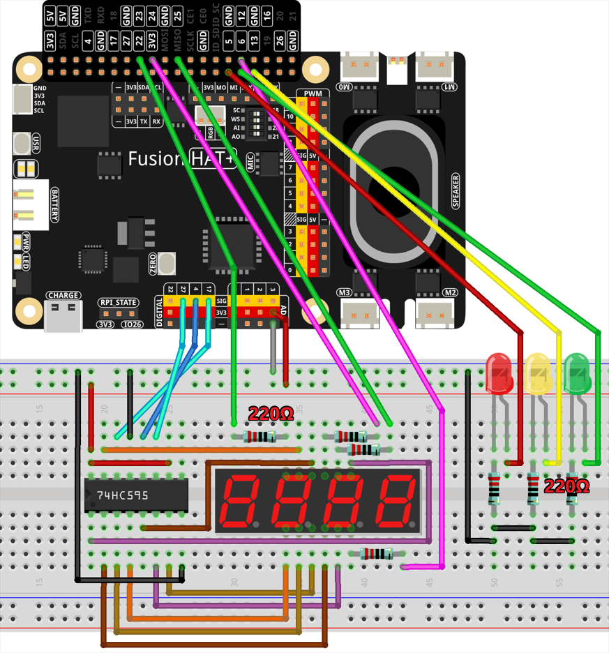

.. note::

    Hello, welcome to the SunFounder Raspberry Pi & Arduino & ESP32 Enthusiasts Community on Facebook! Dive deeper into Raspberry Pi, Arduino, and ESP32 with fellow enthusiasts.

    **Why Join?**

    - **Expert Support**: Solve post-sale issues and technical challenges with help from our community and team.
    - **Learn & Share**: Exchange tips and tutorials to enhance your skills.
    - **Exclusive Previews**: Get early access to new product announcements and sneak peeks.
    - **Special Discounts**: Enjoy exclusive discounts on our newest products.
    - **Festive Promotions and Giveaways**: Take part in giveaways and holiday promotions.

    👉 Ready to explore and create with us? Click [|link_sf_facebook|] and join today!

.. _4.1.9_py:

4.1.9 Traffic Light Simulation
==============================

**Introduction**

This project demonstrates the use of LEDs and a 4-digit 7-segment display to simulate a real-world traffic light system. The LEDs represent the red, yellow, and green lights, while the 7-segment display counts down the time remaining for each light. It provides an engaging way to learn about GPIO control, timing, and 7-segment displays in an educational or prototype setting.

----------------------------------------------

**What You’ll Need**

The following components are required for this project:

.. list-table::
    :widths: 30 20
    :header-rows: 1

    *   - COMPONENT INTRODUCTION
        - PURCHASE LINK

    *   - :ref:`cpn_breadboard`
        - |link_breadboard_buy|
    *   - :ref:`cpn_wires`
        - |link_wires_buy|
    *   - :ref:`cpn_resistor`
        - |link_resistor_buy|
    *   - :ref:`cpn_led`
        - |link_led_buy|
    *   - :ref:`cpn_4_digit`
        - \-
    *   - :ref:`cpn_74hc595`
        - |link_74hc595_buy|
    *   - Fusion HAT
        - 
    *   - Raspberry Pi Zero 2 W
        -

----------------------------------------------

**Circuit Diagram**

Below is the schematic diagram for the traffic light simulation project:

----------------------------------------------

**Wiring Diagram**

Refer to the wiring diagram for assembling the components:

----------------------------------------------

**Writing the Code**

Here is the Python script for the traffic light simulation:

.. raw:: html

   <run></run>

.. code-block:: python

   #!/usr/bin/env python3

   from fusion_hat import Pin
   import threading

   # Setup GPIO pins for 74HC595 shift register
   SDI = Pin(17,Pin.OUT)   # Serial Data Input
   RCLK = Pin(4,Pin.OUT)  # Register Clock
   SRCLK = Pin(27,Pin.OUT) # Shift Register Clock

   # Define GPIO pins for digit selection on the 7-segment display
   placePin = [Pin(pin,Pin.OUT) for pin in (23, 24, 25, 12)]

   # Segment codes for numbers 0-9 on 7-segment display
   number = (0xc0, 0xf9, 0xa4, 0xb0, 0x99, 0x92, 0x82, 0xf8, 0x80, 0x90)

   # Setup GPIO pins for traffic light LEDs
   ledPinR = Pin(5,Pin.OUT) # Red LED
   ledPinG = Pin(6,Pin.OUT)  # Green LED
   ledPinY = Pin(13,Pin.OUT)  # Yellow LED

   # Duration settings for traffic lights
   greenLight = 30
   yellowLight = 5
   redLight = 60

   # Traffic light color names
   lightColor = ("Red", "Green", "Yellow")

   # Initialize state variables
   colorState = 0
   counter = 60
   timer1 = None

   def setup():
      """ Initialize the traffic light system and start the timer. """
      global timer1
      timer1 = threading.Timer(1.0, timer)
      timer1.start()

   def clearDisplay():
      """ Clear the 7-segment display. """
      for _ in range(8):
         SDI.high()
         SRCLK.high()
         SRCLK.low()
      RCLK.high()
      RCLK.low()

   def hc595_shift(data):
      """ Shift data to the 74HC595 shift register for digit display. """
      for i in range(8):
         SDI.value(0x80 & (data << i))
         SRCLK.high()
         SRCLK.low()
      RCLK.high()
      RCLK.low()

   def pickDigit(digit):
      """ Select a specific digit to display on the 7-segment display. """
      for pin in placePin:
         pin.low()
      placePin[digit].high()

   def timer():
      """ Handle the timing for traffic light changes. """
      global counter, colorState, timer1
      timer1 = threading.Timer(1.0, timer)
      timer1.start()
      counter -= 1
      if counter == 0:
         counter = [greenLight, yellowLight, redLight][colorState]
         colorState = (colorState + 1) % 3
      print(f"counter : {counter}    color: {lightColor[colorState]}")

   def lightup():
      """ Update the traffic light LED based on the current state. """
      global colorState
      ledPinR.low()
      ledPinG.low()
      ledPinY.low()
      [ledPinR, ledPinG, ledPinY][colorState].high()

   def display():
      """ Display the current counter value on the 7-segment display. """
      global counter

      for i in range(4):
         digit = counter // (10 ** (3 - i)) % 10
         if i == 0 and digit == 0:
               continue
         clearDisplay()
         pickDigit(3 - i)
         hc595_shift(number[digit])

   def loop():
      """ Main loop to continuously update display and lights. """
      while True:
         display()
         lightup()

   def destroy():
      """ Clean up resources when the script is terminated. """
      global timer1
      timer1.cancel()
      ledPinR.low()
      ledPinG.low()
      ledPinY.low()

   try:
      setup()
      loop()
   except KeyboardInterrupt:
      destroy()

----------------------------------------------

**Understanding the Code**

1. **Initialization:**

   * Sets up GPIO pins for the shift register, 7-segment display, and traffic light LEDs.
   * Defines constants for light durations and initializes state variables.

2. **7-Segment Display Functions:**

   * ``clearDisplay``: Clears all segments on the display.
   * ``hc595_shift``: Sends data to the shift register to control display segments.
   * ``pickDigit``: Activates a specific digit for multiplexing.

3. **Timer Function:**

   * Handles the countdown and transitions between light states.

4. **Traffic Light Control:**

   * Updates the LEDs based on the current state.

5. **Main Loop:**

   * Continuously updates the display and LEDs.

6. **Cleanup:**

   * Ensures all resources are properly released on termination.

----------------------------------------------

**Troubleshooting**

1. **Traffic Lights Not Working**:

   - **Cause**: Incorrect wiring or faulty LEDs.
   - **Solution**:

     - Verify that the LEDs are correctly connected to GPIO pins 5 (Red), 6 (Green), and 13 (Yellow).
     - Test each LED individually using a simple GPIO control script.

2. **7-Segment Display Does Not Show Countdown**:

   - **Cause**: Incorrect wiring or shift register configuration.
   - **Solution**:

     - Ensure the shift register's ``SDI``, ``RCLK``, and ``SRCLK`` pins are properly connected to GPIO 17, 4, and 27, respectively.
     - Verify the digit selection pins match the ``placePin`` configuration.

3. **Countdown Timer Freezes**:

   - **Cause**: Timer thread not restarting correctly.
   - **Solution**: Ensure the ``timer()`` function calls ``timer1.start()`` to restart the timer thread.

4. **Incorrect Light Durations**:

   - **Cause**: Incorrect duration values or state transitions.
   - **Solution**:

     - Verify the ``redLight``, ``greenLight``, and ``yellowLight`` durations.
     - Check the ``timer()`` function logic to ensure correct state transitions.

----------------------------------------------

**Extendable Ideas**

1. **Pedestrian Crossing**: Add a pedestrian crossing button that temporarily interrupts the traffic cycle to allow pedestrians to cross safely.

   .. code-block:: python

      from fusion_hat import Pin
      pedestrian_button = Pin(22, Pin.IN, Pin.PULL_DOWN)

      def handle_pedestrian():
            global colorState, counter
            if colorState == 1:  # If Green Light
               counter = 5  # Shorten green light duration
      pedestrian_button.when_activated = handle_pedestrian

2. **Adaptive Timing**: Adjust the durations of the traffic lights dynamically based on real-time traffic density.

3. **Event Logging**: Log traffic light state changes with timestamps to a file for analysis:

   .. code-block:: python

      with open("traffic_log.txt", "a") as log_file:
            log_file.write(f"{time.strftime('%Y-%m-%d %H:%M:%S')} - {lightColor[colorState]} light\n")

----------------------------------------------

**Conclusion**

This project simulates a traffic light system, providing hands-on experience with GPIO control, shift registers, and 7-segment displays. It’s a fun and educational way to explore electronics and programming while replicating a real-world application. Try enhancing the system to make it even more interactive!
